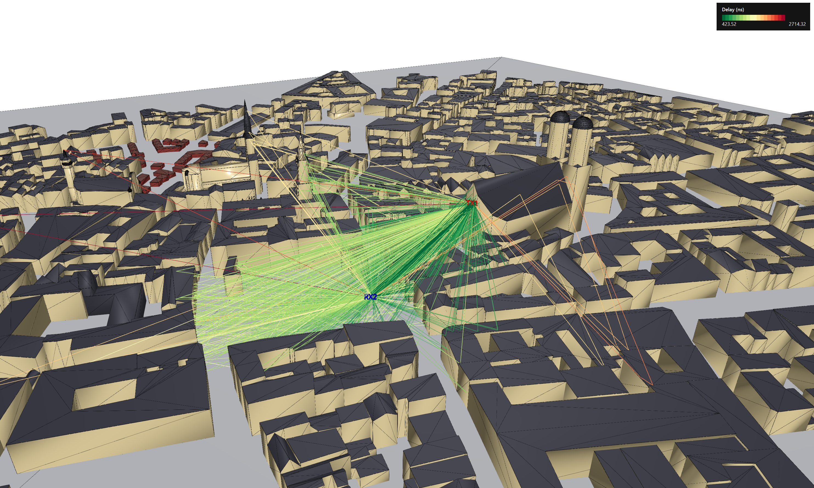
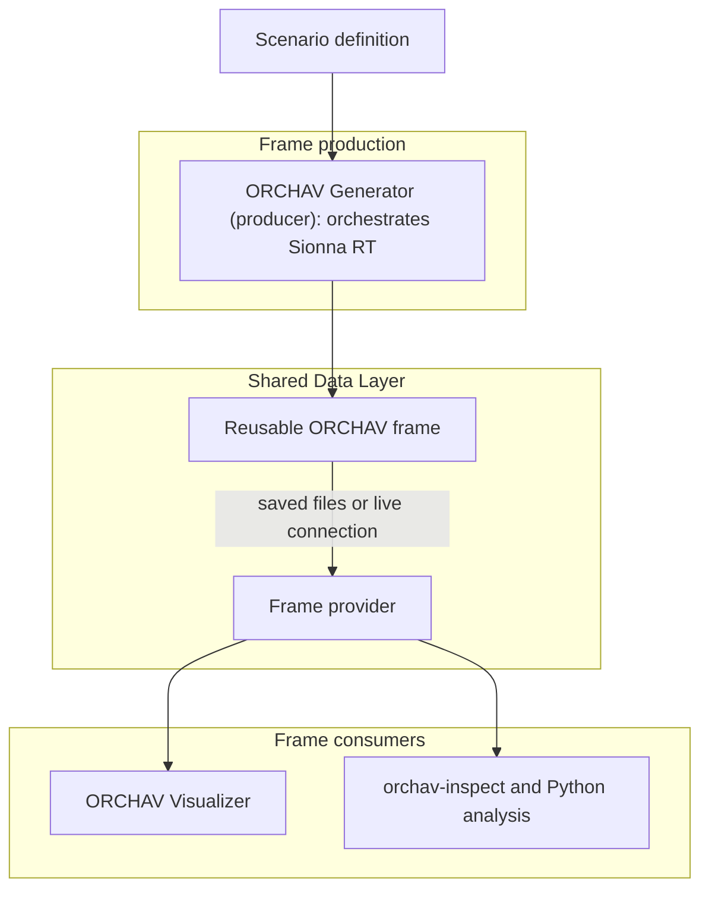

<h1 align="center">
  <picture>
    <source media="(prefers-color-scheme: dark)" srcset="visualizer/resources/branding/orchav-wordmark-on-dark.svg">
    <source media="(prefers-color-scheme: light)" srcset="visualizer/resources/branding/orchav-wordmark-on-light.svg">
    
  </picture>
</h1>

<p align="center">
  <a href="https://www.python.org/downloads/"></a>
  <a href="LICENSE"></a>
  <a href="https://github.com/psf/black"></a>
</p>

ORCHAV (Orchestrator for Ray-tracing Channel Analysis and Visualization) is a
Python toolkit for scenario-driven radio-propagation studies built on
[Sionna RT](https://nvlabs.github.io/sionna/), an open-source,
hardware-accelerated ray tracer for radio-propagation modeling developed by
NVIDIA. ORCHAV does not replace the ray tracer. It orchestrates Sionna RT
simulations and turns their results into reusable
[frames](docs/reference/glossary.md#frame) for visualization, terminal
inspection, and Python analysis. Each frame is a snapshot of one scenario step.
It records the state of its [actors](docs/reference/glossary.md#actor) (i.e.,
[transmitters](docs/reference/glossary.md#transmitter-tx),
[receivers](docs/reference/glossary.md#receiver-rx), and
[targets](docs/reference/glossary.md#target)) and the
[propagation paths](docs/reference/glossary.md#propagation-path-mpc) found
between transmitters and receivers. A propagation path is also known as a
multipath component (MPC).



*ORCHAV's desktop Visualizer displays scene geometry, radio actors, and
delay-colored multipath components from a generated frame.*

## Main Components

- **[Generator](docs/generator/README.md)**: the primary
  [frame producer](docs/reference/glossary.md#producer). It runs the scenario,
  orchestrates Sionna RT, and produces reusable frames.
- **[Shared Data Layer](docs/shared/README.md)**: defines the reusable frame
  structure and provides a common way to save, retrieve, validate, and analyze
  frames through [frame providers](docs/reference/glossary.md#frame-provider).
- **[Visualizer](docs/visualizer/README.md)**: an interactive
  [frame consumer](docs/reference/glossary.md#consumer) for exploring scenes,
  actors, propagation paths, coverage, and metrics.

## ORCHAV Big Picture



The Generator produces frames. The Shared Data Layer gives consumers the same
frame structure whether the frames come from saved files or a live Generator.
A [frame provider](docs/reference/glossary.md#frame-provider) is the interface
a consumer uses to retrieve those frames. The
[Shared Data Layer guide](docs/shared/README.md) explains local file playback, Live
Generator, and remote file playback.

## Install

ORCHAV v0.1 requires Python 3.12. From the repository root, with a Python 3.12
virtual environment active, run:

```text
python -m pip install -e .
```

See the [Installation guide](docs/getting_started/installation.md) for
environment setup, Sionna RT backend requirements, optional extras, and
verification checks.

## First Run

From the repository root with the ORCHAV environment active:

```bash
orchav-generator
orchav-validate scenarios/getting_started/hello_world/
orchav-generator scenarios/getting_started/hello_world/
orchav-inspect scenarios/getting_started/hello_world --frame 0
orchav-visualizer --scenario scenarios/getting_started/hello_world
```

These commands list the included scenarios, run an optional validation
preflight, generate the Hello World frame, inspect it in the terminal, and open
it in the Visualizer. See the [Quickstart](docs/getting_started/quickstart.md)
for the complete walkthrough.

## Platform Testing

ORCHAV v0.1 has been tested across multiple Linux and Windows systems and on
Apple Silicon macOS. See the
[Installation guide](docs/getting_started/installation.md) for the tested
configurations, prerequisites, renderer availability, and validation scope.
Other configurations may work; use the guide's verification checks and the
[Quickstart](docs/getting_started/quickstart.md) before regular use.

Reading existing frame files for inspection, Python analysis, local playback,
or remote playback does not invoke Sionna RT and does not require a CUDA or
LLVM ray-tracing backend.

## Included Scenarios

Start with `getting_started`, then use the Generator and Visualizer scenario
groups as runnable references. The [scenario catalog](scenarios/README.md)
lists every included scenario.

| Folder | Use it for |
|--------|------------|
| [`scenarios/getting_started/`](scenarios/getting_started/README.md) | first-run generation and a minimal Python-scripted authoring example |
| [`scenarios/generator/`](scenarios/generator/README.md) | materials, coverage, mobility, orientation, targets, and other Generator features |
| [`scenarios/visualizer/`](scenarios/visualizer/README.md) | MPC inspection, metrics, statistics, trajectories, data modes, beamforming, notebooks, and synthetic diagnostics |

## Documentation

- [Documentation home](docs/README.md)
- [Installation](docs/getting_started/installation.md)
- [Quickstart](docs/getting_started/quickstart.md)
- [Generator guide](docs/generator/README.md)
- [Visualizer guide](docs/visualizer/README.md)
- [Shared Data Layer guide](docs/shared/README.md)
- [Scenario catalog](scenarios/README.md)
- [Brand assets](visualizer/resources/branding/README.md)
- [Glossary](docs/reference/glossary.md)

## Validation And Contributing

Use [`orchav-validate`](docs/reference/scenario_validation.md) to check scenario
configuration without running a simulation. Contributors should follow
[CONTRIBUTING.md](CONTRIBUTING.md) for the development environment, quality
checks, and pull-request checklist.

## License, Disclaimer, And Third-Party Notices

ORCHAV source code is distributed under the GNU General Public License version
2 unless a file states otherwise. NIST-developed software is provided with the
terms and warranty disclaimer in
[NIST_SOFTWARE_DISCLAIMER.md](NIST_SOFTWARE_DISCLAIMER.md).

Third-party dependencies, optional datasets, and bundled assets are covered by
their own terms. See [THIRD_PARTY_NOTICES.md](THIRD_PARTY_NOTICES.md) for the
dependency and asset summary. Python dependencies are installed from the
user's environment and are not bundled as binary artifacts in this source tree.

The mention of commercial products, their sources, or their use in connection
with material reported herein is not to be construed as either an actual or
implied endorsement of such products by the Department of Commerce.

## Use Of Generative AI

This software and its documentation were developed and edited with assistance
from generative AI tools, including ChatGPT and Codex, developed by OpenAI.
These tools were used to draft and revise documentation, suggest code changes,
write and update tests, perform functional code review, and support refactoring
in accordance with the authors' instructions. All source code, documentation,
scientific claims, and conclusions have been reviewed and verified by the
authors to ensure accuracy, originality, and suitability for release.

## Citation

If you use ORCHAV in your research, please cite the project:

```bibtex
@inproceedings{ropitault2026orchav,
  title={ORCHAV: Connecting Ray-Traced Wireless Simulation and Interactive Propagation Analysis},
  author={Ropitault, Tanguy and Caromi, Raied and Golmie, Nada},
  booktitle={Proceedings of SIMULTECH 2026},
  year={2026}
}
```

## Acknowledgments

- Built on [Sionna RT](https://nvlabs.github.io/sionna/) for ray tracing.
- Uses [pygfx](https://github.com/pygfx/pygfx) with
  [wgpu-py](https://github.com/pygfx/wgpu-py) for the default, notebook, and
  offscreen visualization workflows,
  [PySide6](https://doc.qt.io/qtforpython-6/) for the desktop UI, and
  [Open3D](http://www.open3d.org/) for the Open3D/Filament renderer path.
