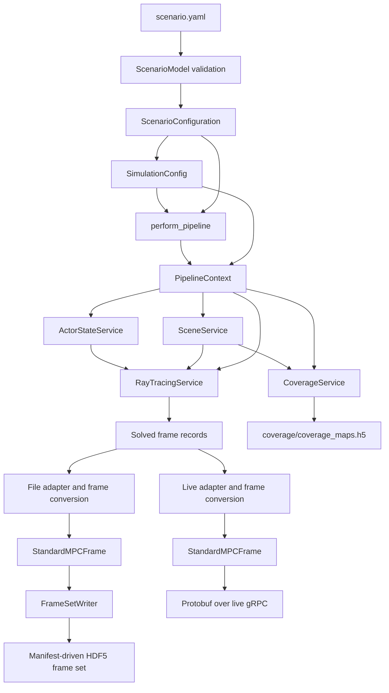
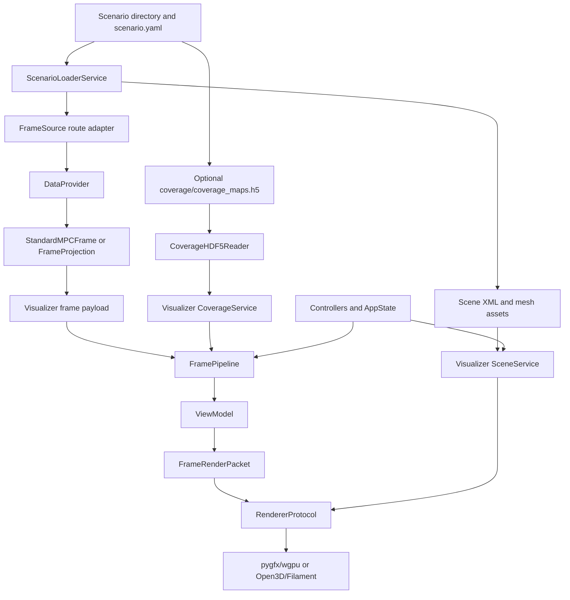

# Developer Architecture

ORCHAV separates simulation, shared data contracts, and visualization. The
Generator orchestrates [Sionna RT](https://nvlabs.github.io/sionna/), the
Shared Data Layer defines the reusable data boundaries, and the Visualizer
consumes those boundaries without depending on Sionna RT objects.

The common propagation-frame contract is
[`StandardMPCFrame`](../shared/frame_reference.md#frame-contract). Coverage uses
a separate HDF5 contract. The
[technical delivery map](../shared/frame_reference.md#technical-delivery-routes)
owns the detailed storage, transport, provider, and consumer routes. This page
focuses on implementation ownership and extension seams.

## Component Boundaries

| Component | Responsibility | Stable boundary |
|-----------|----------------|-----------------|
| Generator | Adapt validated scenarios into runtime configuration, prepare actors and scenes, invoke Sionna RT path computation, and publish propagation frames or coverage. | `ScenarioConfiguration` and `SimulationConfig` input, then `StandardMPCFrame` or coverage HDF5 output. |
| Shared Data Layer | Validate scenario models, define frame and coverage contracts, write and read HDF5, encode protobuf messages, and provide common frame access interfaces. | `ScenarioModel`, `StandardMPCFrame`, `FrameSetWriter`, coverage schema, protobuf messages, and `DataProvider`. |
| Visualizer | Load scenario assets and frame data, derive renderer payloads, coordinate UI state, render results, and export images or video. | Scenario and scene input, frame-provider input, coverage input, and `RendererProtocol`. |

## Generator Boundary

Scenario loading validates YAML as `ScenarioModel`, resolves paths into
`ScenarioConfiguration`, and adapts generator settings into
`SimulationConfig`. Both configurations reach `perform_pipeline`, while
`PipelineContext` owns run-scoped services from `SimulationConfig`.

Sionna RT scene, path, and tensor objects remain inside the Generator. File
output normalizes raw solved records before passing frames to
`FrameSetWriter`. Live output performs the same normalization before protobuf
encoding and does not pass through HDF5.

`perform_pipeline` dispatches the built-in `files` and `live_grpc` Generator
routes. Remote HDF5 is a consumer-side route over an existing frame set. Local
What-if Preview is a Visualizer workflow over file-backed scenarios. The
[Shared Data Layer](../shared/README.md#choose-a-data-mode) owns data-mode
choice, and
[Interactive Recomputation](../visualizer/interactive_recomputation.md) owns
preview and live-edit behavior.

Coverage publication runs beside propagation-frame publication. It has its own
schema, HDF5 reader, and Visualizer loading path. Coverage values do not travel
inside `StandardMPCFrame` or through `DataProvider`.

## Shared Data Boundary

The stable persisted-frame path is `producer -> StandardMPCFrame ->
FrameSetWriter -> HDF5 frame set`. The stable retrieval path is
`DataProvider -> consumer`. A provider can return a `StandardMPCFrame` or a selected-field
[`FrameProjection`](../shared/frame_reference.md#standard-frames-and-selected-field-views).
Local HDF5 can satisfy a projection with selective dataset reads. Live and
remote providers receive a `StandardMPCFrame` over protobuf before projecting
it in memory.

Provider ownership is divided by responsibility:

| Boundary | Owner |
|----------|-------|
| `DataProvider`, `Hdf5Provider`, and `RemoteHdf5Provider` | Shared Data Layer |
| Live `GrpcProvider` and Visualizer `FrameSource` adapters | Visualizer |
| Read-only frame-file gRPC service over generated HDF5 | Generator transport adapter |
| HDF5 layout parsing below `Hdf5Provider` | Shared format reader |

This division keeps the common provider contract independent of UI behavior
while allowing live playback policy to remain with the Visualizer. A retained
file format other than HDF5 would need a format reader and a file-provider
adapter. An external producer that writes the existing HDF5 frame format only
needs to create `StandardMPCFrame` values and use `FrameSetWriter`.

## Visualizer Boundary

The Visualizer combines three independent scenario inputs: scene assets,
propagation frames, and optional coverage. Controllers and `AppState` provide
the current display intent. They do not depend on a concrete renderer backend.

`FramePipeline` can request a projection directly from a provider.
`FrameLoaderService` supplies complete-frame caching and fallback loading when
that path is needed. The pipeline derives application-owned `ViewModel` state,
projects frame-heavy data into `FrameRenderPacket`, and submits the packet
through `RendererProtocol`. Renderer-specific objects stay inside the backend
packages. See [Renderers](../visualizer/renderers.md) for supported backend
behavior.

## Extension Seams

- Change core scenario fields in the shared scenario model and parsers, then
  regenerate the [Scenario YAML Reference](../reference/scenario_yaml.md).
  Optional feature sections should use the registered scenario-extension
  boundary.
- Add Generator behavior behind run-scoped services and the existing frame or
  coverage publication boundaries.
- Add a producer by converting solved records to `StandardMPCFrame`. Use
  `FrameSetWriter` when the result should be persisted.
- Add a retained frame format through a shared format reader and file provider.
  Add another delivery route through `DataProvider` and a Visualizer
  `FrameSource` adapter.
- Add renderer behavior through `RendererProtocol`, explicit
  `RendererCapabilities`, and `FrameRenderPacket`. Keep backend-native objects
  inside the renderer package.
- Add optional Visualizer frame behavior through the runtime-extension
  registry instead of branching the core frame pipeline on a private feature.

## Implementation Entry Points

| Area | Start here |
|------|------------|
| Generator dispatch and lifecycle | [`generator/core/pipeline/dispatch.py`](../../generator/core/pipeline/dispatch.py), then [`offline_pipeline.py`](../../generator/core/pipeline/offline_pipeline.py) or [`streaming.py`](../../generator/core/pipeline/streaming.py) |
| Shared package orientation | [`shared/README.md`](../../shared/README.md) |
| Frame contract, providers, and writing | [`shared/frames/types.py`](../../shared/frames/types.py), [`provider_base.py`](../../shared/frames/provider_base.py), and [`frame_set_writer.py`](../../shared/frames/frame_set_writer.py) |
| Visualizer scenario loading | [`visualizer/src/app/scenario_workflow.py`](../../visualizer/src/app/scenario_workflow.py) |
| Visualizer frame processing | [`visualizer/src/pipeline/frame_pipeline.py`](../../visualizer/src/pipeline/frame_pipeline.py) |
| Renderer contract | [`visualizer/src/renderers/protocol.py`](../../visualizer/src/renderers/protocol.py) |

---

Home: [Documentation](../README.md) | Related: [Frame Data Reference](../shared/frame_reference.md) | [Scenario Authoring](../generator/scenario_authoring.md)
