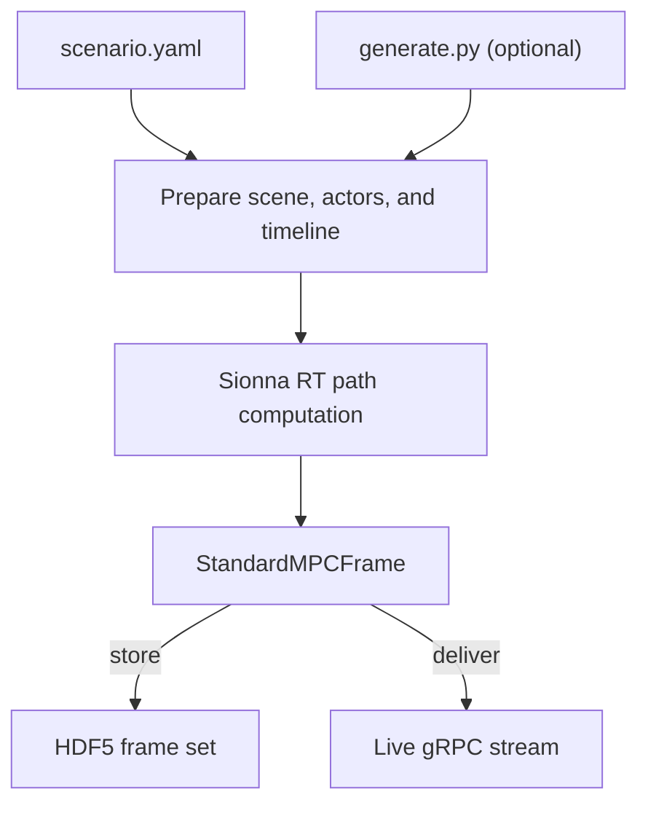

# Generator

The ORCHAV Generator is the primary
[frame producer](../reference/glossary.md#producer). It prepares a scenario's
scene, actors, and timeline. It then asks
[Sionna RT](https://nvlabs.github.io/sionna/) to compute propagation paths and
converts each solved step into the shared ORCHAV frame contract. Those frames
can be stored in HDF5 or transported to a running Visualizer over gRPC.

Within the Generator, authored inputs follow one preparation and path-computation
pipeline before the output route is selected:



After the Generator produces frames, the
[Shared Data Layer](../shared/README.md) handles how they are stored, delivered,
and retrieved.

## Choose A Task

| Goal | Start with |
|---|---|
| Install ORCHAV and run the first scenario | [Quickstart](../getting_started/quickstart.md) |
| Create or modify a scenario | [Scenario Authoring](scenario_authoring.md) |
| Create a scenario visually | [Scenario Builder](scenario_builder.md) |
| Choose scene, ray-tracing, antenna, material, path-filter, or coverage settings | [Simulation Configuration](configuration.md) |
| Add mobility, orientation, or groups | [Mobility and Orientation](mobility_and_orientation.md) |
| Create standalone summary or coverage figures | [Summary and Coverage Figures](generated_figures.md) |
| Look up a command option | [Generator CLI Reference](cli_reference.md) |
| Look up an exact YAML field or default | [Scenario YAML Reference](../reference/scenario_yaml.md) |
| Run a focused example | [Generator Scenarios](../../scenarios/generator/README.md) |

YAML-only authoring is the normal path. Use `generate.py` when a scenario needs
calculated actor specifications, external preprocessing, generated case lists,
or other logic that is clearer in Python.

```bash
orchav-generator --help
orchav-generator
orchav-generator scenarios/getting_started/hello_world/
```

---

Home: [Documentation](../README.md) | Begin: [Scenario Authoring](scenario_authoring.md)
