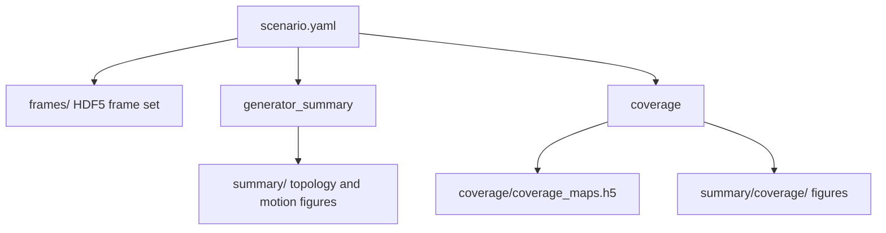
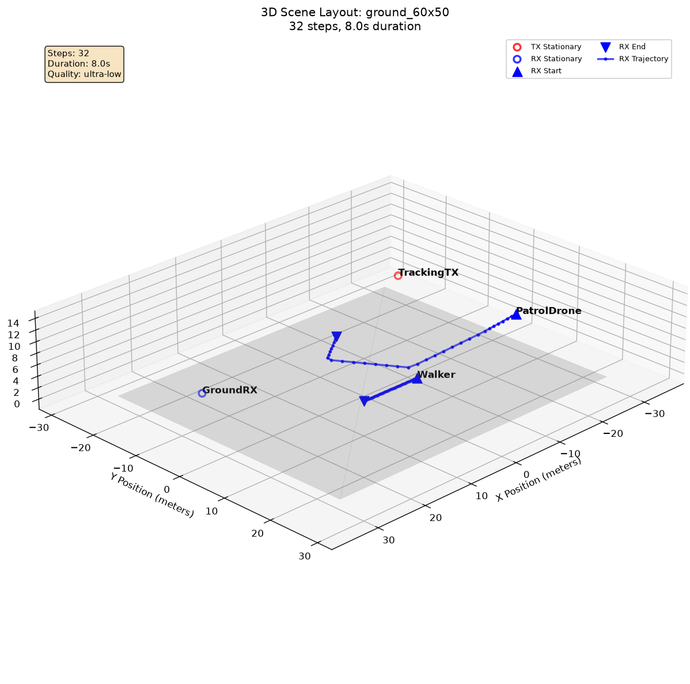
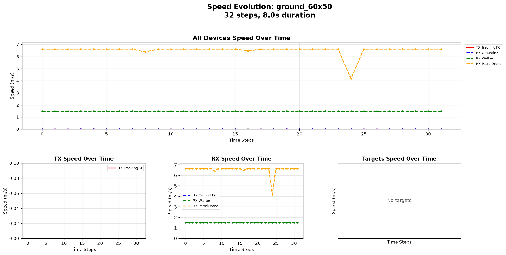
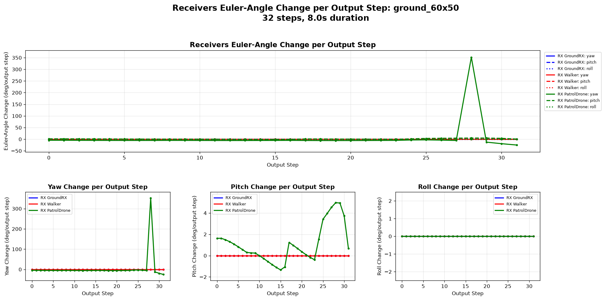
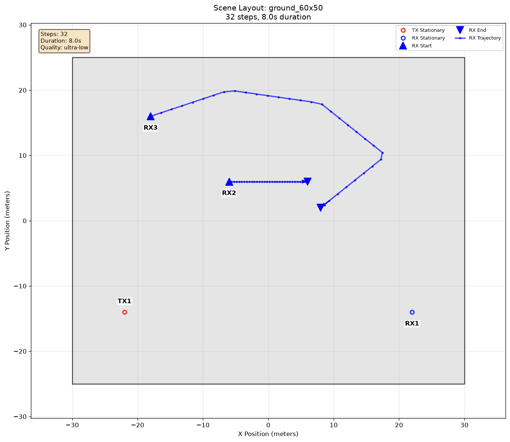

# Summary and Coverage Figures

ORCHAV can write standalone diagnostic figures after a scenario run. They are
saved as ordinary image files and are not Visualizer sessions. Two settings
families create them: `generator_summary` draws topology and motion, while
`coverage.save.figure` draws coverage maps, metric guides, and distributions.

Reusable simulation data and optional figures remain separate products:



Use `frames/` and `coverage/` for reusable data. Use `summary/` when a
standalone figure is useful without opening the Visualizer.

## Enable Summary Figures

Start with the figure types the scenario needs:

```yaml
generator_summary:
  enabled: true
  create: [scene2d, speed]
```

If `generator_summary.enabled` is omitted or false, the Generator does not
create these figures. PNG is the default format. Optional output and
presentation settings are described below.

## Choose Summary Figures

| `create` key | What it answers | Output |
| --- | --- | --- |
| `scene2d` | Where do the actors travel in the XY plane? | `summary/topology/scene_2d.<format>` |
| `scene3d` | How do actor altitude and scene height relate? | `summary/topology/scene_3d.<format>` |
| `speed` | When and how fast does each actor move? | `summary/velocity/speed_evolution.<format>` |
| `orientation` | Which way do the actors point at each output step? | `summary/angular/*_orientation_evolution.<format>` |
| `angular_velocity` | How much do yaw, pitch, and roll change between adjacent output steps? | `summary/angular/*_angular_velocity_evolution.<format>` |

The five Generator figure selectors documented here are `scene2d`, `scene3d`,
`speed`, `orientation`, and `angular_velocity`. Speed is a magnitude in meters
per second sampled at each output step. `angular_velocity` reports Euler-angle
change in degrees per output step, not degrees per second.

The examples below use the actors and trajectories from
[Actor Orientation](../../scenarios/generator/mobility_and_orientation/actor_orientation/README.md),
generated for this page with all five selectors enabled. `orientation` and
`angular_velocity` write a separate file for each populated TX, RX, or target
role. The receiver plots are shown here.

| `scene2d` | `scene3d` |
| --- | --- |
| [](../assets/scenarios/scenarios_generator_mobility_and_orientation_actor_orientation_summary2d.png) | [](../assets/scenarios/scenarios_generator_mobility_and_orientation_actor_orientation_summary3d.png) |
| Shows positions and trajectories in the XY plane. | Shows actor altitude relative to the ground plane. |

| `speed` |
| --- |
| [](../assets/scenarios/scenarios_generator_mobility_and_orientation_actor_orientation_speed.png) |
| Shows speed magnitude in meters per second and makes stops or changes in motion easy to identify. |

| `orientation` | `angular_velocity` |
| --- | --- |
| [](../assets/scenarios/scenarios_generator_mobility_and_orientation_actor_orientation_rx_orientation_evolution.png) | [](../assets/scenarios/scenarios_generator_mobility_and_orientation_actor_orientation_rx_angular_velocity_evolution.png) |
| Shows yaw, pitch, and roll state at each output step. | Highlights step-to-step changes, including abrupt Euler-angle wrapping. |

## Output Locations

ORCHAV writes summary figures beside `scenario.yaml` under `summary/`:

```text
summary/
|-- topology/
|-- velocity/
|-- angular/
`-- coverage/      # when coverage.save.figure.enabled is true
```

See [Scenario Authoring](scenario_authoring.md#scenario-directory) for the
standard scenario directory layout.

## Reuse and Regeneration

When the scenario YAML is unchanged and `summary/` already exists, ORCHAV
reuses it and warns that external files are not included in that decision. Set
`generator_summary.force: true` for one run after changing a scene XML, mesh,
texture, target catalog, scripted object, or another external input.

A rebuild replaces `summary/` only after every requested figure succeeds. If a
figure fails, the previous complete summary and generated frames remain valid,
and the next requested run retries the summary.

Environment-only summary artifacts are cached between runs under
`.cache/orchav/summary_geometry/` by default. The cache key includes the scene
XML, referenced mesh files, and rendering options. TX/RX/target trajectories
are still drawn fresh for each scenario run. Set `ORCHAV_SUMMARY_CACHE_DIR` to
use a different cache location.

## Presentation Options

Presentation settings change how the diagnostic image is drawn. They do not
change the scenario coordinates or generated frame data.

Rasterized 2D summaries choose their vertical scene slice automatically. For
shallow geometry, the lower exclusion offset scales with scene height and
remains capped at 0.1 m, so sub-meter scenes remain visible. No additional YAML
setting is required; `scene2d_resolution` controls only raster pixel size.

```yaml
generator_summary:
  enabled: true
  create: [scene2d, scene3d, speed, orientation, angular_velocity]
  output:
    format: svg
  visualization:
    actor_label_mode: name
    scene2d_material_legend: true
    scene3d_mode: city
    scene3d_z_exaggeration: auto
```

| Setting | Default | Goal |
| --- | --- | --- |
| `output.format` | `png` | Use `svg` for scalable vector figures or `pdf` for page-oriented output. |
| `visualization.actor_label_mode` | `role` | Use `name` when YAML actor names carry more meaning than `TX1` or `RX1`. |
| `visualization.scene2d_material_legend` | `false` | Enable it when the 2D figure must explain the environment's material composition. |
| `visualization.scene3d_mode` | `floor_plan` | Use `city` for dense city geometry or `wireframe` when mesh structure should remain visible. |
| `visualization.scene3d_z_exaggeration` | unset (`city` uses `auto`) | Use `auto` to make city-scale height differences readable without changing coordinates. |

Only `actor_label_mode` changes between the two figures below. Role/index
labels are compact and consistent across scenarios. Actor names are better when
the names communicate each actor's purpose.

| Default `actor_label_mode: role` | `actor_label_mode: name` |
| --- | --- |
| [](../assets/scenarios/scenarios_generator_mobility_and_orientation_actor_orientation_summary2d_role_labels.png) | [](../assets/scenarios/scenarios_generator_mobility_and_orientation_actor_orientation_summary2d.png) |
| Best for comparing roles across scenarios. | Best for explaining scenario-specific behavior. |

The `city` and `wireframe` 3D modes color scene geometry by detected material
family and include those material colors in the figure legend. For every
summary field, see the
[Scenario YAML Reference](../reference/scenario_yaml.md#generator-summary-settings).

## Coverage Figures

Coverage-map figures are separate from `generator_summary.create`. They require
coverage generation and are controlled by `coverage.save.figure`. The images
are written under `summary/coverage`:

```yaml
coverage:
  enabled: true
  save:
    figure:
      enabled: true
      format: png
      filename: coverage_maps
      metrics: [best_path_loss_db, best_rss_dbm, sinr_db]
      metric_filename: coverage_metrics
      distribution:
        enabled: true
        metrics: [best_path_loss_db, best_rss_dbm, sinr_db]
        filename: coverage_distributions
```

| YAML control | Figure | Goal |
| --- | --- | --- |
| `figure.enabled: true` | Quick-look coverage map | Inspect the coverage field at every configured height. |
| Non-empty `figure.metrics` | Metric guide | Compare selected metrics at every configured height. |
| `distribution.enabled: true` with non-empty `distribution.metrics` | Histograms and CDFs | Compare value ranges and distributions at every configured height. |

These examples show both configured heights from
[Single-Transmitter Coverage](../../scenarios/generator/coverage/single_tx/README.md):

| Output | 1.5 m | 30 m |
| --- | --- | --- |
| Quick-look map | [](../assets/scenarios/scenarios_generator_coverage_single_tx_coverage_height-01_1.5m.png) | [](../assets/scenarios/scenarios_generator_coverage_single_tx_coverage_height-02_30m.png) |
| Metric guide | [](../assets/scenarios/scenarios_generator_coverage_single_tx_metrics_height-01_1.5m.png) | [](../assets/scenarios/scenarios_generator_coverage_single_tx_metrics_height-02_30m.png) |
| Distribution | [](../assets/scenarios/scenarios_generator_coverage_single_tx_distributions_height-01_1.5m.png) | [](../assets/scenarios/scenarios_generator_coverage_single_tx_distributions_height-02_30m.png) |

The quick-look map answers where coverage is strong or weak. The metric guide
places selected metrics side by side, and the distribution figure compares
their aggregate histograms and cumulative distributions. Quick-look maps and
metric guides use metric-specific limits shared across the height stack, so a
color has the same meaning when comparing height slices.

Each enabled figure type produces one file for every configured height,
including single-height grids. Filenames combine the one-based height order
with the physical height, for example
`coverage_maps_height-01_1.5m.png` and
`coverage_maps_height-02_30m.png`. Metric guides and distributions follow the
same pattern with their configured filename stems. Enabled figure types must
use distinct base filenames. Comparisons are case-insensitive so the output is
portable to Windows. Per-TX metric layers use
`metric/TXName` syntax, for example `path_loss_db/WestSector`. Coverage-map data
is saved separately as `coverage/coverage_maps.h5`.

---

Up: [Generator](README.md) | Previous: [Mobility and Orientation](mobility_and_orientation.md) | Continue: [Shared Data Layer](../shared/README.md)
