# Mobility and Orientation

Every actor pose combines two independent specifications:

| Specification | Controls |
|---|---|
| Mobility | Position and velocity at each timeline sample |
| Orientation | The direction the actor faces at each timeline sample |

ORCHAV samples both specifications on the shared scenario timeline. Generation,
Scenario Builder preview, and motion plots therefore use the same positions and
orientations. Position-like values are meters, speed is meters per second, time
is seconds, and authored angles are degrees.

## Mobility Models

Each thumbnail shows one concrete configuration rather than the model's full
parameter range. Path-based panels show the samples that generation and
Scenario Builder preview receive. The `network_route` and `mesh_sequence`
panels emphasize the local inputs loaded by those file-backed models.

| Type | Example | Behavior |
|---|---|---|
| `stationary` | 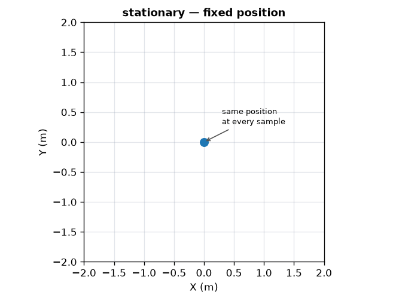 | Fixed `position_m`. |
| `linear` | 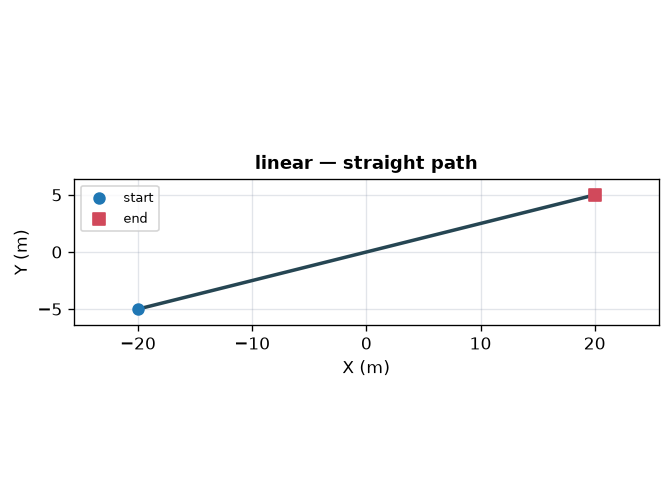 | Straight path from `start_m` to `end_m`. |
| `waypoint` | 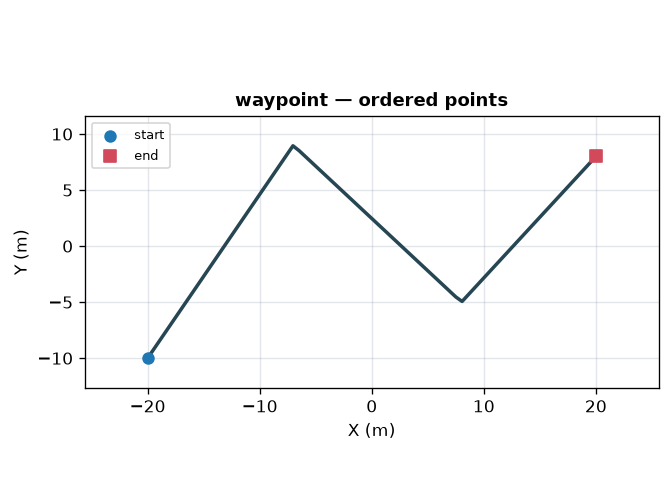 | Ordered `points_m`, with `linear` or `catmull_rom` interpolation. |
| `circular` | 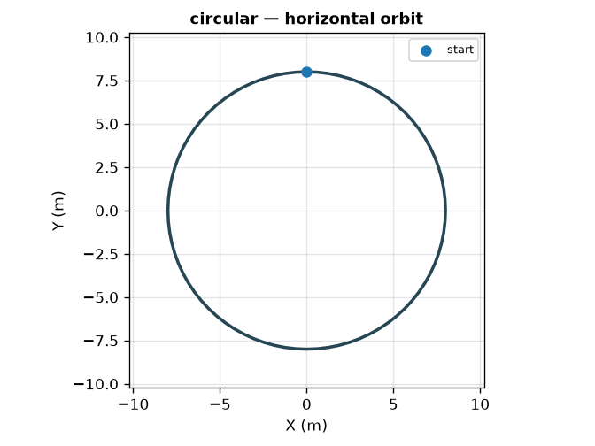 | Horizontal circle with radius, start angle, direction, and turns. |
| `survey` | 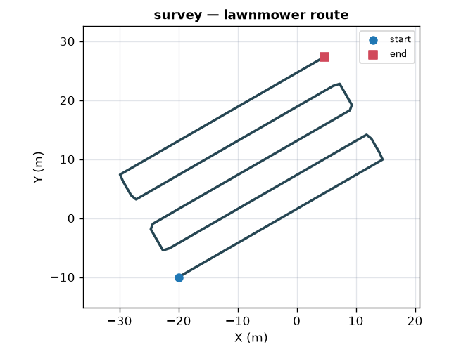 | Rotated lawnmower path over a rectangular area. |
| `grid_scan` | 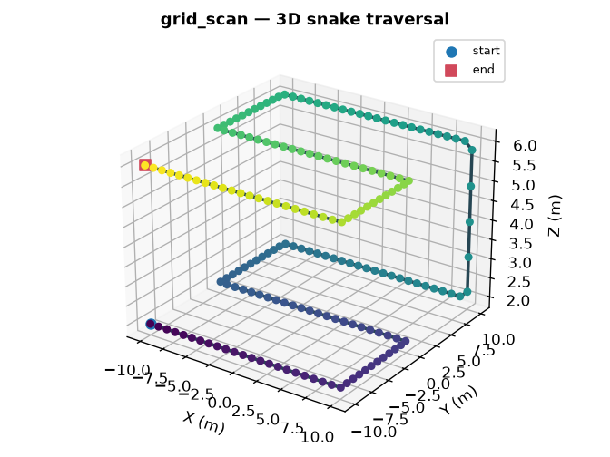 | Raster or snake traversal through a 3D grid. |
| `oscillating` | 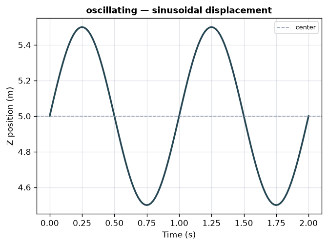 | Sinusoidal displacement along an arbitrary axis. |
| `pendulum` | 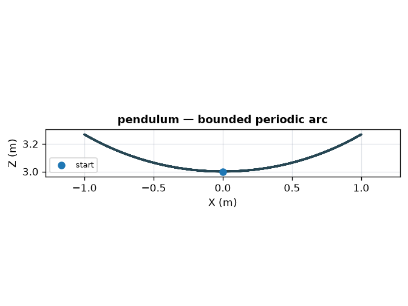 | Periodic arc around a pivot in a selected plane. |
| `figure8` | 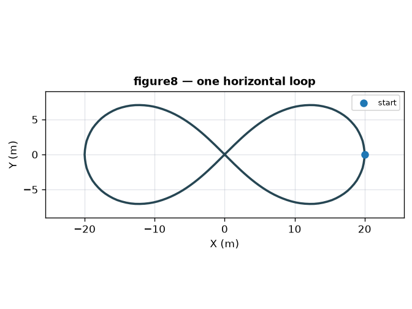 | Figure-eight path in the `xy`, `xz`, or `yz` plane. |
| `spiral` | 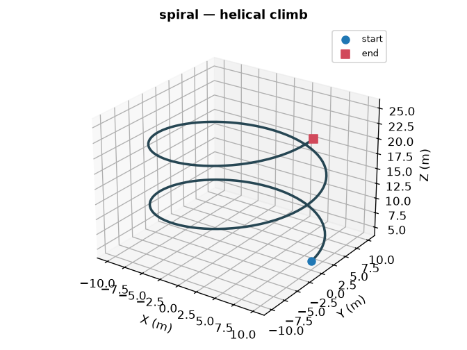 | Helical path between two altitudes. |
| `random_sampling` | 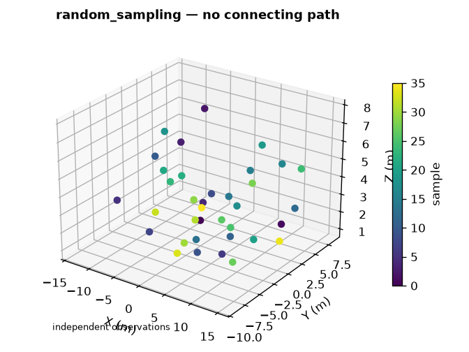 | Independent uniform or Poisson-disk samples, with an optional exact first observation and no physical velocity. |
| `sampled` | 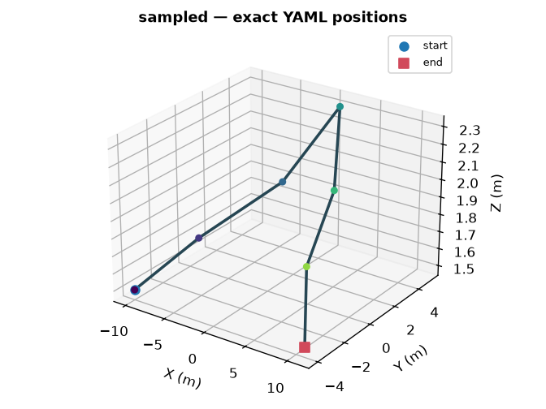 | Exact `positions_m` authored in YAML, one for each timeline step. |
| `gauss_markov` | 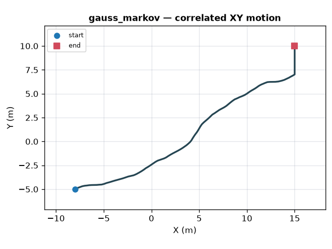 | Seeded correlated motion in XY. Z remains at the initial altitude. |
| `random_waypoint` | 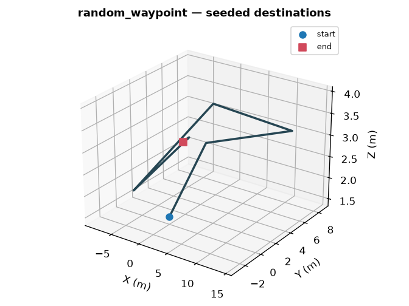 | Seeded destinations, speeds, and optional pauses inside bounds. |
| `manhattan_grid` | 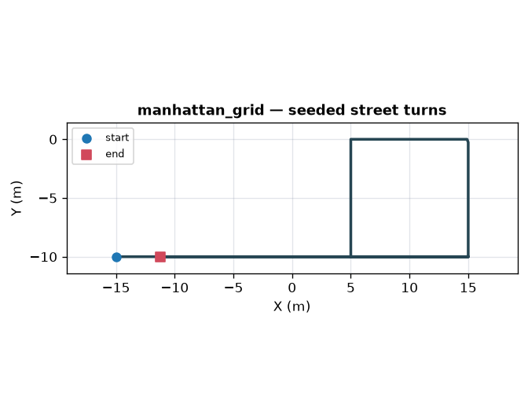 | Seeded movement and turns on a rectangular street grid. |
| `network_route` | 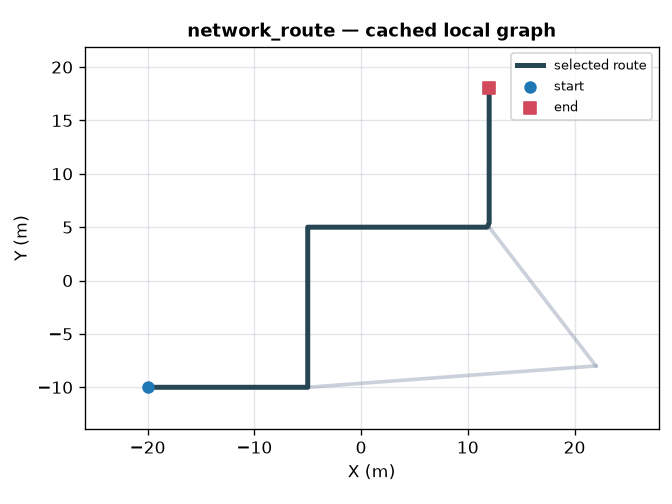 | Route sampled from a cached local network graph. |
| `mesh_sequence` | 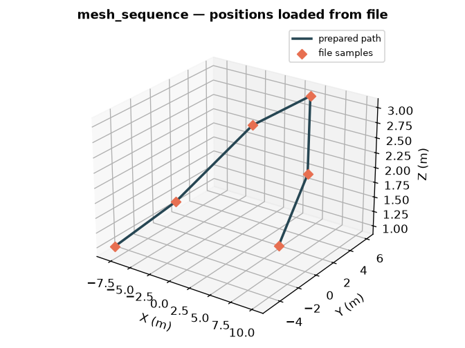 | Target-only positions loaded from a local data file. Target mesh geometry is configured separately. |
| `group_member` | 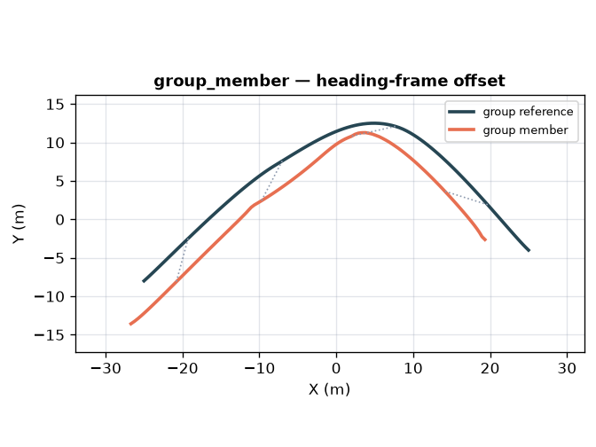 | A named group trajectory plus a local heading-frame offset. |

## Mobility Configurations

These examples show a valid starting configuration for every mobility model.
The [Scenario YAML Reference](../reference/scenario_yaml.md#mobility) lists the
optional fields and exact constraints.

### Fixed Positions And Authored Paths

**`stationary`**

```yaml
mobility:
  type: stationary
  position_m: [0.0, 0.0, 1.5]
```

**`linear`**

```yaml
mobility:
  type: linear
  start_m: [0.0, 0.0, 1.5]
  end_m: [12.0, 0.0, 1.5]
```

**`waypoint`**

```yaml
mobility:
  type: waypoint
  points_m:
    - [0.0, 0.0, 1.5]
    - [10.0, 0.0, 1.5]
    - [10.0, 8.0, 1.5]
  interpolation: catmull_rom
```

**`sampled`**

```yaml
mobility:
  type: sampled
  positions_m:
    - [0.0, 0.0, 1.5]
    - [1.0, 0.5, 1.5]
    - [2.0, 1.0, 1.5]
```

For `sampled`, provide one position for every timeline step. This example
assumes a three-step timeline.

### Geometric Paths

**`circular`**

```yaml
mobility:
  type: circular
  center_m: [0.0, 0.0, 12.0]
  radius_m: 8.0
  start_angle_deg: 90.0
  clockwise: true
  turns: 1.5
```

**`survey`**

```yaml
mobility:
  type: survey
  origin_m: [-20.0, -10.0, 25.0]
  width_m: 40.0
  height_m: 20.0
  row_spacing_m: 5.0
  heading_deg: 30.0
```

**`grid_scan`**

```yaml
mobility:
  type: grid_scan
  x_bounds_m: [-10.0, 10.0]
  y_bounds_m: [-5.0, 5.0]
  z_bounds_m: [1.5, 4.5]
  x_steps: 5
  y_steps: 3
  z_steps: 2
  traversal_pattern: snake
```

**`figure8`**

```yaml
mobility:
  type: figure8
  center_m: [0.0, 0.0, 5.0]
  size_m: 12.0
  plane: xy
  turns: 1.0
```

**`spiral`**

```yaml
mobility:
  type: spiral
  center_m: [0.0, 0.0, 0.0]
  radius_m: 8.0
  start_altitude_m: 2.0
  end_altitude_m: 20.0
  turns: 2.0
```

### Periodic Motion

**`oscillating`**

```yaml
mobility:
  type: oscillating
  center_m: [0.0, 0.0, 5.0]
  axis: [0.0, 0.0, 1.0]
  amplitude_m: 2.0
  frequency_hz: 0.5
```

**`pendulum`**

```yaml
mobility:
  type: pendulum
  pivot_m: [0.0, 0.0, 10.0]
  length_m: 4.0
  max_angle_deg: 30.0
  frequency_hz: 0.5
  plane: xz
```

### Seeded Motion

**`random_sampling`**

```yaml
mobility:
  type: random_sampling
  x_bounds_m: [-20.0, 20.0]
  y_bounds_m: [-10.0, 10.0]
  z_bounds_m: [1.5, 1.5]
  seed: 42
```

**`gauss_markov`**

```yaml
mobility:
  type: gauss_markov
  initial_position_m: [0.0, 0.0, 1.5]
  x_bounds_m: [-20.0, 20.0]
  y_bounds_m: [-10.0, 10.0]
  z_bounds_m: [1.5, 1.5]
  alpha: 0.8
  mean_speed_mps: 1.2
  seed: 42
```

**`random_waypoint`**

```yaml
mobility:
  type: random_waypoint
  initial_position_m: [0.0, 0.0, 1.5]
  x_bounds_m: [-20.0, 20.0]
  y_bounds_m: [-10.0, 10.0]
  z_bounds_m: [1.5, 1.5]
  speed_range_mps: [0.8, 1.6]
  pause_range_s: [0.0, 1.0]
  seed: 42
```

**`manhattan_grid`**

```yaml
mobility:
  type: manhattan_grid
  origin_xy_m: [-20.0, -20.0]
  block_size_m: 10.0
  grid_width: 4
  grid_height: 4
  altitude_m: 1.5
  speed_range_mps: [0.8, 1.6]
  seed: 42
```

Each stochastic model requires a seed so the same scenario produces the same
positions when reopened, previewed, or generated.

### Local Resources And Groups

**`network_route`**

```yaml
mobility:
  type: network_route
  travel_mode: car
  route: shortest_path
  start_node: road_start
  end_node: road_end
```

`network_route` reads a cached GraphML/XML or NetworkX node-link JSON graph. If
`graph_path` is omitted, it reads `street_network.graphml` from the scenario
directory. Graph coordinates must already use the same local-meter coordinate
system as the scene.

**`mesh_sequence`**

```yaml
mobility:
  type: mesh_sequence
  positions_path: motion/positions.npy
  interpolation: linear
```

`mesh_sequence` is available for targets. It loads positions from a local
`.npy`, `.npz`, YAML, JSON, CSV, text, or HDF5 file. The target mesh or animated
mesh sequence is configured separately under `asset`.

**`group_member`**

```yaml
mobility:
  type: group_member
  group: Convoy
  offset_m:
    right: 3.0
    forward: -5.0
    up: 0.0
```

The referenced group defines the shared path. The actor adds a local
right/forward/up offset, as shown in [Optional Groups](#optional-groups).

## Timeline

The root timeline determines when every mobility and orientation model is
sampled:

```yaml
timeline:
  steps: 61
  duration_s: 6.0
```

Samples include both endpoints. A moving scenario requires at least two
samples and positive duration. A fully stationary scenario may use one sample
and zero duration.

## Traversal

Finite path models traverse the complete authored path over
`timeline.duration_s` by default. Add `constant_speed` only when physical speed
should determine progress:

```yaml
mobility:
  type: waypoint
  points_m:
    - [0.0, 0.0, 1.5]
    - [10.0, 0.0, 1.5]
    - [10.0, 8.0, 1.5]
  traversal:
    type: constant_speed
    speed_mps: 1.4
    after_end: ping_pong
```

`after_end` is `hold`, `loop`, or `ping_pong`. Periodic and stochastic models
define their own time behavior.

## Optional Groups

A group owns a standalone reference mobility. An actor joins only by choosing
`group_member`. Ordinary actors do not declare a group.

```yaml
groups:
  - name: Convoy
    mobility:
      type: waypoint
      points_m:
        - [-30.0, 0.0, 2.0]
        - [0.0, 15.0, 2.0]
        - [30.0, 0.0, 2.0]

actors:
  rx:
    - name: LeadRX
      mobility:
        type: group_member
        group: Convoy
    - name: FollowRX
      mobility:
        type: group_member
        group: Convoy
        offset_m:
          right: 3.0
          forward: -5.0
          up: 0.0
```

Offsets are expressed as right, forward, and up in the group's local heading
frame. A group may add bounded seeded deviation. Groups require at least two
members and cannot reference another group.

## Orientation Models

Orientation is optional and defaults to fixed zero yaw, pitch, and roll.
Angles follow Sionna's right-handed Z/Y/X convention. The actor's forward axis
is +X and world up is +Z, so positive pitch turns +X toward -Z while negative
pitch turns it toward +Z.

The examples below use the prepared quaternion orientations. They show either
the actor's +X forward axis or the Euler-angle view exposed at UI and engine
boundaries.

| Type | Example | Behavior |
|---|---|---|
| `fixed` | 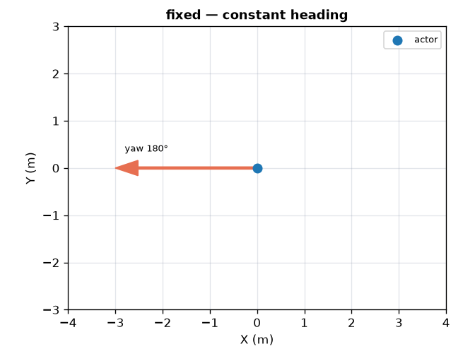 | Constant yaw, pitch, and roll. |
| `keyframes` | 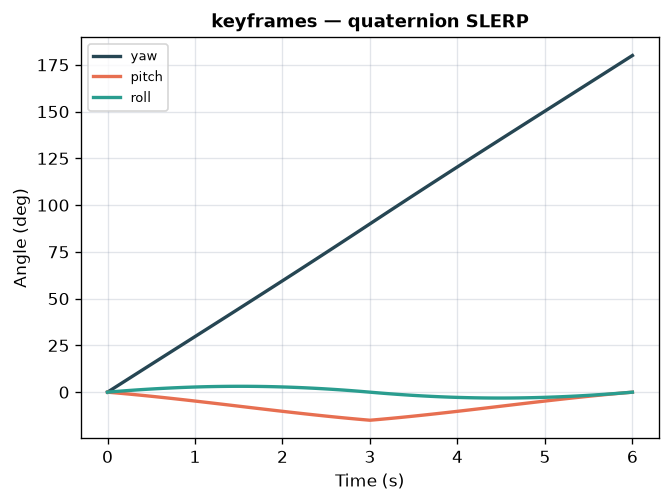 | Time-stamped orientations interpolated with quaternion SLERP. |
| `align_motion` | 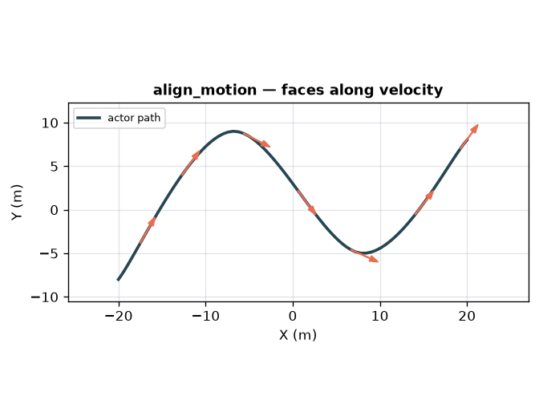 | Points the actor's +X forward axis along physical velocity. |
| `look_at` | 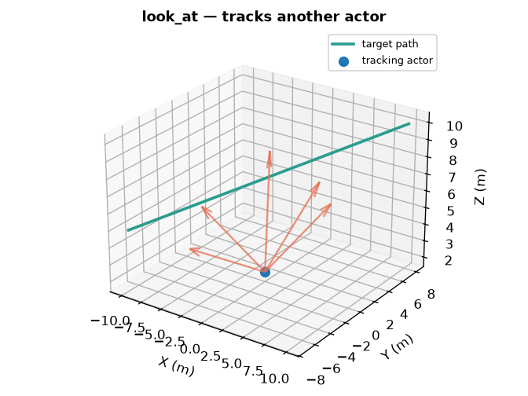 | Points +X toward another actor or a fixed point. |
| `spin` | 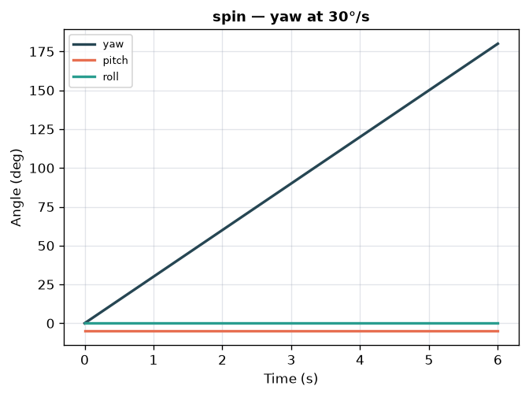 | Rotates one selected yaw, pitch, or roll axis at a constant rate. |
| `random` | 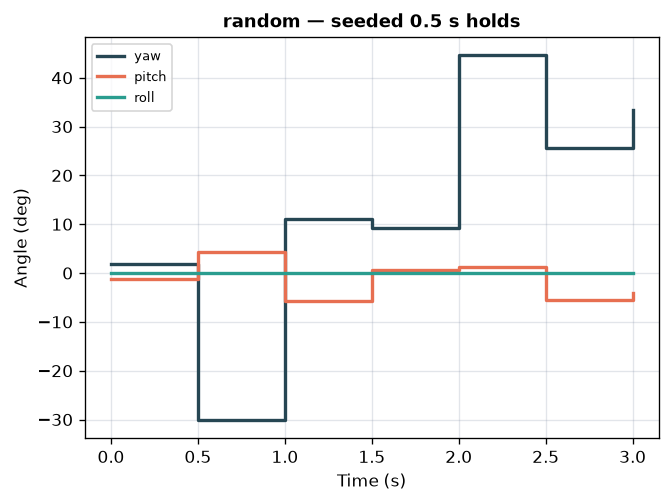 | Seeded bounded samples, optionally held for `update_interval_s`. |

Orientation is prepared in quaternion space. Euler angles are exposed only at
interfaces that require yaw, pitch, and roll.

### Fixed And Keyframes

```yaml
orientation:
  type: fixed
  yaw_deg: 45.0
  pitch_deg: -10.0
  roll_deg: 0.0
```

```yaml
orientation:
  type: keyframes
  keyframes:
    - {time_s: 0.0, yaw_deg: 0.0, pitch_deg: 0.0, roll_deg: 0.0}
    - {time_s: 3.0, yaw_deg: 90.0, pitch_deg: -15.0, roll_deg: 0.0}
    - {time_s: 6.0, yaw_deg: 180.0, pitch_deg: 0.0, roll_deg: 0.0}
```

Keyframe times must be nonnegative and increase strictly.

### Align With Motion

```yaml
orientation:
  type: align_motion
  allow_pitch: false
  smoothing_time_s: 0.2
  yaw_offset_deg: 0.0
```

`align_motion` requires meaningful movement. Optional smoothing and maximum
yaw/pitch rates limit abrupt changes while preserving deterministic output.

### Look At

Track another actor by globally unique name:

```yaml
orientation:
  type: look_at
  actor: PatrolTarget
  allow_pitch: true
```

Or track a fixed point:

```yaml
orientation:
  type: look_at
  point_m: [0.0, 0.0, 10.0]
```

Exactly one of `actor` and `point_m` is required. Smoothing, rate limits,
offsets, and yaw/pitch limits are optional.

### Spin And Random

```yaml
orientation:
  type: spin
  axis: yaw
  rate_deg_s: 30.0
  pitch_deg: -5.0
```

```yaml
orientation:
  type: random
  seed: 7
  yaw_range_deg: [-45.0, 45.0]
  pitch_range_deg: [-10.0, 10.0]
  roll_range_deg: [0.0, 0.0]
  update_interval_s: 0.5
```

## Target Asset Alignment

A catalog target can declare its modeled front direction in
`target_metadata.json`. ORCHAV combines that asset alignment with the actor's
orientation before generation or preview. The
[bundled walking target](../../libraries/targets/nist_human_walking/README.md)
shows a mesh whose visual front needs a `180 deg` yaw offset.

## Runnable Examples

- [Actor Mobility](../../scenarios/generator/mobility_and_orientation/actor_mobility/README.md)
- [Actor Orientation](../../scenarios/generator/mobility_and_orientation/actor_orientation/README.md)
- [Mesh Targets](../../scenarios/generator/targets/mesh_targets/README.md)
- [Multi-Device Trajectory](../../scenarios/visualizer/multi_device_trajectory/README.md)

---

Up: [Generator](README.md) | Previous: [Simulation Configuration](configuration.md) | Next: [Summary and Coverage Figures](generated_figures.md)
