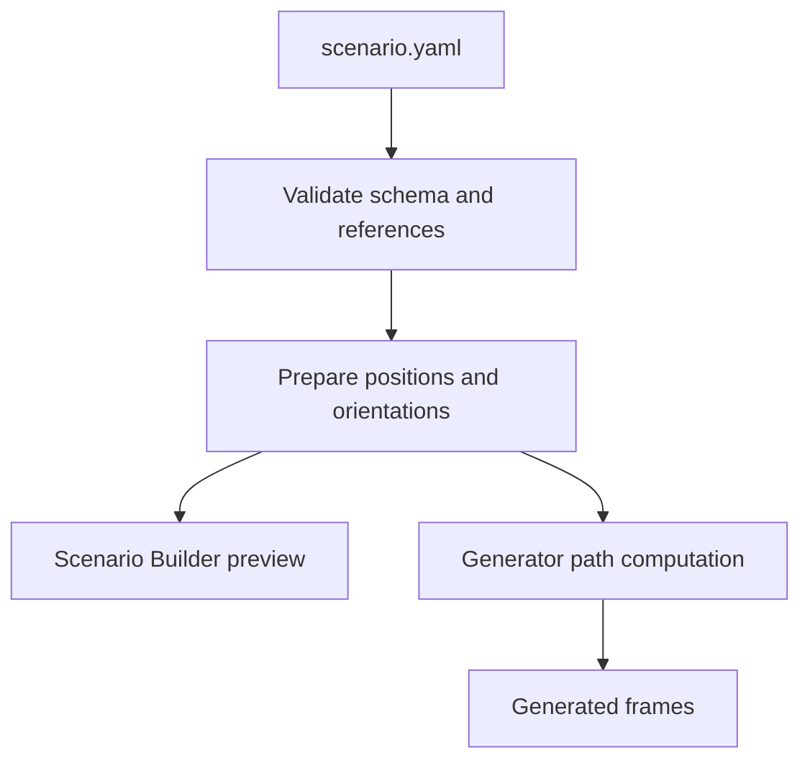

# Scenario Authoring

An ORCHAV scenario is a directory built around `scenario.yaml`. The YAML
selects a scene, defines one shared timeline, declares actors, and includes
only the simulation or output settings that differ from the defaults. ORCHAV
validates and prepares that configuration before asking
[Sionna RT](https://nvlabs.github.io/sionna/) to compute propagation paths.

YAML-only authoring is the normal path. Add `generate.py` only when actor
specifications must be calculated in Python, such as from an external data
source, a parameterized equation, or a generated case list.

## Scenario Directory

```text
my_scenario/
|-- scenario.yaml       # required scenario definition
|-- README.md           # recommended explanation and running instructions
|-- generate.py         # optional Python-scripted actor construction
|-- frames/             # generated HDF5 frame set
|-- summary/            # optional diagnostic figures
`-- coverage/           # optional coverage-map data
```

The input files are portable. `frames/`, `summary/`, and `coverage/` are local
products that can be regenerated. Generated frames can be opened in the
[Visualizer](../visualizer/README.md), inspected from the terminal, or loaded
from Python through a
[frame provider](../reference/glossary.md#frame-provider)
and the [statistics helpers](../shared/statistics.md). They can also be rendered
in Jupyter through
[Notebook Visualization](../visualizer/notebooks.md).

## Start With YAML

The smallest generated scenario contains one stationary transmitter and one
stationary receiver. This example selects `ultra-low` so an introductory run
finishes quickly. Omit the quality block to use the normal `low` default.

```yaml
schema_version: 2

scene:
  source: sionna
  id: etoile

timeline:
  steps: 1
  duration_s: 0.0

raytracing:
  enabled: true
  quality:
    preset: ultra-low

actors:
  tx:
    - name: TX1
      mobility:
        type: stationary
        position_m: [-114.0, 37.0, 30.0]
  rx:
    - name: RX1
      mobility:
        type: stationary
        position_m: [-27.18, -12.61, 1.5]
```

`schema_version: 2` identifies the supported `scenario.yaml` format. It is not
the ORCHAV product version or frame-format version. Keep it at `2`. See
[Versions and Compatibility](../reference/compatibility.md#scenario-yaml) for
the compatibility map.

Positions are `[x, y, z]` values in meters. Put transmitters under `actors.tx`,
receivers under `actors.rx`, and mesh-backed targets under `actors.targets`.
Actor names are globally unique. Position belongs to the actor's mobility
model, including for a stationary actor. Orientation is optional and defaults
to zero yaw, pitch, and roll.

Most scenarios use four sections:

| Section | Responsibility |
|---|---|
| `scene` | Select the environment used by generation and visualization. |
| `timeline` | Set the sample count and duration shared by every actor. |
| `actors` | Declare transmitters, receivers, and optional targets. |
| `raytracing` | Enable and configure propagation-path computation. |

Add `groups`, `coverage`, `generator_summary`, `data`, `view_defaults`, or
`visualizer` only when the workflow needs them. The
[Scenario YAML Reference](../reference/scenario_yaml.md) is the canonical list
of exact fields, defaults, allowed values, and constraints.

## Validate, Generate, and Inspect

From the repository root:

```bash
orchav-validate scenarios/my_scenario/
orchav-generator scenarios/my_scenario/
orchav-inspect scenarios/my_scenario/ --frame 0
orchav-visualizer --scenario scenarios/my_scenario/
```

Explicit validation is optional because the Generator and Visualizer validate
a scenario when they load it. It is recommended after editing YAML because it
reports unknown fields, invalid model types, duplicate names, unresolved actor
references, invalid numeric values, and missing inputs before ray tracing
starts. [Scenario Validation](../reference/scenario_validation.md) explains
normal, strict, and resolved-configuration checks.

Before either preview or generation, ORCHAV samples every actor's mobility and
orientation on the scenario timeline. The
[Scenario Builder](scenario_builder.md) previews those prepared poses, and the
Generator uses the same preparation at every generated step:



## Add Motion

Every actor has one mobility model. Position is part of that model, so the
initial pose remains unambiguous for stationary and moving actors.

```yaml
timeline:
  steps: 30
  duration_s: 3.0

actors:
  rx:
    - name: WalkingRX
      mobility:
        type: linear
        start_m: [-10.0, 0.0, 1.5]
        end_m: [10.0, 0.0, 1.5]
      orientation:
        type: align_motion
        allow_pitch: false
```

This receiver traverses the complete line over the scenario duration and faces
its direction of travel. [Mobility and Orientation](mobility_and_orientation.md)
owns timeline sampling, traversal, groups, every built-in mobility model, and
orientation semantics.

## Add A Target

Targets are actors whose `asset` supplies mesh geometry and radio material.
Their mobility and orientation determine where the mesh is placed and which
way it faces at every timeline step.

```yaml
actors:
  targets:
    - name: ParkedCar
      asset:
        source: catalog
        id: car
        material_type: metal
        scale: 1.0
      mobility:
        type: stationary
        position_m: [5.0, -8.0, 0.79]
      orientation:
        type: fixed
        yaw_deg: 90.0
```

An asset may come from the included catalog, one mesh file, or a directory and
pattern for a mesh sequence. Keep scenario-local paths relative to the scenario
directory and shared-library paths relative to the repository root.

## Refer To Another Actor

Orientation and group relationships use globally unique names. For example, a
stationary transmitter can track a moving receiver:

```yaml
actors:
  tx:
    - name: TrackingTX
      mobility:
        type: stationary
        position_m: [0.0, 0.0, 10.0]
      orientation:
        type: look_at
        actor: WalkingRX
```

Validation rejects unresolved, ambiguous, and self references. Renaming an
actor in the Scenario Builder updates references before saving.

## Choose An Authoring Surface

| Need | Surface |
|---|---|
| Declarative scenes, actors, motion, targets, and normal outputs | `scenario.yaml` |
| Visual creation using the supported schema | [Scenario Builder](scenario_builder.md) |
| Calculated actors, preprocessing, generated cases, or custom equations | `generate.py` |

The Scenario Builder writes the same validated YAML used by command-line
generation. It preserves recognized settings outside its editable surface.

## Python-Scripted Actors

A scripted scenario loads the normal YAML configuration, calculates actor
specifications, and passes them to the same Generator pipeline:

```python
from pathlib import Path

from generator import build_simulation_config, perform_pipeline
from shared.scenarios import load_scenario_configuration
from shared.scenarios.actors import (
    ActorsSpec,
    RxActorSpec,
    StationaryMobilitySpec,
    TxActorSpec,
)

scenario_dir = Path(__file__).parent
scenario = load_scenario_configuration(scenario_dir)
simulation = build_simulation_config(scenario)
rx_radius_m = 10.0
rx_position_m = (rx_radius_m, 0.4 * rx_radius_m, 1.5)

actors = ActorsSpec(
    tx=(
        TxActorSpec(
            name="TX1",
            mobility=StationaryMobilitySpec(position_m=(0.0, 0.0, 10.0)),
        ),
    ),
    rx=(
        RxActorSpec(
            name="RX1",
            mobility=StationaryMobilitySpec(position_m=rx_position_m),
        ),
    ),
)

perform_pipeline(
    simulation_config=simulation,
    scenario_configuration=scenario,
    actors=actors,
)
```

The supplied actors replace the YAML actor collection for that invocation.
They still use the YAML timeline and the same mobility, orientation, reference,
and runtime validation. See
[Hello World Scripted](../../scenarios/getting_started/hello_world_scripted/README.md)
for a runnable calculated trajectory.

## Continue

- [Simulation Configuration](configuration.md) explains scene selection,
  ray-tracing settings, antennas, materials, path filtering, and coverage.
- [Mobility and Orientation](mobility_and_orientation.md) covers pose models and
  group motion.
- [Summary and Coverage Figures](generated_figures.md) covers standalone images
  written beside generated data.
- [Generator Scenarios](../../scenarios/generator/README.md) provides runnable
  examples organized by learning track.

---

Up: [Generator](README.md) | Next: [Simulation Configuration](configuration.md) | Related: [Scenario YAML Reference](../reference/scenario_yaml.md)
