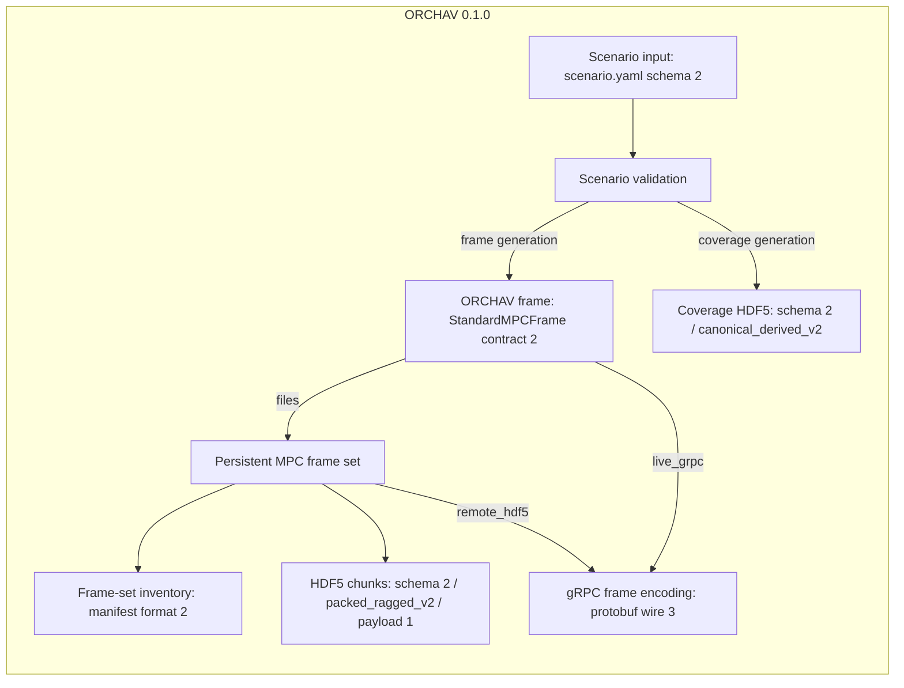

# Versions and Compatibility

ORCHAV `0.1.0` is a software release. The scenarios it reads, the frames it
creates, the files it stores, and the messages it sends each have their own
format identifier. An identifier applies only to the artifact or interface
named beside it.

Most users set only one of these values: every `scenario.yaml` contains
`schema_version: 2`. ORCHAV writes and validates the identifiers in generated
frames, HDF5 files, manifests, coverage files, and gRPC messages.

## Compatibility Map

Read the map from top to bottom. The scenario schema identifies the authored
YAML accepted by validation. Generation can create ORCHAV frames, a coverage
grid, or both. A frame can be stored as an HDF5 frame set or encoded for a gRPC
connection. Each representation has its own compatibility marker.



The arrows represent validation or transformation between contracts. They do
not mean that connected formats share one version sequence.

## Current Identifiers

| Artifact or boundary | Identifier | Current value | What it identifies |
|----------------------|------------|---------------|--------------------|
| ORCHAV software | Package and release version | `0.1.0` | The Generator, Visualizer, shared packages, documentation, and included scenarios released together. It is not written into every data format as a compatibility test. |
| `scenario.yaml` | Root `schema_version` | `2` | The accepted structure and meaning of authored scenario YAML. |
| In-memory ORCHAV frame | `StandardMPCFrame.version` | `2` | The source-independent fields, arrays, shapes, units, and validation rules for one frame. |
| `frames_manifest.json` | `manifest_version` | `2` | The JSON frame-set inventory and metadata document. |
| MPC HDF5 chunk | `schema_version` | `2` | The ORCHAV groups, datasets, and attributes in each HDF5 chunk. The manifest repeats this value to advertise the chunks it owns. |
| MPC HDF5 chunk | `storage_layout` | `packed_ragged_v2` | The exact packed, ragged organization used inside the chunks. The manifest repeats this layout marker. |
| Packed HDF5 chunk payload | `packed_frame_version` | `1` | The compact-array vocabulary stored in an HDF5 chunk. This is not the in-memory frame-contract version. |
| Frame data sent over gRPC | `wire_format_version` | `3` | The protobuf encoding used by Live Generator and Remote HDF5 Playback. It is unrelated to protobuf's `proto3` syntax or package version. |
| Coverage HDF5 file | `coverage_schema_version` and `coverage_storage_layout` | `2` and `canonical_derived_v2` | The separate grid, transmitter, metric, solver, and metadata layout used by coverage output. |

The repeated `2` values do not make these artifacts the same format. For
example, a `StandardMPCFrame` contract at version `2` is correctly stored with
packed payload version `1` and sent with protobuf wire version `3`. The one
intentional duplication is within a frame set: its manifest advertises the
same HDF5 schema and storage layout required from its chunks.

<a id="scenario-yaml"></a>

## Scenario YAML: The Version You Set

Keep this at the root of every scenario:

```yaml
schema_version: 2
```

ORCHAV checks it before using the rest of the scenario. A missing or
unsupported value stops validation, generation, and visualization rather than
being guessed or converted. Do not increment it when you add fields to your
own scenario. ORCHAV changes this number only when the supported YAML contract
changes.

Validate the scenario before running it:

```bash
orchav-validate path/to/scenario
```

See the [Scenario YAML Reference](scenario_yaml.md) for the current fields and
[Scenario Authoring](../generator/scenario_authoring.md) for complete examples.

## Generated Data: Versions ORCHAV Sets

ORCHAV writes the frame, manifest, HDF5, coverage, and protobuf identifiers.
They are compatibility checks, not configuration choices:

- A frame-set reader verifies the manifest, HDF5 schema, storage layout, and
  packed payload before returning frame data.
- The protobuf decoder requires wire version `3`. There is no version
  negotiation or fallback. Use compatible client and server installations,
  preferably from the same ORCHAV release.
- The coverage reader verifies its separate schema and storage layout before
  loading coverage metrics.

Do not repair an incompatibility by editing generated JSON, HDF5 attributes,
or protobuf fields. Regenerate frame or coverage output with the current
Generator when the scenario inputs are available. An external frame producer
must adapt its data to the current `StandardMPCFrame` contract and write it
through the current frame-set interfaces.

## Scenario Builder Marker

The Scenario Builder may add
`visualizer.scenario_builder.document_version: 2` when it saves a scenario.
This component-owned marker is separate from the root scenario schema. A
hand-authored scenario does not need to add it. The Builder opens an
unsupported document version read-only. See
[Scenario Builder](../generator/scenario_builder.md).

Disposable cache and session files may have component-owned schema counters
that are recreated or handled by their owning tools. They are not public data
exchange contracts and are intentionally outside this map.

## Related Details

- [Scenario YAML Reference](scenario_yaml.md)
- [Scenario Validation](scenario_validation.md)
- [Frame Contract](../shared/frame_reference.md#frame-contract)
- [HDF5 Frame Layout](../shared/frame_reference.md#hdf5-frame-layout)
- [Technical Delivery Routes](../shared/frame_reference.md#technical-delivery-routes)
- [Coverage Maps](../concepts/propagation.md#coverage-maps)

Home: [Documentation](../README.md)
