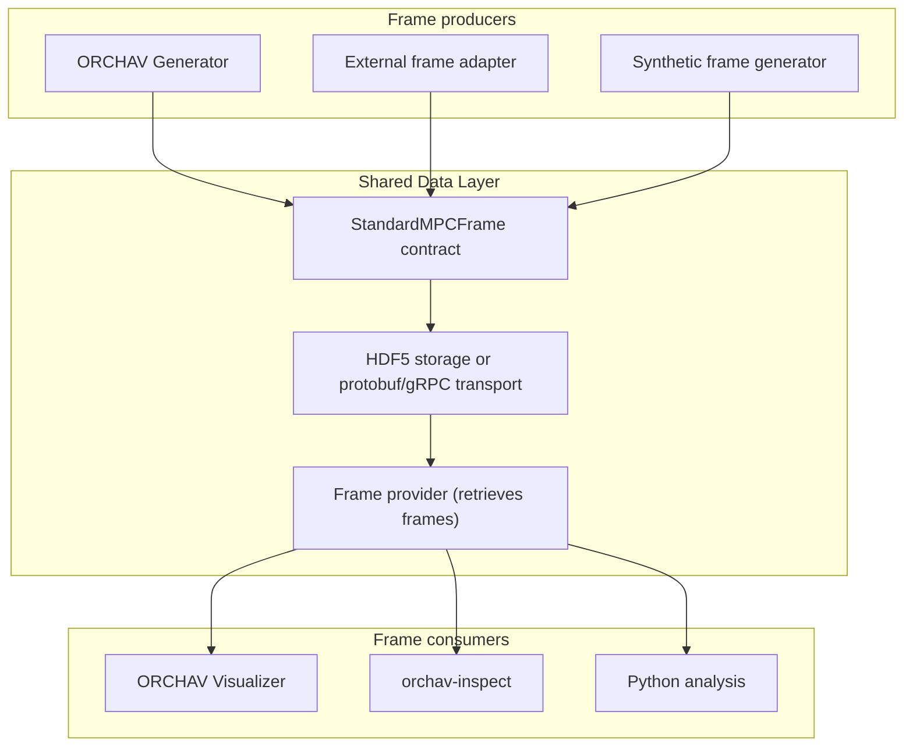

# Shared Data Layer

A [frame](../reference/glossary.md#frame) moves from a
[producer](../reference/glossary.md#producer) to one or more
[consumers](../reference/glossary.md#consumer) through the Shared Data Layer.
The layer keeps that handoff consistent: the same generated frame can be
saved, reopened in the Visualizer, inspected from the command line, or analyzed
in Python.

The layer represents each frame with the source-independent
`StandardMPCFrame` contract, stores frame sets in HDF5, carries live or remote
frames over protobuf/gRPC, and gives consumers a common way to retrieve them. A
[frame provider](../reference/glossary.md#frame-provider) is the software interface
that retrieves a requested frame from one of these routes.

## Producer, Shared Data Layer, And Consumer Roles

The ORCHAV Generator is the primary frame producer. External adapters and the
included synthetic generator can produce the same contract without running the
Generator pipeline. Once a producer creates a frame, consumers use Shared Data
Layer interfaces rather than [Sionna RT](https://nvlabs.github.io/sionna/)
tensors or source-specific records.

HDF5 is the durable representation used for local playback, inspection,
analysis, and remote serving. Protobuf is the wire representation used over
gRPC. Both carry or reconstruct the same ORCHAV frame contract. Neither is a
second simulation model. See the [Frame Data Reference](frame_reference.md)
for the exact delivery routes, frame fields, HDF5 layout, and provider behavior.

## Choose A Data Mode

The Visualizer's `data.mode` selects how frames reach it. Start with `files`
unless frames must be computed on demand or remain on another machine.

| Data mode | Choose it when | Durable frame data | Interactive recomputation |
|-----------|----------------|--------------------|---------------------------|
| Local HDF5 Playback (`files`) | You want the default reproducible workflow: generate once, inspect offline, analyze in Python, or share a frame set. | An HDF5 frame set under `frames/`. | Optional **Local What-if Preview** for the current step with pygfx and a local Sionna RT installation. The temporary result is not saved. |
| Live Generator (`live_grpc`) | You want frames on demand and temporary actor or ray-tracing changes while a Generator is running. | Session caches only. No HDF5 frame set is written. | Yes. Supported changes travel to the Generator over gRPC, which recomputes requested frames. |
| Remote HDF5 Playback (`remote_hdf5`) | You want to view a fixed frame set through a server without copying it to the Visualizer machine. | The server-side HDF5 frame set remains authoritative. | No. The frame-file service is read-only and does not run ray tracing. |

The synthetic benchmark generator and external ray-tracer import example are
alternative producers, not additional data modes. Both write a normal HDF5
frame set and then use `files` for playback, inspection, and analysis.

Use the runnable [Data Mode Scenarios](../../scenarios/visualizer/data_modes/README.md)
for complete commands and minimal YAML. See
[Interactive Recomputation](../visualizer/interactive_recomputation.md)
for Local What-if Preview and Live Generator edit behavior.

## Choose A Shared-Data Task

| Goal | Start with |
|------|------------|
| Check generated frames without opening the Visualizer | [Frame Inspection](frame_inspection.md) |
| Load a generated HDF5 frame from Python | [Frame Data Reference](frame_reference.md#minimal-hdf5-frame-provider-example) |
| Calculate channel statistics from frame arrays | [Statistics Helpers](statistics.md) |
| Understand frame fields, HDF5 storage, selected-field views, or how frames are retrieved | [Frame Data Reference](frame_reference.md) |
| Import solved paths from another propagation tool | [External Ray-Tracer Import](frame_reference.md#external-ray-tracer-import) |
| Validate `scenario.yaml` | [Scenario Validation](../reference/scenario_validation.md) |
| Configure desktop Visualizer scene/Open3D IBL locations or network endpoint defaults | [Application Configuration](../reference/application_configuration.md) |
| Change diagnostic output | [Logging](../reference/logging.md) |
| Create repeatable high-density test frames | [Synthetic Frame Generation](synthetic_frames.md) |

## Developer Details

For component ownership, package boundaries, stable interfaces, and extension
points, see the [Developer Architecture](../development/architecture.md).

---

Home: [Documentation](../README.md) | Related: [Frame Data Reference](frame_reference.md) | [Developer Architecture](../development/architecture.md)
