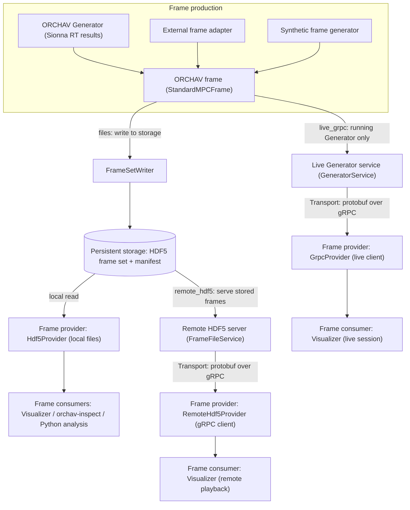

# Frame Data Reference

This reference defines ORCHAV's in-memory frame contract, technical delivery
routes, HDF5 layout, frame retrieval, and selected-field views. ORCHAV calls
the common retrieval interface a
[frame provider](../reference/glossary.md#frame-provider). Start with the [Shared Data
Layer](README.md) when choosing a data mode or learning how producers, the
Shared Data Layer, and consumers fit together.

For exact scenario YAML fields, use the generated
[Scenario YAML Reference](../reference/scenario_yaml.md).

Use this page according to the task at hand:

| Goal | Go to |
|------|-------|
| Choose local files, Live Generator, or remote playback | [Choose a Data Mode](README.md#choose-a-data-mode) |
| Follow the exact writer, service, transport, and frame-provider routes | [Technical Delivery Routes](#technical-delivery-routes) |
| Compare standard frames with selected-field views | [Standard Frames and Selected-Field Views](#standard-frames-and-selected-field-views) |
| Load local HDF5 frames from Python | [Minimal HDF5 Frame Provider Example](#minimal-hdf5-frame-provider-example) |
| Render local HDF5 frames in Jupyter | [Notebook Visualization](../visualizer/notebooks.md) |
| Understand the in-memory frame fields | [Frame Contract](#frame-contract) |
| Import solved paths from external software | [External Ray-Tracer Import](#external-ray-tracer-import) |
| Inspect the persisted HDF5 representation | [HDF5 Frame Layout](#hdf5-frame-layout) |

<a id="mpc-frame-boundary-map"></a>

<a id="how-frames-move-through-orchav"></a>

## Technical Delivery Routes

Each producer converts its source data into the same `StandardMPCFrame`
contract. For the ORCHAV Generator, that source data is the output from
[Sionna RT](https://nvlabs.github.io/sionna/). The resulting ORCHAV frame then
follows a storage or transport route to a frame provider and then a consumer.
The frame provider retrieves the frame for the consumer. All included producers
can write HDF5. Only a running ORCHAV Generator exposes the `live_grpc` route.



`StandardMPCFrame` names the in-memory data contract. HDF5 stores that frame.
Protobuf encodes it for transport over gRPC. They are representations of the
same ORCHAV frame, not additional frame contracts. Sionna RT scene, path, and
CIR objects stay inside the Generator, so downstream tools do not depend on
backend-specific objects.

The HDF5 branch splits because the same stored frame set supports two access
paths. `Hdf5Provider` opens it directly for local use. For remote playback,
`FrameFileService` uses its own `Hdf5Provider` to open it on the server, then
sends frames over gRPC to the client-side `RemoteHdf5Provider`. That client
does not open the server's HDF5 files itself.

<a id="frame-flow-vocabulary"></a>

### Frame-flow Vocabulary

| Term | Meaning in ORCHAV |
|------|-------------------|
| **Frame producer** | Code that creates a `StandardMPCFrame`. The ORCHAV Generator is the primary producer. An external adapter or synthetic frame generator can be an alternative producer. |
| **Frame contract** | The source-independent structure of one ORCHAV frame, represented by `StandardMPCFrame`. |
| **Delivery route** | The user-visible path selected by `data.mode`: local HDF5, Live Generator, or remote HDF5. |
| **Frame provider** | The software interface that retrieves frames from one delivery route for a consumer. The included implementations are `Hdf5Provider`, `GrpcProvider`, and `RemoteHdf5Provider`. |
| **Frame consumer** | A tool that uses frames, such as the Visualizer, `orchav-inspect`, or a Python analysis script. A consumer need not support every provider. For example, `orchav-inspect` reads HDF5 frame sets. |

<a id="complete-frames-and-selective-reads"></a>

## Standard Frames and Selected-Field Views

`StandardMPCFrame` is ORCHAV's normal frame object. Every required core field
is present. Empty arrays and validity flags represent data that is absent for a
particular step. This does not mean that every optional metadata or extension
payload is populated. A selected-field view instead contains only the logical
components requested by a consumer.

Here, **projection** means a selected-field data view. It is unrelated to a
camera projection or a 2D/3D rendering view.

| Operation | Return value | Use |
|-----------|--------------|-----|
| `provider.load_frame(step)` | One `StandardMPCFrame` with every required core field. | Use when code needs the standard interoperable frame contract. |
| `provider.load_frame_projection(step, request)` | A `FrameProjection` containing a partial `ProjectedMPCFrame` plus an exact inventory of loaded components and metrics. | Use when a consumer needs only selected logical fields, such as topology and delay metrics. |

A `ProjectedMPCFrame` is deliberately partial and is not a partially valid
`StandardMPCFrame`. Its inventory makes the fields resident in memory
explicit, so it cannot be mistaken for a `StandardMPCFrame` that is safe to
store or send.

`Hdf5Provider` can satisfy a selected-field request by reading only the needed
HDF5 datasets. `GrpcProvider` and `RemoteHdf5Provider` receive and decode a
`StandardMPCFrame` first, then form the selected-field view in memory. Selective
reads therefore reduce HDF5 I/O and consumer memory when applicable, but they
do not reduce network transfer in ORCHAV 0.1.

## Frame Contract

`StandardMPCFrame` is the source-independent in-memory object shared by frame
producers, the Shared Data Layer, and consumers. It is defined in
`shared/frames/types.py` and validated by `shared/frames/schema.py`. The
Generator converts Sionna RT results into this contract before writing HDF5 or
serving frames over gRPC.

Every valid frame has these core fields. Empty axes are represented by empty
arrays, not by omitted attributes.

| Field | Shape | Unit | Meaning |
|-------|-------|------|---------|
| `version` | scalar | compatibility identifier | Frame-contract version. ORCHAV 0.1 accepts `2`. |
| `frame_index` | scalar | index | Non-negative frame ID. |
| `recomputed_from_stored_positions` | scalar | boolean | Whether actor state was reconstructed from stored positions. |
| `tx_rx_pairs` | `(Q, 2)` `int32` | index | Ordered TX/RX pair mapping. |
| `pair_path_offsets` | `(Q + 1,)` `int64` | index | Adjacent values select each pair's paths. |
| `bounce_offsets` | `(P + 1,)` `int64` | index | Adjacent values select each path's physical bounces. |
| `tx_positions` | `(N_tx, 3)` | m | Transmitter positions. |
| `rx_positions` | `(N_rx, 3)` | m | Receiver positions. |
| `tx_orientations`, `rx_orientations` | `(N, 3)` | rad | Device orientation as yaw, pitch, roll. |
| `tx_names`, `rx_names` | length `N` | text | Device names aligned with the position axes. |
| `bounce_xyz_m` | `(B, 3)` `float32` | m | Physical bounce-point coordinates. |
| `interactions` | `(B,)` `uint8` | code | Positive physical interaction code for each bounce. |
| `material_ids` | `(B,)` `uint16` | index | Material-catalog row for each bounce. |
| `material_names`, `material_itu_types` | length `M` | text | Material catalog. Row zero is the empty material. |
| Six path metric arrays | `(P,)` `float32` | mixed | Delay, loss, and AoA/AoD values aligned with paths. |
| `metric_valid_bits` | `(P,)` `uint8` | bitset | Identifies which metric values are available. |
| `target_positions_m` | `(T, 3)` `float64` | m | Target positions. Empty when there are no targets. |
| `targets_metadata` | length `T` | mapping | Metadata aligned with target positions. |

The six metric attributes are `delays_ns`, `path_loss_db`, `aoa_az_deg`,
`aoa_el_deg`, `aod_az_deg`, and `aod_el_deg`. They are always path-aligned.
An unavailable value is `NaN` and has its validity bit cleared. Optional
metadata consists of `timestamp_s`, `beamforming`, `provenance`, and extension
payloads. Count properties such as `num_tx`, `num_pairs`, and `num_paths` are
derived from the compact arrays.

`StandardMPCFrame` is structurally immutable. Its direct constructor validates
canonical dtypes and shapes without copying supplied NumPy arrays, so producers
must treat those buffers as immutable after construction.

<a id="frame-schema"></a>

### Units and Validation

Units and conventions:

| Field family | Unit or convention |
|--------------|--------------------|
| Positions and vertices | meters |
| Orientations | `(yaw, pitch, roll)` in radians after YAML conversion |
| Delays | nanoseconds |
| Path loss | decibels |
| AoA/AoD | degrees |
| Missing metrics | the validity bit is clear and the numeric value is `NaN` |
| Paths without bounces | Adjacent `bounce_offsets` are equal. A LoS path has no physical bounce row. |

Validate `StandardMPCFrame` objects at component boundaries with
`shared.frames.schema`:

```python
from shared.frames.schema import validate_standard_mpc_frame

errors = validate_standard_mpc_frame(frame, raise_on_error=False)
```

Use `orchav-inspect` for a terminal summary of generated HDF5 frames:

```bash
orchav-inspect scenarios/getting_started/hello_world --frame 0
```

## HDF5 Frame Layout

Generation in the `files` data mode writes packed HDF5 chunks under `frames/` plus one
authoritative `frames_manifest.json`. The manifest lists the exact chunks and
frame IDs, records stable generation and frame-set identities, and lets a
frame provider start without opening every HDF5 file.

The manifest uses `manifest_version: 2`. It and the chunks advertise ORCHAV
HDF5 frame schema `2` and storage layout `packed_ragged_v2`. Each chunk also
carries packed payload version `1`. ORCHAV writes and checks these values
automatically. [Versions and Compatibility](../reference/compatibility.md) explains how
they relate to the separate scenario, in-memory frame, coverage, and gRPC
identifiers.

```text
frames/
|-- frames_manifest.json
|-- mpc_frames_00000-00099.h5
`-- mpc_frames_00100-00199.h5
```

Each HDF5 chunk stores frame-level state by row and uses two ragged index
levels:

- `index/frame_pair_path_offsets` maps a frame and TX/RX pair to its path rows.
- `paths/bounce_offsets` maps each path to its physical interaction points.

Paths, metrics, and bounces are therefore stored without maximum-path or
maximum-bounce padding.

```text
mpc_frames_00000-00099.h5
|-- attrs: schema_version=2, packed_frame_version=1,
|          storage_layout="packed_ragged_v2"
|-- static/             TX/RX topology, names, material catalog
|-- frames/             IDs, device state, per-frame JSON metadata
|-- index/              frame-to-path and frame-to-target offsets
|-- paths/              one row per path, including six metric columns
|-- bounces/            one row per physical interaction point
`-- targets/            ragged target positions and metadata
```

The six metrics are stored once per path. A validity bitset distinguishes
missing values from legitimate zero values. Geometry, interactions, materials,
metrics, targets, and recognized extension products can be requested
independently. A consumer that needs only metrics or graph topology can omit
bounce coordinates.

`data.files.chunk_size` must be positive. It is a requested upper bound.
Generation also enforces a 100-frame hard limit, an approximately 256 MiB
uncompressed-payload limit, and topology or extension-layout boundaries.

`FrameSetWriter.finalize()` makes a new frame set visible only after all chunks
and its manifest are complete and validated. If regeneration fails, the
previous complete `frames/` directory remains available.

Use [Frame Inspection](frame_inspection.md) to list available frames or
inspect a generated chunk without writing custom HDF5-reading code.

## Generator Outputs

The Generator supports:

| Output | Use |
|--------|-----|
| HDF5 frame chunks | Default reproducible output for visualization, inspection, and external analysis. |
| Live Generator (gRPC) delivery | Frames computed by a running Generator and delivered on request for a Visualizer session. |
| Summary products | Scenario-specific diagnostic figures and coverage outputs when enabled. |

The Generator does not use `remote_hdf5` as an output strategy. Remote HDF5 is
a Visualizer data mode that serves an existing HDF5 frame set.

<a id="data-providers"></a>

## Frame Providers

The Shared Data Layer exposes `DataProvider`, the common frame-provider interface.
Consumers therefore do not need to know whether an ORCHAV frame came from local
files, a running Generator, or a remote frame server.

| Frame provider | Source | Frame result |
|----------|--------|--------------|
| `Hdf5Provider` | Local manifest-driven HDF5 frame set written through `FrameSetWriter`. | `StandardMPCFrame` loaded from HDF5. |
| `GrpcProvider` | Live Generator gRPC service. | `StandardMPCFrame` decoded from `FrameData.standard_mpc_frame`. |
| `RemoteHdf5Provider` | Frame-file service reading an existing HDF5 frame set. | `StandardMPCFrame` decoded from `PreGeneratedFrameResponse.frame_data`. |

Synthetic benchmark and example scripts are frame producers: they create
`StandardMPCFrame` objects and write normal HDF5 frame sets. There is
no separate synthetic frame provider or synthetic data mode.

For selected-field behavior, see
[Standard Frames and Selected-Field Views](#standard-frames-and-selected-field-views).
The common frame-provider interface does not imply that every storage extension is
available over every transport. Protobuf encoding rejects unsupported
extension payloads so data cannot be silently lost. Use local `Hdf5Provider`
for a frame set containing an extension that the wire format does not support.

### Minimal HDF5 Frame Provider Example

The example below covers local HDF5 retrieval. For calculations on the loaded
arrays, see [Statistics Helpers](statistics.md). For 3D output in Jupyter, see
[Notebook Visualization](../visualizer/notebooks.md).

`Hdf5Provider` loads generated frames into the same `StandardMPCFrame` objects
used by ORCHAV's Visualizer and analysis code. After generating
[Hello World](../../scenarios/getting_started/hello_world/README.md), pass its
scenario directory, which contains `frames/`, rather than opening physical
HDF5 datasets directly:

```python
from shared.frames.providers import Hdf5Provider

with Hdf5Provider("scenarios/getting_started/hello_world") as provider:
    print(provider.list_frames())
    frame = provider.load_frame(0)

print(f"paths: {frame.num_paths}")
print(frame.tx_names)
print(frame.rx_names)
```

Use `provider.list_frames()` to discover available frame indices before
loading a sequence. Before calculating a link-specific result, select the
link's path range with `tx_rx_pairs` and `pair_path_offsets`. The
[statistics helpers](statistics.md#analyze-one-link-in-python) provide a
worked one-link example and describe the available metrics and units.
[`orchav-inspect`](frame_inspection.md) is the simpler choice when a terminal
summary is sufficient.

## External Ray-Tracer Import

An external propagation tool does not need to understand ORCHAV's Generator or
HDF5 internals. Keep its source data in any convenient format, then add a small
frame-producing adapter that creates one `StandardMPCFrame` per time step:

1. Read the external software's TX/RX state, paths, bounces, metrics, and
   optional metadata.
2. Construct `StandardMPCFrame` directly when the data is already compact, or
   use `standard_mpc_frame_from_pair_data()` for per-pair padded or ragged
   source arrays.
3. Append the frames to `FrameSetWriter.create_new(destination)` and call
   `finalize()`.
4. Open the resulting frame directory through `Hdf5Provider`, the Visualizer,
   or `orchav-inspect`.

`create_new()` requires an absent destination whose parent already exists. It
will not replace a scenario's generated `frames/` directory. This makes import
output explicit and prevents a failed or accidental import from damaging an
existing frame set.

No new `DataProvider` or Generator integration is needed for this route: the
adapter is the frame producer, `StandardMPCFrame` is the interoperability
contract, and `FrameSetWriter` writes ORCHAV's normal HDF5 frame set. The
external ray tracer runs independently and hands solved records to the adapter.
Add a format-specific reader and frame provider only when ORCHAV must read and
retain a different on-disk format directly.

See the
[external ray-tracer import example](../../examples/external_raytracer_import/README.md)
for a minimal runnable adapter.

## Remote HDF5 Server

The frame-file server reads a completed manifest-driven HDF5 frame set. It
does not rerun ray tracing or modify the files. It holds one fixed snapshot.
Stop it before regenerating the scenario, then restart it for the new frame
set.

The runnable
[Remote HDF5 Playback scenario guide](../../scenarios/visualizer/data_modes/remote_hdf5/README.md)
contains the server and Visualizer commands, port and host options, and the
safe restart workflow.

Live Generator (gRPC) and Remote HDF5 Playback are intended for trusted
workstations, lab machines, SSH tunnels, or private networks. They do not
provide Internet-facing authentication or authorization.

---

Home: [Documentation](../README.md) | Related: [Developer Architecture](../development/architecture.md) | [Frame Inspection](frame_inspection.md) | [Data Mode Scenarios](../../scenarios/visualizer/data_modes/README.md)
