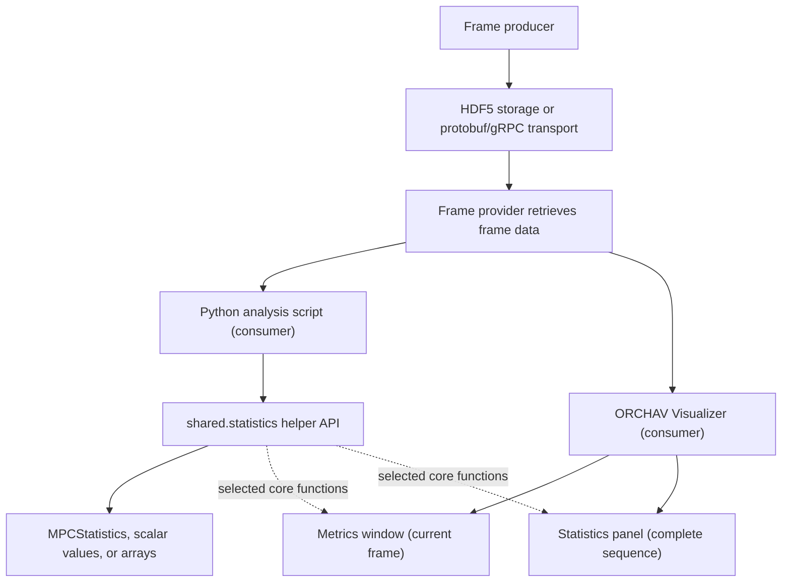

# Statistics Helpers

`shared.statistics` is a Python calculation library for channel metrics,
distributions, and plot-ready values. It works on NumPy arrays supplied by a
caller. It does not retrieve frames and it does not provide a user interface.

## Where Statistics Fit



The Python script and the Visualizer are
[consumers](../reference/glossary.md#consumer). A
[frame provider](../reference/glossary.md#frame-provider) retrieves data for
them. The statistics helpers perform calculations on arrays that those
consumers supply.

This is a Python API, not a standalone command-line tool. Use
[`orchav-inspect`](frame_inspection.md) for a terminal summary or the Visualizer
for interactive charts.

## Choose A Workflow

| Need | Start with |
|------|-------------|
| Inspect generated frame contents in a terminal | [`orchav-inspect`](frame_inspection.md) |
| Analyze one TX/RX link in Python | [Python example](#analyze-one-link-in-python) |
| Watch current-frame Metrics during playback | [`metrics_evolution`](../../scenarios/visualizer/metrics_evolution/README.md) |
| Explore complete-sequence Statistics and Graphs | [`statistics`](../../scenarios/visualizer/statistics/README.md) |

## Analyze One Link In Python

This example uses the [Specular Reflection
scenario](../../scenarios/generator/propagation_and_materials/specular_reflection/README.md)
because it has one transmitter, one receiver, and one timeline step. Generate
it once:

```bash
orchav-generator scenarios/generator/propagation_and_materials/specular_reflection/
```

Then load the frame through the normal HDF5 frame provider and pass its path
arrays to `compute_mpc_statistics()`:

```python
from shared.frames.providers import Hdf5Provider
from shared.statistics import compute_mpc_statistics

with Hdf5Provider(
    "scenarios/generator/propagation_and_materials/specular_reflection"
) as provider:
    frame = provider.load_frame(0)

stats = compute_mpc_statistics(
    delays_ns=frame.delays_ns,
    pathloss_db=frame.path_loss_db,
    aoa_az_deg=frame.aoa_az_deg,
    aod_az_deg=frame.aod_az_deg,
    threshold_db=-30.0,
)

tx_index, rx_index = frame.tx_rx_pairs[0]
print(f"link: {frame.tx_names[int(tx_index)]} -> {frame.rx_names[int(rx_index)]}")
print(stats)
```

The Python script is the consumer in this workflow. `Hdf5Provider` retrieves
the frame, while `compute_mpc_statistics()` only receives ordinary arrays. The
same function can analyze arrays from another source when they describe one
TX/RX link and use the documented units.

## What `compute_mpc_statistics()` Returns

`compute_mpc_statistics()` returns an immutable `MPCStatistics` record for one
TX/RX link.

| Field | Unit | Description |
|-------|------|-------------|
| `P_incoh` | dimensionless | Sum of retained linear path-gain ratios. |
| `P_incoh_db` | dB | `10 * log10(P_incoh)`, normally negative. |
| `sigma_tau_ns` | ns | RMS delay spread. |
| `mean_delay_ns` | ns | Path-gain-weighted mean absolute delay. |
| `N_paths` | count | Paths retained by the relative threshold. |
| `max_delay_ns` / `min_delay_ns` | ns | Delay range. |
| `earliest_path_delay_ns` / `earliest_path_loss_db` | ns / dB | Earliest retained path, with no line-of-sight claim. |
| `mean_aoa_az_deg` / `mean_aod_az_deg` | deg | Path-gain-weighted circular mean azimuths. |
| `mean_aoa_el_deg` / `mean_aod_el_deg` | deg | Path-gain-weighted mean elevations. |
| `rms_aoa_az_deg` / `rms_aod_az_deg` | deg | Path-gain-weighted wrapped RMS azimuth spreads. |
| `rms_aoa_el_deg` / `rms_aod_el_deg` | deg | Path-gain-weighted linear RMS elevation spreads. |

### Units And Weighting

Path loss is converted to a dimensionless path-gain ratio before it is used as
a relative weight:

```text
path_gain = 10 ** (-path_loss_db / 10)
```

This ratio is not received power in watts or dBm. Transmit power, antenna
response, and the rest of the link budget are not inputs to
`compute_mpc_statistics()`.

The helper removes paths whose delay or path loss is unavailable or
non-finite. It then retains paths whose gain is at least
`sum(all_finite_path_gains) * 10**(threshold_db / 10)`. Therefore,
`threshold_db` is a finite, non-positive cutoff relative to the pre-threshold
path-gain sum. It is not an absolute path-loss or power value.

## Lower-Level Calculation Functions

These functions accept NumPy arrays directly. `compute_mpc_statistics()` uses
the delay and angular helpers internally. The Visualizer also uses selected
functions for its own current-frame and complete-sequence models.

| Function | Expected input | Returns |
|----------|----------------|---------|
| `compute_delay_spread(delays_ns, powers_linear)` | Delays in ns and non-negative relative weights | RMS delay spread in ns |
| `compute_angular_spread(angles_deg, powers_linear)` | Circular angles in degrees and relative weights | Wrapped RMS angular spread in degrees |
| `compute_linear_angular_spread(angles_deg, powers_linear)` | Linear angles in degrees and relative weights | RMS angular spread in degrees |
| `compute_power_delay_profile(delays_ns, powers_linear)` | Delays in ns and finite positive relative weights | Per-path delays and weights in dB, sorted by delay |
| `compute_binned_power_delay_profile(delays_ns, powers_linear)` | Delays in ns and finite positive relative weights | Power-weighted bin delays and summed weights in dB |
| `pathloss_db_to_power_linear(pathloss_db)` | Path loss in dB | Dimensionless path-gain ratio |
| `compute_signal_strength_distribution(powers_linear)` | Physical signal power in watts | Histogram centers in dBm and counts |
| `compute_snr_distribution(powers_linear, noise_power_w)` | Physical signal and noise power in watts | Histogram centers in dB and counts |

The phase-free delay helpers do not fabricate a complex channel impulse
response. Use them for power-domain summaries only. They cannot recover phase
or complex channel coefficients.

### Physical-Power Distributions

`compute_signal_strength_distribution()` and `compute_snr_distribution()`
expect physical signal power in watts. They are separate from the relative
path-gain calculation used by `compute_mpc_statistics()`:

```python
import numpy as np

from shared.statistics import (
    compute_signal_strength_distribution,
    compute_snr_distribution,
)

signal_power_w = np.array([1e-9, 2e-9, 5e-10])
strength_dbm, strength_counts = compute_signal_strength_distribution(
    signal_power_w
)
snr_db, snr_counts = compute_snr_distribution(
    signal_power_w,
    noise_power_w=1e-12,
)
```

Do not pass dimensionless path-gain ratios to these watts-based helpers and
interpret the result as physical received power.

### Distribution Utilities

The generic distribution helpers work with any finite numeric values:

```python
import numpy as np

from shared.statistics import compute_cdf, compute_histogram, compute_statistics_summary

values = np.array([1.0, 2.0, 2.5, 4.0])
centers, counts = compute_histogram(values, bins=4)
sorted_values, cdf = compute_cdf(values)
summary = compute_statistics_summary(values)
```

The summary dictionary includes count, mean, standard deviation, minimum,
maximum, median, and quartiles.

## How The Visualizer Uses The Helpers

The Visualizer does not display the `MPCStatistics` record from the Python
example. It has two separate consumer workflows that reuse selected
calculations from `shared.statistics`:

| Visualizer feature | Scope | Result model |
|--------------------|-------|--------------|
| Metrics | Current frame and current path selection | `FrameStats` for path counts, ranges, spreads, and a binned power-delay profile. |
| Statistics | Complete frame sequence from the active frame provider | A streaming accumulator that summarizes pair-frame observations without retaining playback frames. |

For complete-sequence Statistics, each TX/RX pair represented in a frame is one
**pair-frame** observation. ORCHAV classifies it as direct-path present,
indirect-only, or no-path. For pair-frames with available path loss, it sums
dimensionless path-gain ratios. When delay and path loss are both available, it
also computes path-gain-weighted RMS delay spread. The panel shows the 10th
percentile (P10), median, 90th percentile (P90), and CDF views without pooling
unrelated links into one channel.

The represented pair list is authoritative. Native output from the Generator
includes configured TX/RX pairs, including pairs with zero paths. An external
producer may deliberately supply a smaller pair set. See
[Visual Analysis](../visualizer/analysis.md) for the user-facing panels and
controls.

---

Up: [Shared Data Layer](README.md) | Related: [Frame Data Reference](frame_reference.md) | [Frame Inspection](frame_inspection.md) | [Visual Analysis](../visualizer/analysis.md)
