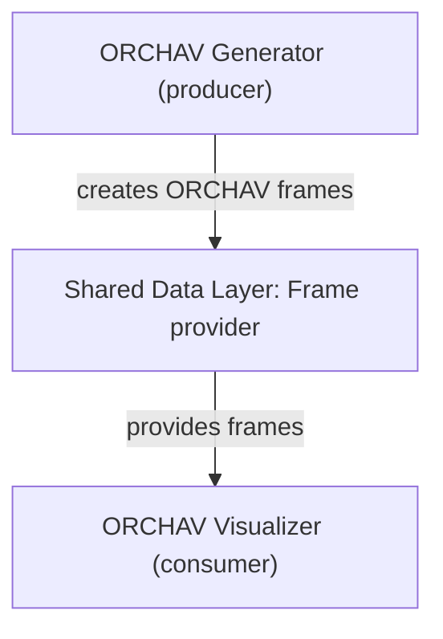

# Visualizer

The ORCHAV Visualizer is the primary interactive
[frame consumer](../reference/glossary.md#consumer).
It reads generated propagation
[frames](../reference/glossary.md#frame), which are snapshots of scenario
results at successive timeline steps.
The [Generator](../generator/README.md) is the primary
[frame producer](../reference/glossary.md#producer), which creates those frames.
The [Shared Data Layer](../shared/README.md) exposes them through a
[frame provider](../reference/glossary.md#frame-provider). This interface retrieves
frames from local HDF5 files, a running Generator, or a remote HDF5 server and
returns the same frame structure to the Visualizer.

With frames loaded, the Visualizer plays sequences, renders [multipath
components (MPCs)](../reference/glossary.md#propagation-path-mpc), follows moving
[actors](../reference/glossary.md#actor), compares channel metrics, displays
companion coverage data, and exports images or video.

The desktop application uses `pygfx` by default. [Renderers](renderers.md)
explains the Open3D/Filament alternative available on Windows and Linux, and
the pygfx-only renderer behavior on macOS.

## Start Here

After completing the repository [Quickstart](../getting_started/quickstart.md),
use [Your First Visualizer Session](first_session.md) to reopen the generated
Hello World frame, orient yourself in the interface, inspect its MPCs, and
export an image.

For guided examples, continue with the
[Visualizer scenarios](../../scenarios/visualizer/README.md). Their core path
moves from individual-path inspection to current-frame metrics, whole-scenario
statistics, and multi-device trajectories. Data modes, notebooks, beam
patterns, and performance workloads are optional branches rather than required
steps.

## Choose A Task

| Goal | Guide |
|------|-------|
| Learn the desktop interface | [Your First Visualizer Session](first_session.md) |
| Inspect current-frame metrics, scenario statistics, coverage, camera tools, or RF X-Ray | [Visual Analysis](analysis.md) |
| Classify one MPC in detail | [MPC Explorer](mpc_explorer.md) |
| Test a temporary actor or solver change | [Interactive Recomputation](interactive_recomputation.md) |
| Inspect antenna-array response overlays | [Beam-Pattern Visualization](beam_patterns.md) |
| Resume an investigation | [Workspace Snapshots](workspace_snapshots.md) |
| Choose a frame provider and data mode | [Shared Data Layer](../shared/README.md) |
| Choose a renderer for the current platform | [Renderers](renderers.md) |
| Render without the desktop application | [Headless Rendering](headless_rendering.md) |
| Render or regenerate local frames in Jupyter | [Notebook Visualization](notebooks.md) |
| Configure the initial camera, coloring, visibility, panels, or markers | [Visualizer Scenario Defaults](scenario_defaults.md) |
| Look up launch and automation flags | [Visualizer CLI Reference](cli_reference.md) |
| Understand playback caches | [Caching](caching.md) |

The [Scenario Builder](../generator/scenario_builder.md) is an optional
authoring workspace hosted in the desktop application. It creates scenario
inputs for the Generator.

---

Home: [Documentation index](../README.md) | Begin: [Your First Visualizer Session](first_session.md)
