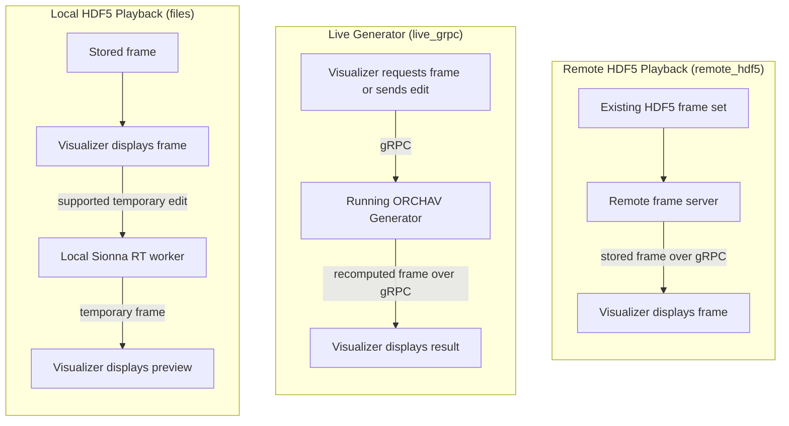

# Interactive Recomputation

Interactive recomputation lets the Visualizer request a temporary propagation
result without rewriting `scenario.yaml` or replacing the generated HDF5 frame
set. It is a capability of the selected data mode, not a fourth data mode.

The [Shared Data Layer guide](../shared/README.md) explains how frames are
stored or transported. The selected mode determines which temporary edits the
Visualizer can request and where the recomputation runs.

Local What-if Preview requires the local [Sionna
RT](https://nvlabs.github.io/sionna/) backend used for frame generation. Live
Generator and Remote HDF5 Playback require the [`grpc`
optional extra](../getting_started/installation.md#optional-extras).

The outer left-to-right layout is intentional: it presents three comparable
columns, while every workflow still reads from top to bottom.

## Mode Boundaries

| Data mode | Visualizer edit behavior |
|---|---|
| [Local HDF5 Playback](../../scenarios/visualizer/data_modes/hdf5_files/README.md) (`files`) | With pygfx and local Sionna RT dependencies, **Local What-if Preview** starts a local worker and recomputes only the displayed frame. It does not use gRPC or write a replacement frame set. |
| [Live Generator](../../scenarios/visualizer/data_modes/live_grpc/README.md) (`live_grpc`) | Ray-tracing controls work with either renderer. With pygfx, the Visualizer can also send supported TX, RX, or target edits over gRPC. The running Generator returns recomputed frames for the current session. |
| [Remote HDF5 Playback](../../scenarios/visualizer/data_modes/remote_hdf5/README.md) (`remote_hdf5`) | Read-only. The remote frame server supplies an existing frame set and has no ray-tracing worker. |

The linked scenarios provide the runnable setup for each mode. They are
alternatives to choose by workflow, not sequential tutorial steps.

## Local What-if Preview

Use Local What-if Preview to test one current-step change before deciding
whether to edit and regenerate the scenario:

1. Open a file-backed scenario with the pygfx renderer and select a frame.
2. Open **Edit** > **Actor Editing** and select **Enable Local What-if
   Preview**.
3. Move a supported TX, RX, or target with the transform gizmo. A lower-cost
   solve can update while dragging. Releasing the gizmo requests the
   final-quality current-frame solve.
4. To test solver settings, change the controls under **Raytracing** and choose
   **Recompute**.
5. Use **Reset Selected** or **Reset All** to restore the loaded actor poses.

The Visualizer starts a local subprocess, loads the scenario, and invokes
Sionna RT for the displayed step. The
returned [`StandardMPCFrame`](../shared/frame_reference.md#frame-contract)
replaces only that step's in-memory preview. Use pygfx for this workflow
because Local What-if Preview relies on its transform gizmo.

## Live Generator Session Editing

Use Live Generator when a separate running Generator should compute requested
frames across the timeline and accept supported edits over gRPC. Ray-tracing
settings can be applied with either renderer. Actor editing uses the pygfx
transform gizmo. Release the gizmo to send an actor edit, or choose **Apply
Raytracing Changes** after changing solver settings. The Generator returns a
new `StandardMPCFrame` and keeps the edit in the current session only.

## Remote HDF5 Playback Is Read-Only

Remote HDF5 Playback retrieves frames from an existing HDF5 frame set through
the remote frame server. The server does not run Sionna RT, so it cannot offer
either local preview or live Generator session editing.

## Persisting A Change

Interactive recomputation changes neither scenario source files nor stored
frames. To retain a change, edit the scenario source or use the
[Scenario Builder](../generator/scenario_builder.md), then validate and run the
Generator again. To change environment-mesh transforms, edit them in the
scenario source before regenerating.

---

Up: [Visualizer](README.md) | Related: [Shared Data Layer](../shared/README.md) | [Visual Analysis](analysis.md)
