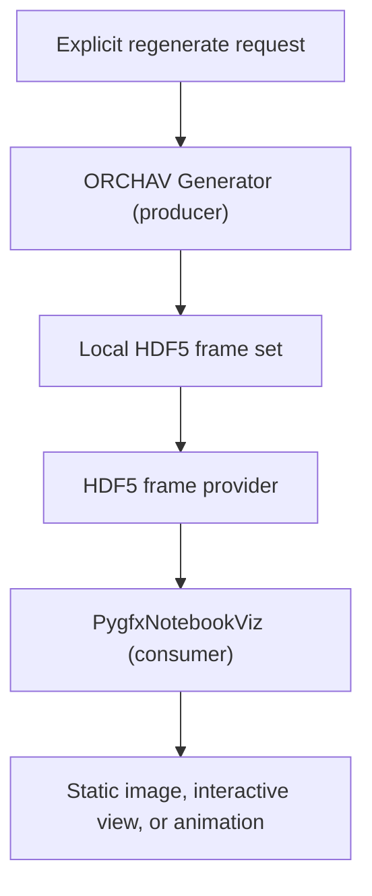

# Notebook Visualization

Use notebook visualization to explore local HDF5 frames in Jupyter without
opening the desktop Visualizer. `PygfxNotebookViz` is the supported notebook
interface. It shows the scene, [actors](../reference/glossary.md#actor),
[targets](../reference/glossary.md#target), and stored
[propagation paths](../reference/glossary.md#propagation-path-mpc) through the
same frame contract used by the desktop application.

In its normal use, the notebook wrapper is a
[consumer](../reference/glossary.md#consumer). It retrieves existing frames
through the local HDF5 [frame provider](../reference/glossary.md#frame-provider).
Calling `regenerate()` is a separate
[producer](../reference/glossary.md#producer) action that runs the
[Generator](../generator/README.md) before reloading those files.



## Set Up The Example

From the repository root, install the Jupyter extra, generate the three-frame
notebook scenario, and start JupyterLab:

```bash
python -m pip install -e ".[jupyter]"
orchav-generator scenarios/visualizer/notebook_mode/
jupyter lab examples/notebook/notebook_mode.ipynb
```

The [example notebook](../../examples/notebook/notebook_mode.ipynb) is cleared
of saved outputs. Run its cells after the frame set has been generated.

## Open The Scenario

Create one wrapper and reuse it across cells:

```python
from visualizer.src.notebook.pygfx import PygfxNotebookViz

viz = PygfxNotebookViz("scenarios/visualizer/notebook_mode")
print(viz.frames)
```

Notebook visualization reads the local HDF5 `files` data mode. Omitting `data`
from a scenario selects this standard file-backed workflow. Use the desktop
Visualizer for `live_grpc` or `remote_hdf5` sessions.

## Render A Static Image

`render()` returns an `(H, W, 3)` `uint8` NumPy array. By default, it also
displays the image inline when IPython and Pillow are available:

```python
image = viz.render(
    frame=2,
    color_mode="path_loss",
    azimuth=55,
    elevation=35,
    width=1024,
    height=768,
)
print(image.shape)
```

Pass `display=False` when a script needs only the array. This offscreen pygfx
path does not require a Qt desktop window, which makes it useful for remote
notebooks and reports. It requires a working wgpu backend.

## Interact In A Cell

With the `jupyter` extra installed, `show()` returns an in-cell view with orbit,
pan, and zoom controls:

```python
viz.show(frame=0, width=900, height=650)
```

`widget()` returns the canvas when it needs to be placed in a larger notebook
layout:

```python
canvas = viz.widget(frame=0, width=800, height=600)
canvas
```

`animate()` plays selected stored frames and keeps the same interactive camera:

```python
animation = viz.animate(frames=[0, 1, 2], fps=5, loop=True)
animation
```

The same calls accept TX/RX filters, camera settings, MPC visibility settings,
and the `reflection_order`, `mpc_type`, `delay`, and `path_loss` color modes.
See the runnable [Notebook Mode scenario](../../scenarios/visualizer/notebook_mode/README.md)
for the scene and expected output.

## Regenerate A Simple Position Study

Ordinary `render()`, `show()`, `widget()`, and `animate()` calls only consume
stored frames. Use `regenerate()` when changing TX or RX positions must produce
new propagation paths:

```python
viz.regenerate(
    tx_positions=[[0.0, 0.0, 25.0]],
    rx_positions=[[70.0, -25.0, 1.5]],
    quality="ultra-low",
    steps=1,
)
viz.render(frame=0)
```

This action closes the current HDF5 source, runs the Generator, and reloads the
notebook wrapper after the scenario's `frames/` output is replaced. If
generation fails, it attempts to reopen the rolled-back frame set without
replacing the original generation exception. It requires the Generator
dependencies and a working
[Sionna RT](https://nvlabs.github.io/sionna/) backend.

`regenerate()` is designed for simple stationary position studies:

- Each row in `tx_positions` or `rx_positions` creates a separate device. The
  rows are not trajectory samples.
- Every generated TX and RX is stationary with zero fixed yaw, pitch, and
  roll. A value of `steps` greater than one repeats those stationary poses.
- Targets from `scenario.yaml` are not reconstructed automatically.

For motion, nonzero orientation, targets, or other actor logic, edit the
scenario and run the [Generator](../generator/README.md). Release the consumer
first with `viz.close()`, then call `viz.reload()` after generation
finishes. This is required on platforms where an open HDF5 handle prevents the
producer from replacing the frame set.

The standalone `generate_frames()` helper provides the same stationary
producer step when generation and visualization belong in separate cells:

```python
from visualizer.src.notebook.generator import generate_frames

viz.close()
generate_frames(
    "scenarios/visualizer/notebook_mode",
    tx_positions=[[0.0, 0.0, 25.0]],
    rx_positions=[[-30.0, 10.0, 1.5]],
    quality="ultra-low",
    steps=1,
)
viz.reload()
```

`close()` is idempotent. A scoped consumer can instead use
`with PygfxNotebookViz(...) as viz:` so the frame source closes when the
block exits. Integrated `viz.regenerate()` performs the close, generation,
and reload sequence automatically.

## Visual-Only Marker Overrides

Passing `tx_positions` or `rx_positions` to a rendering call moves only the
displayed markers. Stored MPC geometry does not move or recompute:

```python
# Presentation change only. Stored paths remain unchanged.
viz.render(rx_positions=[[80.0, 50.0, 1.5]])
```

Use marker overrides for presentation experiments. Use `regenerate()` or the
Generator when the physical channel must change.

## Choose Notebook Or Desktop Visualization

Use the notebook interface for scene and frame layers in a cell. Use the
desktop Visualizer when you need analysis panels, coverage controls, the MPC
Explorer, or interactive recomputation. Use the
[Frame Data Reference](../shared/frame_reference.md#minimal-hdf5-frame-provider-example)
to load local frames for custom Python work and the
[Statistics Helpers](../shared/statistics.md) for calculations. Use
[Headless Rendering](headless_rendering.md) for command-line image output or
the `render_scenario()` Python API.

---

Up: [Visualizer](README.md) | Related: [Notebook Examples](../../examples/notebook/README.md) | [Headless Rendering](headless_rendering.md) | [Renderers](renderers.md)
