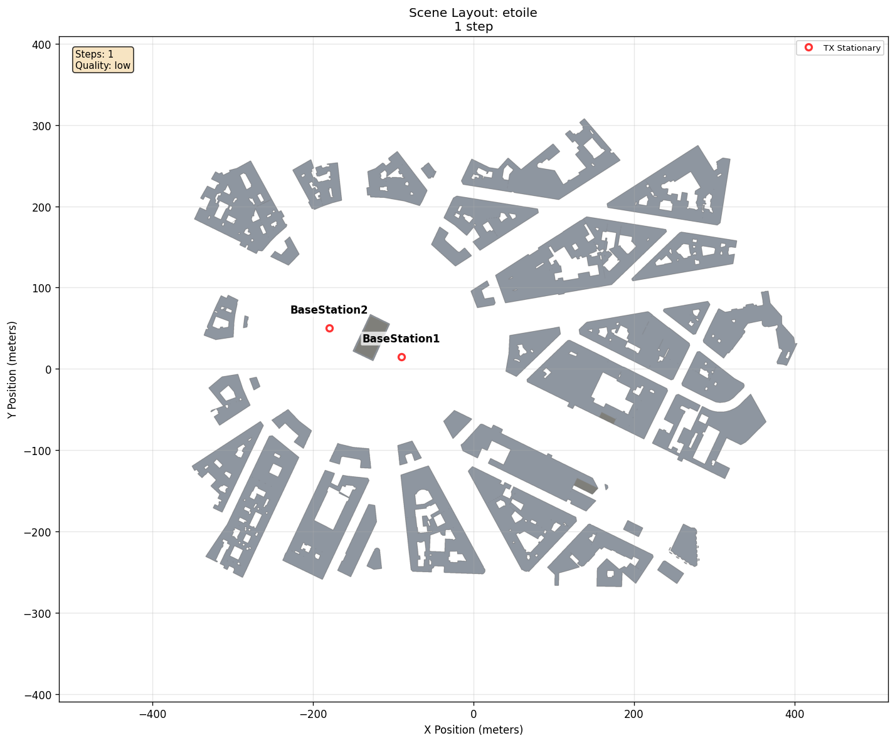
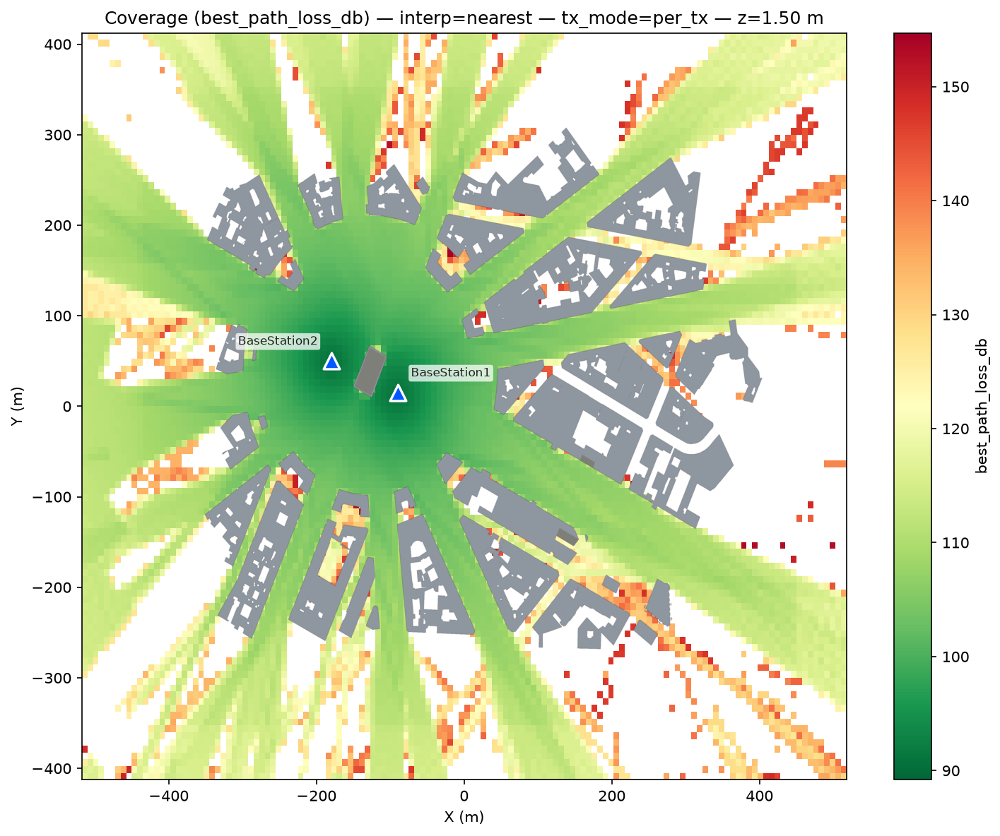
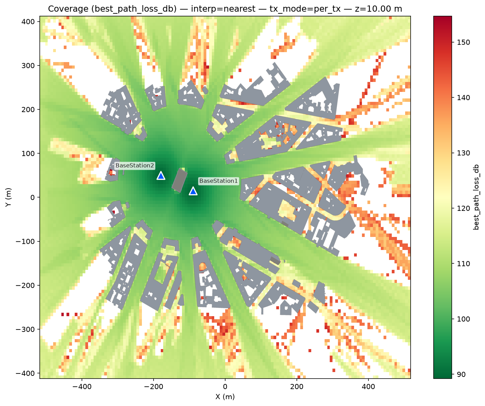
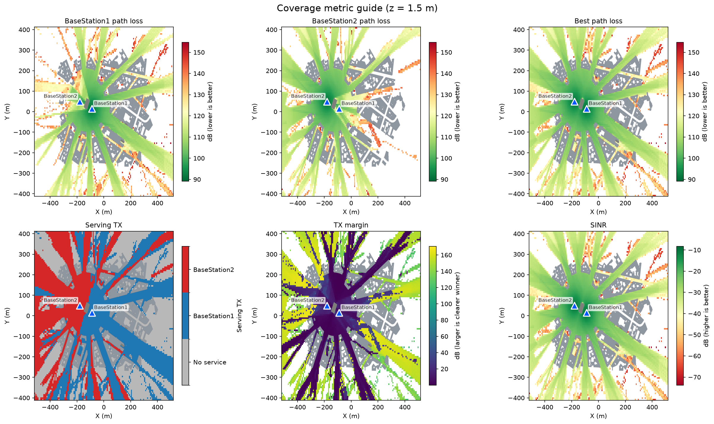
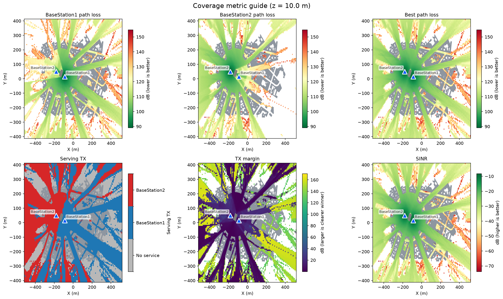
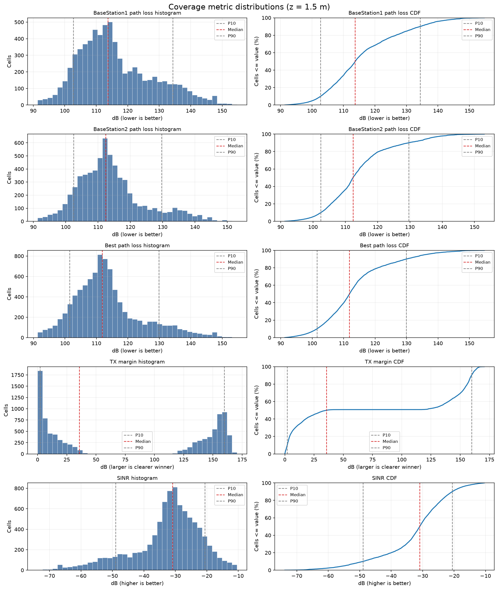
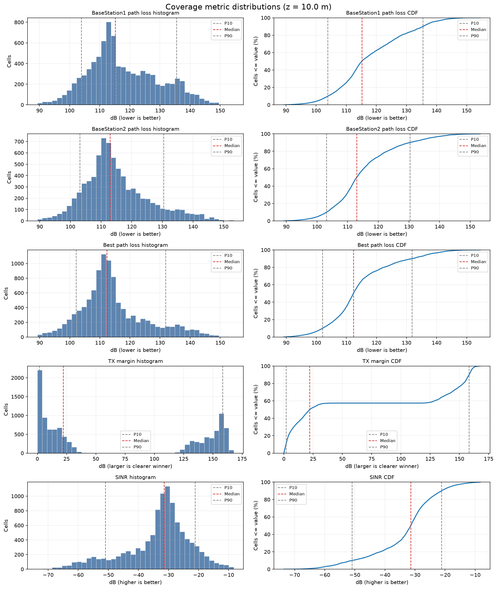

# Multi-Transmitter Coverage Map

[Scenarios](../../../README.md) > [Generator](../../README.md) > Multi-Transmitter Coverage Map

This scenario extends the Etoile coverage example to two transmitters. It is
useful for checking serving-transmitter assignment, transmitter margin, and
co-channel interference on the same grid.

To run it, see [Running](#running).

## Scene Layout



| Element | Role |
| --- | --- |
| `BaseStation1` | First transmitter, placed west of the center of the scene |
| `BaseStation2` | Second transmitter, placed farther north-west |
| Coverage grid | Virtual receiver samples at 1.5 m and 10 m |

## Configuration Walkthrough

The important difference from the single-transmitter example is the second
entry in `actors.tx`. Each transmitter uses stationary mobility and a fixed
orientation:

```yaml
actors:
  tx:
    - name: BaseStation1
      mobility:
        type: stationary
        position_m: [-90.0, 15.0, 35.0]
      orientation:
        type: fixed
        yaw_deg: 35.0
        pitch_deg: -35.0
    - name: BaseStation2
      mobility:
        type: stationary
        position_m: [-180.0, 50.0, 35.0]
      orientation:
        type: fixed
        yaw_deg: 15.0
        pitch_deg: -35.0

coverage:
  enabled: true
  grid:
    resolution_m: [7.5, 7.5]
    heights_m: [1.5, 10.0]
```

The omitted coverage settings use automatic scene bounds, the default
`medium` coverage solver, per-transmitter layers, and the standard derived
metric set. The two explicit transmitter entries are therefore enough to make
both individual and combined views available.

## Running

```bash
orchav-validate scenarios/generator/coverage/multi_tx
orchav-generator scenarios/generator/coverage/multi_tx
orchav-inspect scenarios/generator/coverage/multi_tx --coverage
orchav-visualizer --scenario scenarios/generator/coverage/multi_tx
```

The scenario writes coverage data to `coverage/coverage_maps.h5` and diagnostic
figures to `summary/coverage/`. It also writes one topology frame so the
Visualizer can load the scene. The radio-map solver produces the coverage data.

## What To Notice

- Per-transmitter path-loss layers show how each transmitter covers the scene.
- `serving_tx` stores the zero-based transmitter selected at each grid cell.
  `-1` is shown as the gray **No service** category.
- `tx_margin_db` highlights where the best transmitter is clearly dominant or nearly tied.
- `sinr_db` uses both transmitters, so it can differ from a path-loss-only view.

## Outputs

ORCHAV generates the quick-look map, metric guide, and distribution figure for
each configured height:

| Output | 1.5 m | 10 m |
| --- | --- | --- |
| Quick-look map |  |  |
| Metric guide |  |  |
| Distribution |  |  |

Use this example when testing coverage-map consumers that need more than one
transmitter layer. Map and metric-guide colors use limits shared across both
heights, so their colors can be compared directly.

The output names include both the one-based height order and physical height,
such as `coverage_metrics_height-01_1.5m.png` and
`coverage_metrics_height-02_10m.png`.

## Browse Scenarios

> **Scenario path:** [All scenarios](../../../README.md) | [Generator](../../README.md) |
> Current: **Multi-Transmitter Coverage Map**
>
> Track: **Coverage** | Previous: [Single-Transmitter Coverage](../single_tx/README.md)
