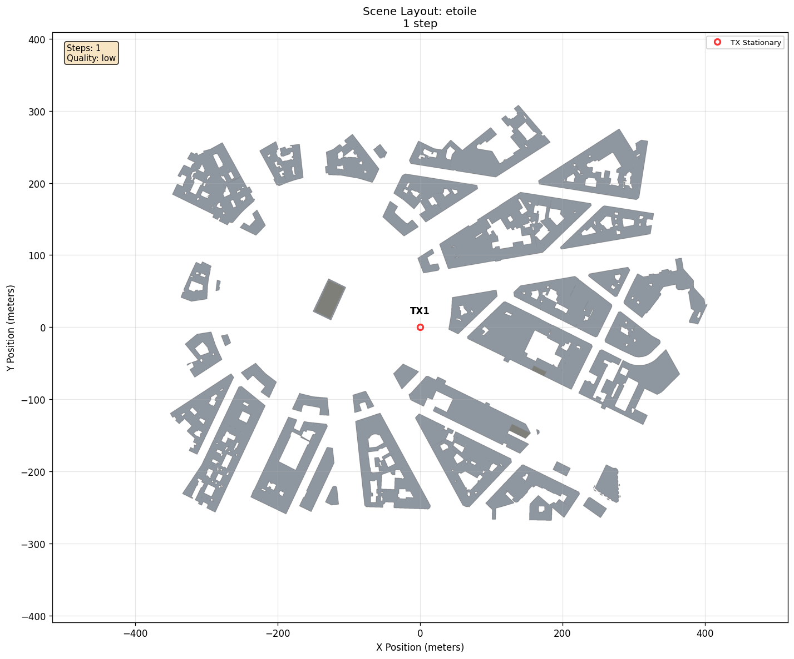
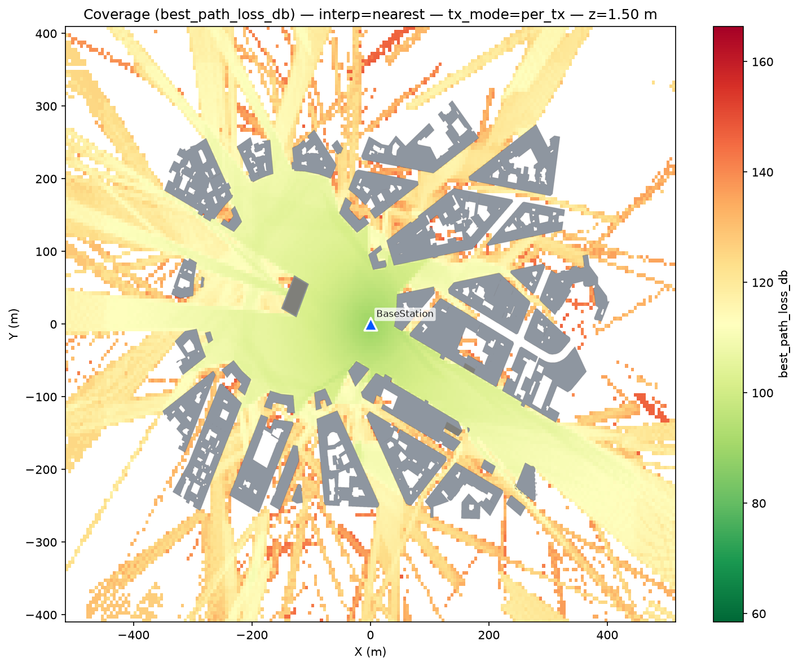
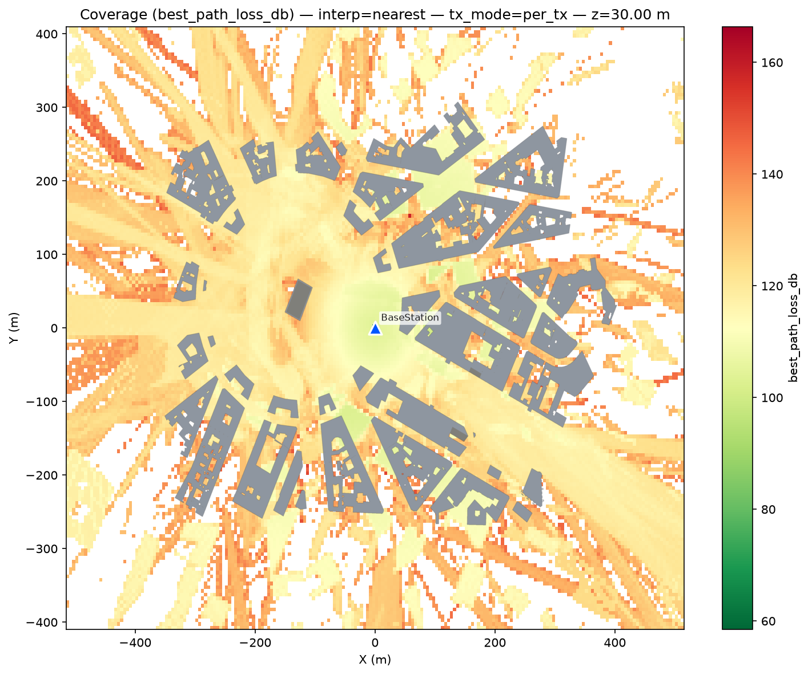
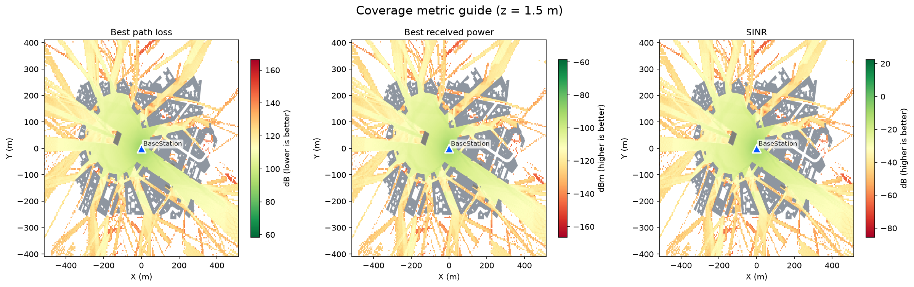
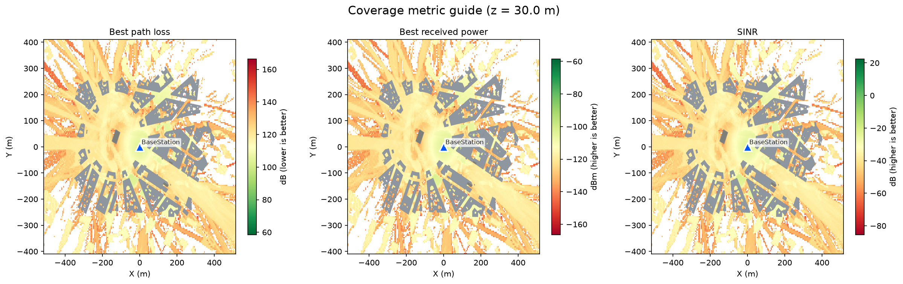
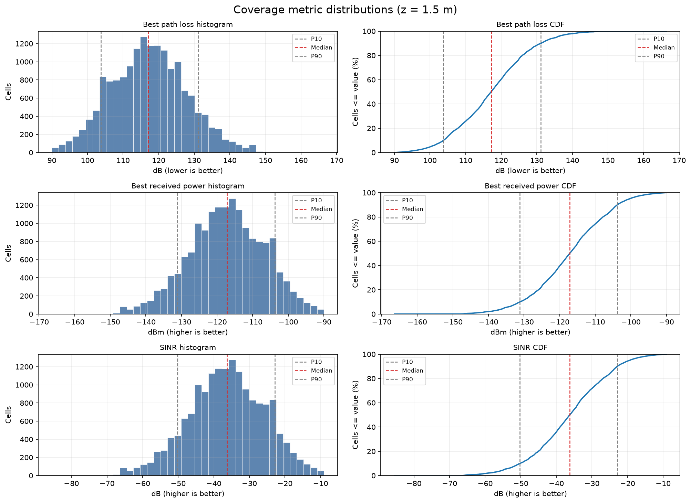
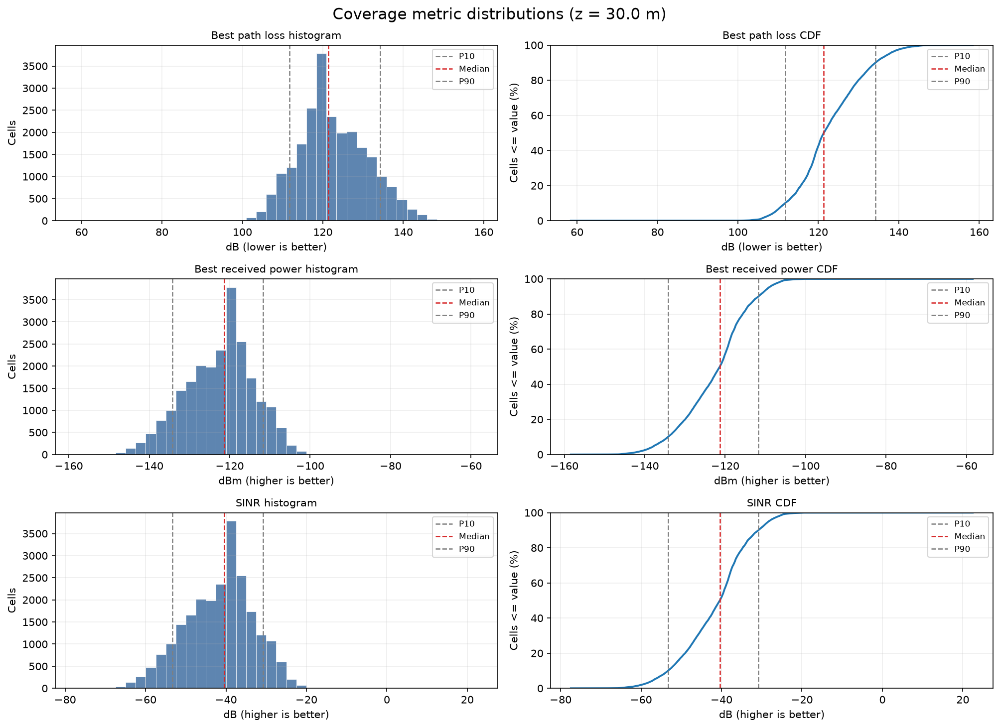

# Single-Transmitter Coverage Map

[Scenarios](../../../README.md) > [Generator](../../README.md) > Single-Transmitter Coverage Map

This scenario generates coverage maps over the built-in
[Sionna RT](https://nvlabs.github.io/sionna/) Etoile scene. It is a static
radio-map workflow: one transmitter is placed above the scene and the Generator
samples virtual receiver locations at two heights instead of tracing a small
set of named receivers.

To run it, see [Running](#running).

## Scene Layout



| Element | Role |
| --- | --- |
| `BaseStation` | Single transmitter at 30 m altitude |
| Coverage grid | Virtual receiver samples over the Etoile scene |
| Coverage heights | 1.5 m and 30 m |

## Configuration Walkthrough

The scenario is intentionally small:

```yaml
scene:
  source: sionna
  id: etoile

actors:
  tx:
    - name: BaseStation
      mobility:
        type: stationary
        position_m: [0, 0, 30]
      orientation:
        type: fixed
        pitch_deg: -45

coverage:
  enabled: true
  grid:
    resolution_m: [5, 5]
    heights_m: [1.5, 30.0]
```

The coverage block uses automatic scene bounds and the default `medium`
coverage solver. The explicit seed keeps its sampling repeatable.

## Running

```bash
orchav-validate scenarios/generator/coverage/single_tx
orchav-generator scenarios/generator/coverage/single_tx
orchav-inspect scenarios/generator/coverage/single_tx --coverage
orchav-visualizer --scenario scenarios/generator/coverage/single_tx
```

## Outputs

Running the scenario writes the coverage dataset to `coverage/coverage_maps.h5`.
The PNG maps, metric guides, and distributions shown below are generated under
`summary/coverage/`, once for each configured height. The accompanying
`frames/` directory contains the single topology frame and its manifest. It
does not duplicate the coverage grid.

| Output | 1.5 m | 30 m |
| --- | --- | --- |
| Quick-look map |  |  |
| Metric guide |  |  |
| Distribution |  |  |

Use the map views to compare where coverage is strong or weak across the scene.
Use the distribution plots to compare aggregate path loss, RSS, and SINR across
the sampled grid. Map and metric-guide colors use limits shared across both
heights, so their colors can be compared directly.

The output names include both the one-based height order and physical height,
such as `coverage_maps_height-01_1.5m.png` and
`coverage_maps_height-02_30m.png`.

## View Coverage In The Visualizer

After opening the scenario, select the **Coverage** tab and enable **Show
Coverage Map**. Choose a metric and use the height selector to switch between
1.5 m and 30 m. See [Coverage
Inspection](../../../../docs/visualizer/analysis.md#coverage-inspection) for the
remaining overlay controls.

## What To Notice

- `path_loss_db/BaseStation` is the path loss from `BaseStation` to every grid
  cell. `best_path_loss_db` normally selects the lowest path loss across all
  transmitters. With only one transmitter, it contains the same values. The
  distinction becomes useful in the
  [multi-transmitter example](../multi_tx/README.md).
- The same map is generated at 1.5 m and 30 m, so street-level and elevated
  coverage can be compared directly.
- Received-power and SINR views are derived from the stored path gain and radio
  metadata rather than saved as separate solver outputs.
- The coverage workflow samples virtual receiver positions, so the YAML does
  not need receiver actors.

This scenario does not need the top-level `raytracing` block because it does
not generate propagation paths for named transmitter and receiver pairs. The
`coverage` block configures its separate grid solver. After the coverage map is
published, ORCHAV writes one topology frame so the Visualizer can load the
transmitter placement.

## Browse Scenarios

> **Scenario path:** [All scenarios](../../../README.md) | [Generator](../../README.md) |
> Current: **Single-Transmitter Coverage Map**
>
> Track: **Coverage** | Next: [Multi-Transmitter Coverage](../multi_tx/README.md)
