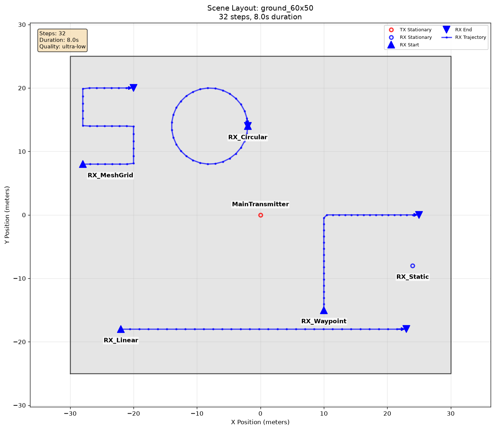
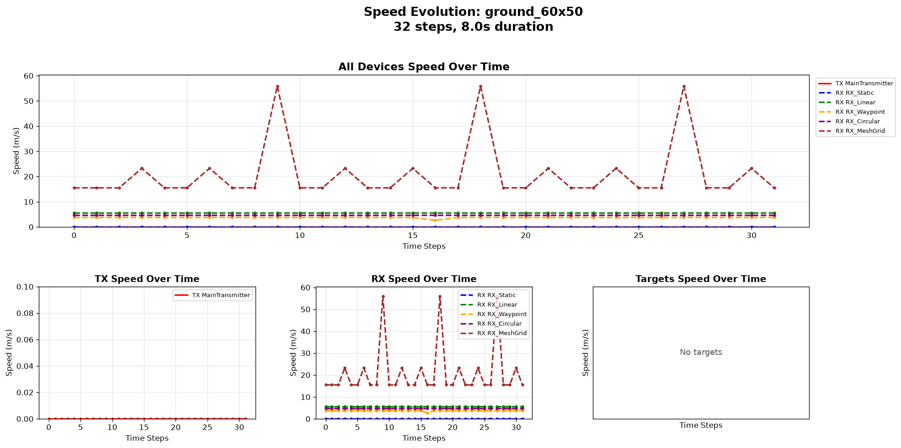

# Actor Mobility

[Scenarios](../../../README.md) > [Generator](../../README.md) > Actor Mobility

This is the first Generator scenario to inspect after getting started. One
stationary transmitter and five receiver mobility cases share a simple ground
scene so the effect of each model is easy to see: one fixed reference receiver
and four moving receivers.

To run it, see [Running](#running).

## Scene Layout



| Element | Role |
| --- | --- |
| `MainTransmitter` | Fixed transmitter above the center of the ground scene |
| `RX_Static` | Fixed receiver |
| `RX_Linear` | Receiver moving along one straight path |
| `RX_Waypoint` | Receiver moving through multiple waypoints |
| `RX_Circular` | Receiver moving around a circular path |
| `RX_MeshGrid` | Receiver traversing a compact non-overlapping grid |

## Configuration Walkthrough

For mobility semantics and the exact field reference, see
[Mobility Models](../../../../docs/generator/mobility_and_orientation.md#mobility-models)
and [Scenario YAML Reference](../../../../docs/reference/scenario_yaml.md#mobility).

```yaml
timeline:
  steps: 32
  duration_s: 8.0

raytracing:
  enabled: true
  quality:
    preset: ultra-low

actors:
  rx:
    - name: RX_Linear
      mobility:
        type: linear
        start_m: [-22, -18, 1.5]
        end_m: [23, -18, 1.5]
    - name: RX_Waypoint
      mobility:
        type: waypoint
        points_m:
          - [10, -15, 1.5]
          - [10, 0, 1.5]
          - [25, 0, 1.5]
    - name: RX_Circular
      mobility:
        type: circular
        center_m: [-8, 14, 1.5]
        radius_m: 6.0
        clockwise: true
    - name: RX_MeshGrid
      mobility:
        type: grid_scan
        x_bounds_m: [-28, -20]
        y_bounds_m: [8, 20]
        z_bounds_m: [1.5, 1.5]
        x_steps: 3
        y_steps: 3
        z_steps: 1
```

The waypoint interpolation is linear by default. The circular receiver starts
at `0 deg` and completes one turn, while the grid scan uses snake traversal
from the bottom-left corner. Those defaults do not need YAML fields.

The full YAML also requests the scene-layout and receiver-speed [summary
figures](../../../../docs/generator/generated_figures.md) shown on this page.

## Running

```bash
orchav-validate scenarios/generator/mobility_and_orientation/actor_mobility
orchav-generator scenarios/generator/mobility_and_orientation/actor_mobility
orchav-inspect scenarios/generator/mobility_and_orientation/actor_mobility --frame 0
orchav-visualizer --scenario scenarios/generator/mobility_and_orientation/actor_mobility
```

## What To Notice

- The YAML schema can declare several mobility models directly.
- Use this scenario as a compact reference for editing receiver positions and
  mobility blocks.
- The [mobility model reference](../../../../docs/generator/mobility_and_orientation.md#mobility-models)
  lists the deterministic, stochastic, grid, and network-backed options.

## Outputs



The speed figure summarizes the receiver motion over time. After generation:

- `frames/` contains reusable HDF5 frame chunks and `frames_manifest.json`.
- `summary/` contains the scene layout and speed plots.
- `orchav-inspect` reports TX/RX counts, path counts, and node positions without opening the desktop Visualizer.

## Browse Scenarios

> **Scenario path:** [All scenarios](../../../README.md) | [Generator](../../README.md) |
> Current: **Actor Mobility**
>
> Track: **Mobility and Orientation** | Next: [Actor Orientation](../actor_orientation/README.md)
