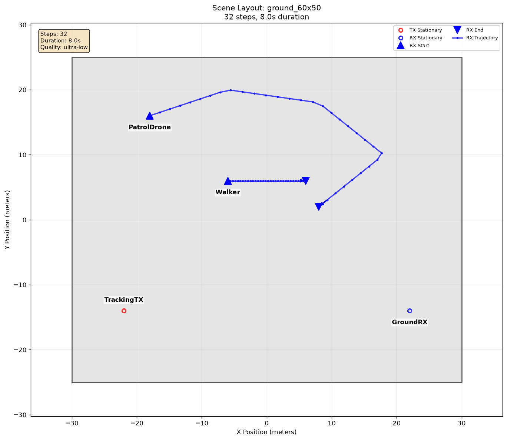
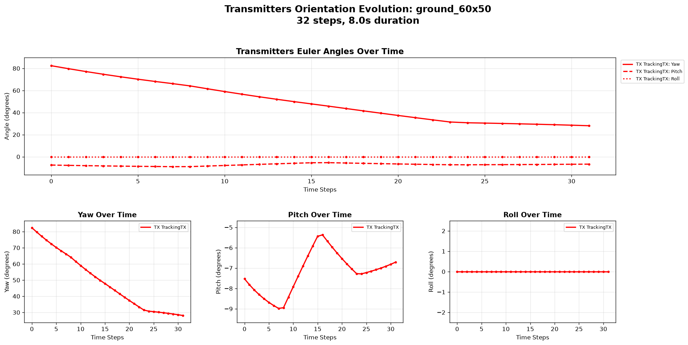
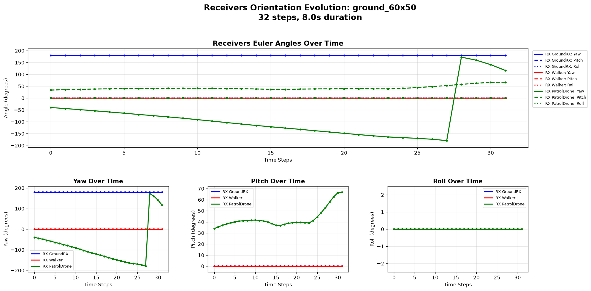

# Actor Orientation

[Scenarios](../../../README.md) > [Generator](../../README.md) > Actor Orientation

This scenario focuses on actor orientation. A stationary transmitter tracks a
moving drone, the drone tracks a walker, and the walker faces its direction of
travel.

To run it, see [Running](#running).

## Scene Layout



| Element | Role |
| --- | --- |
| `TrackingTX` | Fixed transmitter looking at the drone |
| `GroundRX` | Fixed receiver with a fixed orientation |
| `PatrolDrone` | Moving receiver looking at the walker |
| `Walker` | Moving receiver facing its path |

## Configuration Walkthrough

For orientation semantics and exact fields, see
[Orientation Models](../../../../docs/generator/mobility_and_orientation.md#orientation-models)
and [Scenario YAML Reference](../../../../docs/reference/scenario_yaml.md#orientation).

```yaml
actors:
  tx:
    - name: TrackingTX
      mobility:
        type: stationary
        position_m: [-22, -14, 8]
      orientation:
        type: look_at
        actor: PatrolDrone

  rx:
    - name: Walker
      mobility:
        type: linear
        start_m: [-6, 6, 1.5]
        end_m: [6, 6, 1.5]
      orientation:
        type: align_motion
        allow_pitch: false
```

The full YAML also includes a waypoint drone, a fixed ground receiver, and
summary output for the scene, speed, and actor orientations. The actor blocks
remain the focus of this example.

## Running

```bash
orchav-validate scenarios/generator/mobility_and_orientation/actor_orientation
orchav-generator scenarios/generator/mobility_and_orientation/actor_orientation
orchav-visualizer --scenario scenarios/generator/mobility_and_orientation/actor_orientation
```

## What To Notice

- Mobility and orientation are separate parts of each actor configuration.
- `look_at` can rotate a stationary actor toward a moving actor.
- `align_motion` can align an actor with its trajectory.
- The [orientation model reference](../../../../docs/generator/mobility_and_orientation.md#orientation-models)
  lists the exact options for scheduled pointing, motion alignment, and
  target tracking.
- Orientation plots are useful for spotting yaw wrapping or unexpected pitch changes.

## Outputs





The orientation figures are the main diagnostic output. Generated frames retain
the actor orientations used by the Visualizer.

## Browse Scenarios

> **Scenario path:** [All scenarios](../../../README.md) | [Generator](../../README.md) |
> Current: **Actor Orientation**
>
> Track: **Mobility and Orientation** | Previous: [Actor Mobility](../actor_mobility/README.md)
