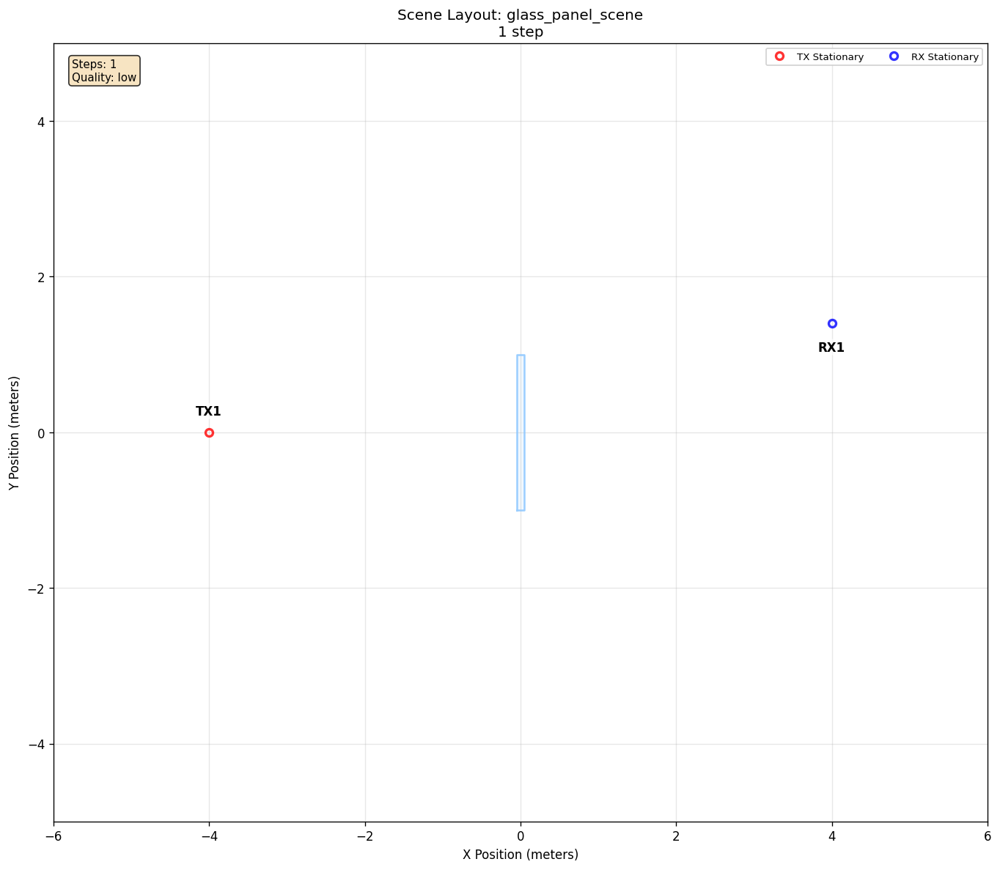

# Refraction And Diffraction

[Scenarios](../../../README.md) > [Generator](../../README.md) > Refraction And Diffraction

This scenario places a transmitter and receiver around a thin glass panel. It is a compact check for solver support around refraction and edge diffraction without adding moving actors or targets.

To run it, see [Running](#running).

## Scene Layout



| Element | Role |
| --- | --- |
| `TX` | Fixed transmitter on one side of the glass panel |
| `RX` | Fixed receiver near the opposite edge of the panel |
| Glass panel | Refraction surface and edge-diffraction obstacle loaded from `meshes/glass_panel.ply` |

## Configuration Walkthrough

```yaml
scene:
  source: local
  id: glass_panel_scene.xml

raytracing:
  enabled: true
  quality:
    custom:
      max_depth: 2
      samples_per_src: 10000000
      max_num_paths_per_src: 1000000
      refraction: true
      diffraction: true
      edge_diffraction: true
```

The scenario inherits the default `low` profile. The `custom` block contains
only the larger ray budgets and propagation options required by this check.

Unlike the room and ground examples that reference shared library scenes, this
scenario keeps its scene XML and mesh in the scenario directory:
`glass_panel_scene.xml` references `meshes/glass_panel.ply`. That makes the
minimal transmissive obstacle easy to inspect alongside the YAML.

## Running

```bash
orchav-validate scenarios/generator/propagation_and_materials/refraction_and_diffraction
orchav-generator scenarios/generator/propagation_and_materials/refraction_and_diffraction
orchav-inspect scenarios/generator/propagation_and_materials/refraction_and_diffraction --frame 0
orchav-visualizer --scenario scenarios/generator/propagation_and_materials/refraction_and_diffraction
```

## What To Notice

- Refraction requires a transmissive material. Here, a path can pass through the glass panel.
- Diffraction lets a path reach the receiver by bending around an edge of the panel.
- The scenario is static, so differences in output usually come from solver behavior or the tracing budget rather than mobility.

`orchav-inspect` reports both interaction segments and the number of paths that
contain each [interaction
type](../../../../docs/concepts/propagation.md#interaction-types). For example, a
representative run can report:

```text
Interaction segments: code 4 (refraction)=2, code 8 (diffraction)=1
Paths with interaction: code 4 (refraction)=1, code 8 (diffraction)=1
```

In this result, one path enters and leaves the glass panel. Those two crossings
produce two code 4 refraction segments, but they belong to one refracted path.
Another path contains one code 8 diffraction segment at the panel edge. Exact
counts can change with the [Sionna RT](https://nvlabs.github.io/sionna/) version
and tracing behavior, so use the
codes and the segment-versus-path distinction as the observation rather than
treating these numbers as fixed expected output.

## Outputs

Running the scenario writes one default HDF5 frame chunk under `frames/` and a
scene summary under `summary/`. The generated frame records interaction codes
when the active Sionna RT version returns refraction or diffraction
interactions. Use this scenario as a compatibility check when changing Sionna
RT versions or solver options.

## Browse Scenarios

> **Scenario path:** [All scenarios](../../../README.md) | [Generator](../../README.md) |
> Current: **Refraction And Diffraction**
>
> Track: **Propagation and Materials** | Previous: [Scene Diffuse Scattering](../scene_diffuse_scattering/README.md)
