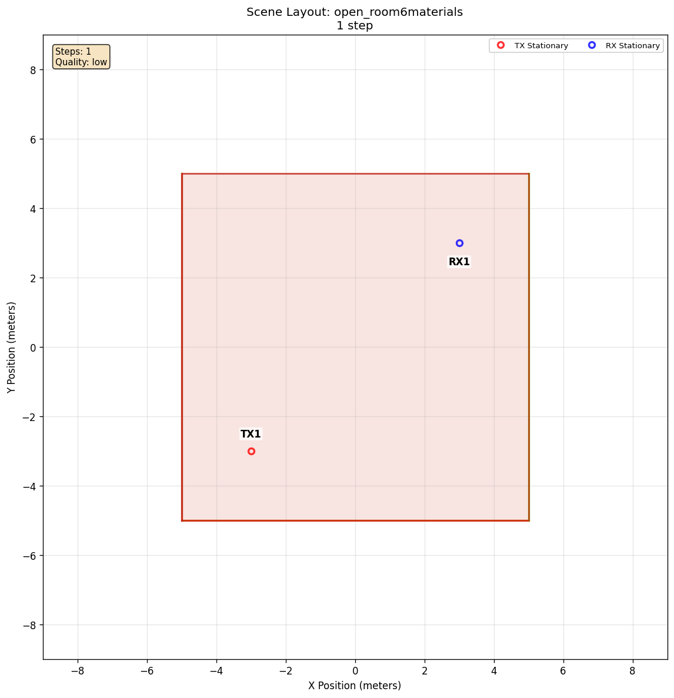

# Scene Diffuse Scattering

[Scenarios](../../../README.md) > [Generator](../../README.md) > Scene Diffuse Scattering

This comparison uses one room to show when scene surfaces produce diffuse
paths and how ORCHAV resolves their scattering coefficients. It starts with
diffuse solving enabled but the scene's material values unchanged, then adds a
family preset and explicit material overrides.

To run it, see [Running](#running).

## Scene Layout



| Element | Configuration |
| --- | --- |
| Scene | Open room with concrete, wood, brick, plasterboard, and chipboard surfaces |
| `TX` | Stationary at `(-3.0 m, -3.0 m, 4.0 m)` |
| `RX` | Stationary at `(3.0 m, 3.0 m, 1.0 m)` |
| Tracing | One step, maximum path depth 1, diffuse reflection enabled |

The room and actor placement match the [specular reflection
scenario](../specular_reflection/README.md). In this bundled scene, every
loaded scattering coefficient is `0` before ORCHAV applies an optional preset
or override.

## Configuration Walkthrough

Diffuse paths require two independent conditions:

1. The solver must have `diffuse_reflection: true`.
2. At least one effective scene material must have a nonzero
   `scattering_coefficient`.

The parent `scenario.yaml` tests only the first condition:

```yaml
raytracing:
  enabled: true
  quality:
    custom:
      max_depth: 1
      diffuse_reflection: true
```

ORCHAV leaves scene material values unchanged unless the scenario requests a
preset or an explicit override. Material settings are resolved in this order:

```text
values loaded with the scene
-> optional scene-material preset
-> explicit per-material overrides
```

The final applicable value wins. The four prepared inputs keep the geometry,
actors, and tracing settings constant:

| Variant | Material policy | Frame directory |
| --- | --- | --- |
| Switch only (`scenario.yaml`) | Keep the loaded zero coefficients | `frames/` |
| [ITU preset](itu_preset/README.md) | Apply ORCHAV's known coefficients by material family | `itu_preset/frames/` |
| [ITU preset with concrete override](itu_preset_concrete_override/README.md) | Apply the preset, then set concrete back to `0` | `itu_preset_concrete_override/frames/` |
| [Explicit concrete](explicit_concrete/README.md) | Set concrete to `0.1` without applying the preset | `explicit_concrete/frames/` |

An override can therefore refine a preset or set one material directly when
no preset is active. Neither approach enables diffuse solving by itself.

## Running

Run the commands from the repository root. Each variant has its own directory,
so its generated frames remain available for comparison.

### 1. Enable Diffuse Solving Only

```bash
orchav-validate scenarios/generator/propagation_and_materials/scene_diffuse_scattering
orchav-generator scenarios/generator/propagation_and_materials/scene_diffuse_scattering
orchav-inspect scenarios/generator/propagation_and_materials/scene_diffuse_scattering --frame 0 --materials
```

The material list shows zero scattering coefficients. The interaction summary
does not contain `code 2 (diffuse)` because enabling the solver does not change
the loaded material values.

### 2. Apply The ITU-Family Preset

The first child adds a preset:

```yaml
raytracing:
  scene_materials:
    scattering_coefficient_preset: itu
```

```bash
orchav-validate scenarios/generator/propagation_and_materials/scene_diffuse_scattering/itu_preset
orchav-generator scenarios/generator/propagation_and_materials/scene_diffuse_scattering/itu_preset
orchav-inspect scenarios/generator/propagation_and_materials/scene_diffuse_scattering/itu_preset --frame 0 --materials
```

Known material families now have nonzero coefficients, and the interaction
summary contains `code 2 (diffuse)`. Brick remains at zero because this preset
does not define a value for its family.

### 3. Override Concrete After The Preset

The next child keeps the preset and adds an explicit override:

```yaml
raytracing:
  scene_materials:
    scattering_coefficient_preset: itu
  materials:
    itu_concrete:
      scattering_coefficient: 0.0
```

```bash
orchav-validate scenarios/generator/propagation_and_materials/scene_diffuse_scattering/itu_preset_concrete_override
orchav-generator scenarios/generator/propagation_and_materials/scene_diffuse_scattering/itu_preset_concrete_override
orchav-inspect scenarios/generator/propagation_and_materials/scene_diffuse_scattering/itu_preset_concrete_override --frame 0 --materials
```

Concrete returns to `0`, which demonstrates that the explicit value wins.
Diffuse paths remain because wood, plasterboard, and chipboard still use their
nonzero preset values.

### 4. Set Concrete Directly

The final child skips the preset and sets one material explicitly:

```yaml
raytracing:
  quality:
    custom:
      diffuse_reflection: true
  materials:
    itu_concrete:
      scattering_coefficient: 0.1
```

```bash
orchav-validate scenarios/generator/propagation_and_materials/scene_diffuse_scattering/explicit_concrete
orchav-generator scenarios/generator/propagation_and_materials/scene_diffuse_scattering/explicit_concrete
orchav-inspect scenarios/generator/propagation_and_materials/scene_diffuse_scattering/explicit_concrete --frame 0 --materials
```

This variant confirms that a preset is optional. The solver switch and the
explicit nonzero coefficient together allow diffuse paths from the concrete
surface.

## What To Notice

A representative [Sionna RT](https://nvlabs.github.io/sionna/) run produced:

| Variant | Total MPCs | Paths with diffuse interactions |
| --- | ---: | ---: |
| Diffuse switch only | 6 | 0 |
| `itu` family preset | 34,546 | 34,540 |
| Preset with concrete set to zero | 27,620 | 27,614 |
| Explicit concrete coefficient `0.1` | 382 | 376 |

Exact counts can vary with the Sionna RT version, seed, quality settings, and
scene geometry. Check the material list and the presence or absence of
`code 2 (diffuse)` instead of treating these counts as pass/fail values.

Diffuse and specular paths differ in how a signal can leave an interaction
point. A specular path must follow the mirror-law direction. A diffuse path
still needs an incident ray and a visible surface-to-receiver segment, but its
outgoing segment is not restricted to the exact mirror direction. This wider
set of possible directions can produce many more retained paths.

To compare one result interactively, open its scenario directory. For example:

```bash
orchav-visualizer --scenario scenarios/generator/propagation_and_materials/scene_diffuse_scattering/itu_preset
```

## Outputs And Path Limits

Each generated variant writes a manifest-driven HDF5 frame set under its own
`frames/` directory. The parent scenario also writes the scene-layout figure
under `summary/`. Recorded interaction codes let inspection and analysis tools
separate line-of-sight, specular, and diffuse interactions.

A nonzero scattering coefficient can make generated frame sets and Visualizer
sessions much larger. To limit stored paths, add a path filter to the variant
being studied:

```yaml
raytracing:
  path_filter:
    max_paths_per_pair: 1000
```

For the explicit-concrete setup, raising the coefficient from `0.1` to `0.9`
produced 35,378 MPCs in one representative run. The filter retained 1,000 of
them, including 994 paths with diffuse interactions.

`max_paths_per_pair` filters stored output after path metrics are computed. It
keeps generated files and Visualizer sessions manageable, but does not reduce
the ray-tracing search itself. To reduce solver work, lower the coefficient,
ray budget, or interaction depth.

For exact material fields, see [Generator
Configuration](../../../../docs/generator/configuration.md#diffuse-scattering)
and the [Scenario YAML
Reference](../../../../docs/reference/scenario_yaml.md#raytracing-scene-materials).

## Browse Scenarios

> **Scenario path:** [All scenarios](../../../README.md) | [Generator](../../README.md) |
> Current: **Scene Diffuse Scattering**
>
> Track: **Propagation and Materials** | Previous: [Specular Reflection](../specular_reflection/README.md) | Next: [Refraction And Diffraction](../refraction_and_diffraction/README.md)
