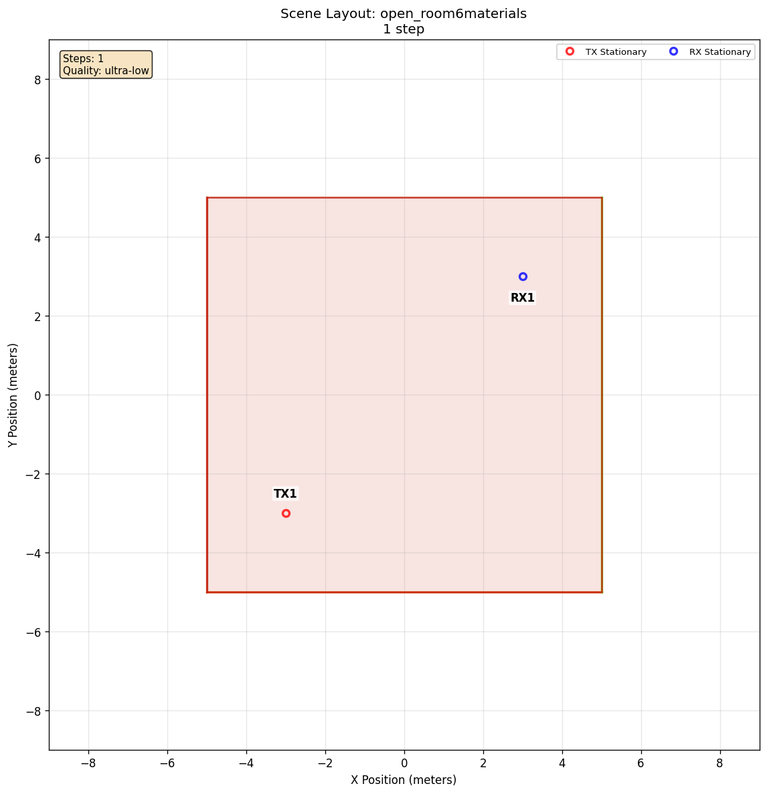

# Specular Reflection

[Scenarios](../../../README.md) > [Generator](../../README.md) > Specular Reflection

This scenario isolates specular reflection in a controlled indoor geometry. A
stationary transmitter and receiver are placed inside an open room, where
[Sionna RT](https://nvlabs.github.io/sionna/) computes the line-of-sight path
and paths reflected by the walls.

To run it, see [Running](#running).

## Scene Layout



| Element | Role |
| --- | --- |
| `TX` | Fixed transmitter in the open room |
| `RX` | Fixed receiver across the room |
| Room surfaces | Front wall: `itu_concrete`, back wall: `itu_wood`, left wall: `itu_brick`, right wall: `itu_plasterboard`, floor: `itu_chipboard` |

## Configuration Walkthrough

```yaml
scene:
  id: box/open_room6materials.xml

timeline:
  steps: 1
  duration_s: 0.0

raytracing:
  enabled: true
  quality:
    preset: ultra-low

actors:
  tx:
    - name: TX
      mobility:
        type: stationary
        position_m: [-3, -3, 4]
  rx:
    - name: RX
      mobility:
        type: stationary
        position_m: [3, 3, 1]
```

The room is open at the top and intentionally assigns a different ITU radio material to each major surface. That makes the output easier to inspect because reflected paths can be associated with concrete, wood, brick, plasterboard, or chipboard interactions.

## Running

```bash
orchav-validate scenarios/generator/propagation_and_materials/specular_reflection
orchav-generator scenarios/generator/propagation_and_materials/specular_reflection
orchav-visualizer --scenario scenarios/generator/propagation_and_materials/specular_reflection
```

The default YAML uses an ultra-low tracing budget so the scenario runs quickly.

## What To Notice

- Reflected paths identify which room surface participated in the interaction.
- Increasing `max_depth`, `samples_per_src`, or `max_num_paths_per_src` can reveal more reflection chains.
- A low ray budget keeps an exploratory run fast, but it should not be
  interpreted as an accurate channel representation.

## Try A Deeper Search

After inspecting the default output, replace `preset: ultra-low` with the
following custom quality block to search for additional reflection chains:

```yaml
raytracing:
  enabled: true
  quality:
    custom:
      max_depth: 5
      samples_per_src: 10000000
      max_num_paths_per_src: 1000000
```

Settings not listed in the custom block use the `low` profile defaults. The
higher limits can increase generation time.

## Outputs

Running the scenario writes one default HDF5 frame chunk under `frames/` and a
scene summary under `summary/`. The frame stores the path type, delay, angles,
path loss, and object interaction data for each multipath component.

## Browse Scenarios

> **Scenario path:** [All scenarios](../../../README.md) | [Generator](../../README.md) |
> Current: **Specular Reflection**
>
> Track: **Propagation and Materials** | Next: [Scene Diffuse Scattering](../scene_diffuse_scattering/README.md)
