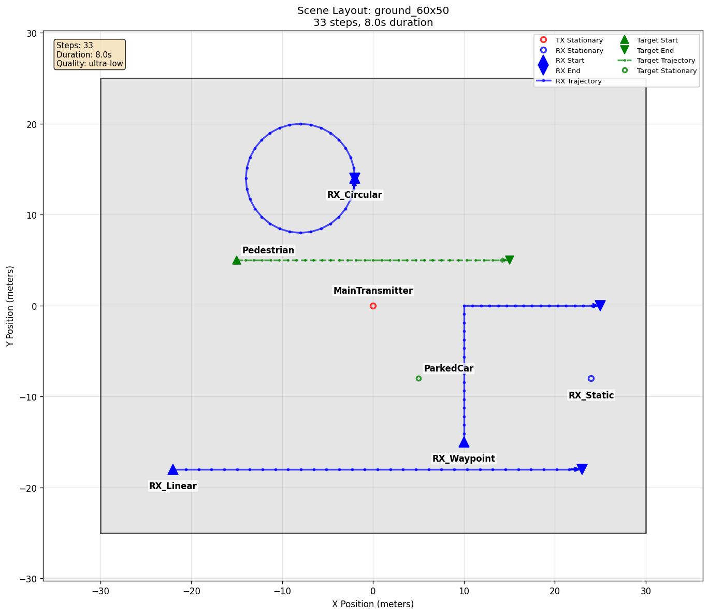

# Mesh Targets

[Scenarios](../../../README.md) > [Generator](../../README.md) > Mesh Targets

This scenario adds physical [targets](../../../../docs/reference/glossary.md#target)
to the mobility models used in the basic Generator examples. It includes a
walking pedestrian and a parked car so the generated frames contain object
interactions as well as actor-to-actor paths.

To run it, see [Running](#running).

## Scene Layout



| Element | Role |
| --- | --- |
| `MainTransmitter` | Fixed transmitter |
| `RX_Static`, `RX_Linear`, `RX_Waypoint`, `RX_Circular` | Receiver mobility examples |
| `Pedestrian` | Moving walking target |
| `ParkedCar` | Static vehicle target |

## Configuration Walkthrough

```yaml
actors:
  targets:
    - name: Pedestrian
      asset:
        source: directory
        path: libraries/targets/nist_human_walking
        pattern: "fitted_*.ply"
      mobility:
        type: linear
        start_m: [-15, 5, 0.85]
        end_m: [15, 5, 0.85]
      orientation:
        type: align_motion
        allow_pitch: false

    - name: ParkedCar
      asset:
        source: directory
        path: libraries/targets/car
        pattern: car.ply
        switch_meshes: false
      mobility:
        type: stationary
        position_m: [5, -8, 0.79]
```

The pedestrian uses a time-varying mesh sequence selected by `asset.pattern`,
while the car uses one static mesh. `orientation.type: align_motion` makes the
pedestrian face its direction of motion. The pedestrian uses the default
`glass` radio material. The full YAML explicitly assigns `metal` to the car.

## Running

```bash
orchav-validate scenarios/generator/targets/mesh_targets
orchav-generator scenarios/generator/targets/mesh_targets
orchav-visualizer --scenario scenarios/generator/targets/mesh_targets
```

## What To Notice

- Target actors are listed separately from transmitter and receiver actors.
- Moving targets use the same mobility and orientation concepts as other actors.
- The default ultra-low ray budget keeps the example fast, so target interactions are intentionally sparse.
- Specular rays do not hit the target in every frame. This is expected for
  small or faceted target meshes.
- Path records can identify which object was involved in an interaction.

## Outputs

Running the scenario writes default HDF5 frame chunks under `frames/` and
summary figures under `summary/`. Generated frames include target metadata and
object-interaction fields. Use those records to separate direct paths,
environmental interactions, and target-related interactions:

```bash
orchav-inspect scenarios/generator/targets/mesh_targets --frame 0
```

With the default `ultra-low` preset, frame 0 stays small:

```text
TX: 1, RX: 4, Targets: 2
Pairs: 4
Total MPCs: 8
Paths per pair: [2, 2, 2, 2]
```

Those paths confirm that the frame is valid and that the targets are present, but they do not mean that every frame contains a target hit. In the default run, target-impinging specular paths appear only in favorable frames. Inspect frames around the moving pedestrian crossing:

```bash
orchav-inspect scenarios/generator/targets/mesh_targets --frame 9
orchav-inspect scenarios/generator/targets/mesh_targets --frame 10
orchav-inspect scenarios/generator/targets/mesh_targets --frame 11
```

A representative run reports one additional specular MPC in the `MainTransmitter` to `RX_Linear` pair:

```text
TX: 1, RX: 4, Targets: 2
Pairs: 4
Total MPCs: 9
Paths per pair: [2, 3, 2, 2]
Interaction segments: code 1 (specular)=5
Paths with interaction: code 1 (specular)=5
```

Direct paths have no physical bounce rows, so they do not appear in the
interaction-code counts.

This sparsity is normal. A one-bounce specular target path must satisfy the mirror law and visibility checks for the current transmitter, target facet, and receiver geometry. Targets are much smaller than scene walls, and animated meshes expose different facets over time, so a fast tutorial ray budget should not be expected to hit the target in every frame.

## Browse Scenarios

> **Scenario path:** [All scenarios](../../../README.md) | [Generator](../../README.md) |
> Current: **Mesh Targets**
>
> Track: **Targets** | Next: [Target Orientation](../target_orientation/README.md)
