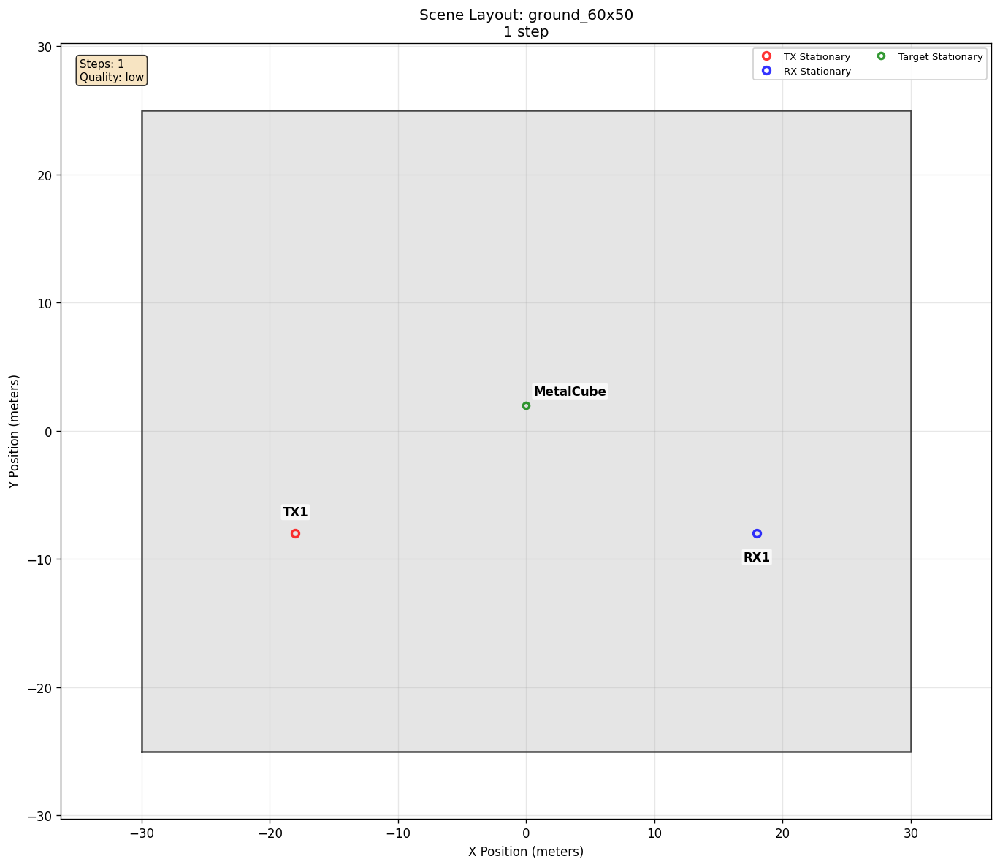

# Target Diffuse Scattering

[Scenarios](../../../README.md) > [Generator](../../README.md) > Target Diffuse Scattering

This scenario isolates diffuse scattering from a large target. A transmitter and receiver are placed on opposite sides of a metal cube so the difference between sparse specular interactions and diffuse target returns is easy to inspect.

To run it, see [Running](#running).

## Scene Layout



| Element | Role |
| --- | --- |
| `TX` | Fixed transmitter |
| `RX` | Fixed receiver |
| `MetalCube` | Large target with diffuse scattering enabled |

## Configuration Walkthrough

```yaml
raytracing:
  enabled: true
  quality:
    custom:
      diffuse_reflection: true
  materials:
    itu_metal_MetalCube:
      scattering_coefficient: 0.3

actors:
  targets:
    - name: MetalCube
      asset:
        source: directory
        path: libraries/targets/cube
        pattern: cube.ply
        scale: 5.0
        switch_meshes: false
      mobility:
        type: stationary
        position_m: [0, 2, 2.5]
```

The scenario inherits the default `low` profile before diffuse reflection is
enabled.

The material name includes the target name so the override applies to the target
surface in the generated scene. Diffuse target scattering needs both
`diffuse_reflection: true` and a positive target scattering coefficient. The
coefficient is unitless. Larger values can retain more target-involving diffuse
paths.

For a target surface, the key difference from strict specular reflection is the receiver-connection step after the diffuse hit. A specular path must satisfy a narrow mirror-law geometry. A diffuse target path still needs an impinging ray and a visible target-to-receiver segment, but the scattered energy is not constrained to the exact mirror direction. That makes diffuse scattering useful for compact target examples where specular hits can be sparse.

## Running

```bash
orchav-validate scenarios/generator/targets/target_diffuse_scattering
orchav-generator scenarios/generator/targets/target_diffuse_scattering
orchav-visualizer --scenario scenarios/generator/targets/target_diffuse_scattering
```

## What To Notice

- The target material override sets a nonzero scattering coefficient.
- Diffuse target interactions can produce many more returned paths than specular-only tracing.
- The scenario has one frame, so it is a compact example of target scattering
  behavior.
- The goal is to show the practical effect of diffuse target scattering, not to prescribe a full target-modeling workflow.

## Outputs

Running the scenario writes one default HDF5 frame chunk under `frames/` and a
scene summary under `summary/`. The generated frame is useful for checking
whether object interaction metadata, path type, and target-derived paths are
being written consistently:

```bash
orchav-inspect scenarios/generator/targets/target_diffuse_scattering --frame 0
```

A representative run with diffuse reflection enabled reports many
target-involving paths:

```text
TX: 1, RX: 1, Targets: 1
Pairs: 1
Total MPCs: 349
Paths per pair: [349]
Interaction segments: code 1 (specular)=176, code 2 (diffuse)=345
Paths with interaction: code 1 (specular)=172, code 2 (diffuse)=345
```

Exact path totals can vary with the supported Sionna RT, Dr.Jit, driver, and
hardware combination. The useful observation is the presence of diffuse code
`2` and the large increase relative to the specular-only comparison.

To isolate the diffuse contribution, set `diffuse_reflection` to `false`, regenerate, and inspect frame 0 again:

```yaml
raytracing:
  quality:
    custom:
      diffuse_reflection: false
```

The specular-only run keeps direct and mirror-law paths but removes paths whose interaction sequence contains diffuse code `2`:

```text
TX: 1, RX: 1, Targets: 1
Pairs: 1
Total MPCs: 4
Paths per pair: [4]
Interaction segments: code 1 (specular)=4
Paths with interaction: code 1 (specular)=3
```

Direct paths have no physical bounce rows, so they do not appear in the
interaction-code counts.

This comparison shows the practical effect: for small or faceted targets, strict specular rays may hit only a few valid geometries, while diffuse scattering can preserve target-involving paths across a wider set of viewing angles.

## Browse Scenarios

> **Scenario path:** [All scenarios](../../../README.md) | [Generator](../../README.md) |
> Current: **Target Diffuse Scattering**
>
> Track: **Targets** | Previous: [Target Orientation](../target_orientation/README.md)
