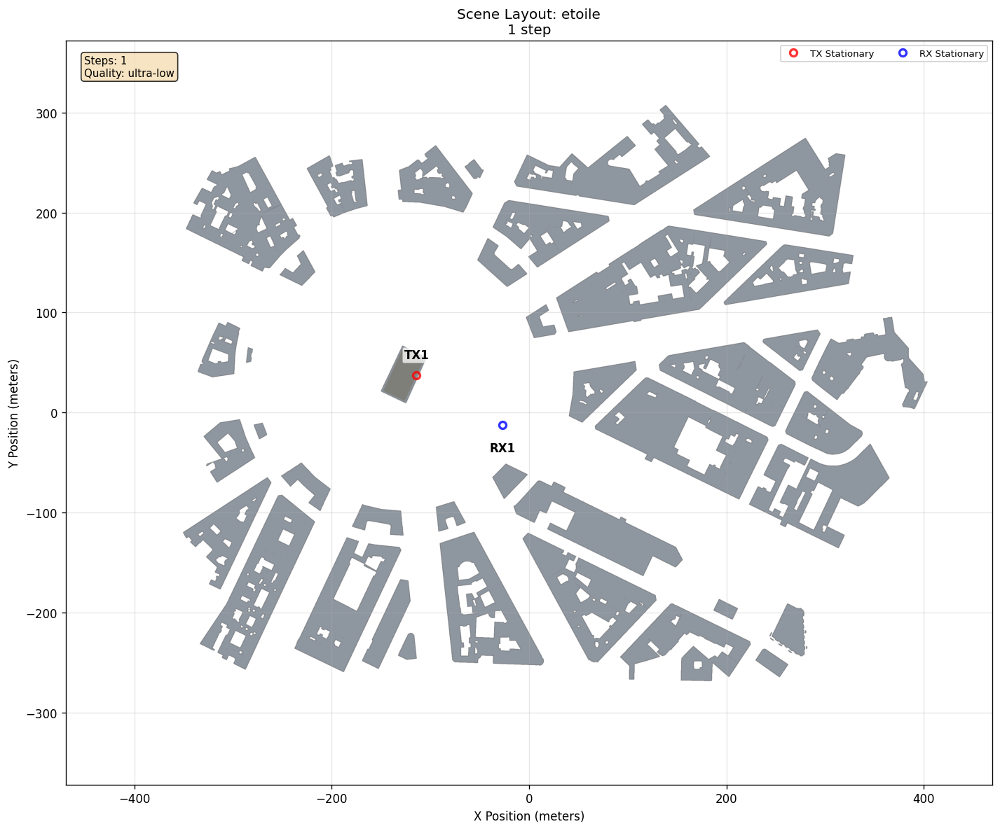

# Hello World

[Scenarios](../../README.md) > [Getting Started](../README.md) > Hello World

The smallest ORCHAV Generator workflow uses one stationary transmitter, one
stationary receiver, and one static frame in `etoile`, a
[Sionna RT](https://nvlabs.github.io/sionna/)-provided scene representing the
Arc de Triomphe roundabout in Paris. Use it to verify installation, inspect the
first generated HDF5 frame, and understand YAML-only authoring.

To run it, see [Running](#running).

## Scene Layout



| Element | Configuration |
|---|---|
| Scene | `etoile`, the Sionna RT-provided Arc de Triomphe roundabout scene |
| `TX1` | Stationary at `(-114.0 m, 37.0 m, 30.0 m)` |
| `RX1` | Stationary at `(-27.18 m, -12.61 m, 1.5 m)` |
| Targets | None |

TX1 is placed slightly inside the central opening of the Arc de Triomphe. RX1
is at street level about 100 m away. The layout is a standalone Generator
summary figure. See [Summary and Coverage
Figures](../../../docs/generator/generated_figures.md).

## Configuration Walkthrough

`scenario.yaml` contains the complete authored input:

| Setting | Value |
|---|---|
| Scene | Sionna RT scene `etoile` |
| Timeline | One step over `0.0 s` |
| Path computation | Enabled with the fast `ultra-low` preset |
| Actors | One YAML-defined TX and one YAML-defined RX |
| Frame output | Default `files` mode under `frames/` |

`timeline.steps: 1` is sufficient because both actors are stationary.
Orientation is omitted, so each actor uses the default fixed zero orientation.
The `ultra-low` quality preset keeps this installation check fast. Ordinary
generation uses `low` when no preset is authored.

For exact fields and defaults, use the
[Scenario YAML Reference](../../../docs/reference/scenario_yaml.md). The
required `schema_version: 2` identifies the scenario YAML format. See
[Versions and Compatibility](../../../docs/reference/compatibility.md#scenario-yaml).
[Scenario Authoring](../../../docs/generator/scenario_authoring.md) explains
how to create this directory and add actors.

## Running

If you arrived from the Quickstart, you have already completed these commands.
Continue at [Generated Files](#generated-files).

From the repository root, validate the YAML before starting ray tracing:

```bash
orchav-validate scenarios/getting_started/hello_world
```

Explicit validation is optional because generation validates while loading the
scenario, but it provides a fast configuration check after YAML edits.

Generate the frame:

```bash
orchav-generator scenarios/getting_started/hello_world/
```

Inspect frame 0 from the terminal:

```bash
orchav-inspect scenarios/getting_started/hello_world --frame 0
```

Open the same frame in the Visualizer:

```bash
orchav-visualizer --scenario scenarios/getting_started/hello_world
```

The exact MPC count depends on the Sionna RT result. The inspector output
should show one frame, one TX, one RX, and one TX/RX pair.

## Generated Files

After generation:

- `frames/mpc_frames_00000-00000.h5` contains frame 0.
- `frames/frames_manifest.json` is the authoritative frame and chunk inventory.
- `orchav-inspect` reports the actors, pair, MPCs, interactions, and node
  positions without opening the GUI.

To understand how ORCHAV prepares the scenario and uses Sionna RT, see the
[Generator guide](../../../docs/generator/README.md). To learn what ORCHAV saves
under `frames/` and how those files are organized, see the [Frame
Reference](../../../docs/shared/frame_reference.md). To compare saved-frame
playback with a Live Generator or remote playback, see the [Shared Data
Layer](../../../docs/shared/README.md). For more ways to check generated frames
from the terminal, see [Frame
Inspection](../../../docs/shared/frame_inspection.md).

Opening the scenario in the Visualizer may also create a dot-prefixed
`.orchav-stats-<path-hash>.npz` file beside `frames/`. It is a Git-ignored,
disposable cache of derived whole-scenario statistics, not another generated
frame. The Visualizer recreates it when needed. See
[Statistics Cache](../../../docs/visualizer/analysis.md#statistics-cache).

## Try A Validation Error

The included YAML passes validation. To see how ORCHAV reports a typo,
temporarily add the invalid `step` key beside `steps`:

```yaml
timeline:
  steps: 1
  step: 1  # Invalid: the field is named "steps".
  duration_s: 0.0
```

Run the validator again:

```bash
orchav-validate scenarios/getting_started/hello_world
```

It exits with a nonzero status without starting ray tracing, and the diagnostic
includes:

```text
Scenario configuration validation failed:
  - Unknown key 'timeline.step'. Did you mean: 'steps'?
```

Remove the `step` line before continuing. See
[Scenario Validation](../../../docs/reference/scenario_validation.md) for
strict checks and resolved-configuration output.

## Browse Scenarios

Previous: [Quickstart](../../../docs/getting_started/quickstart.md) | Up:
[Getting Started](../README.md) | Current: **Hello World**

Continue with the generated frame: [Your First Visualizer
Session](../../../docs/visualizer/first_session.md)

Optional authoring branch: [Hello World
Scripted](../hello_world_scripted/README.md)
