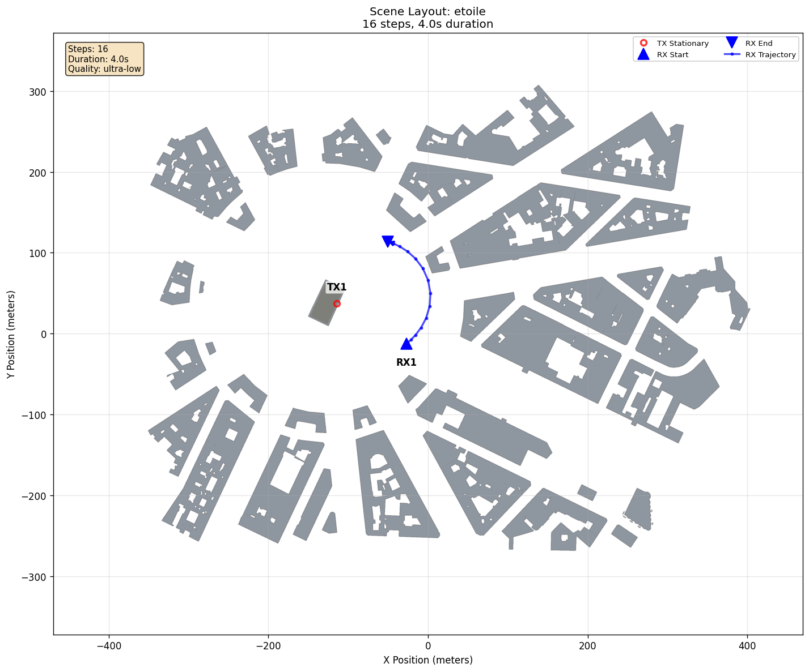

# Hello World Scripted

[Scenarios](../../README.md) > [Getting Started](../README.md) > Hello World Scripted

This companion to [Hello World](../hello_world/README.md) keeps the same
`etoile` scene and one TX/RX pair, but uses `generate.py` to calculate a curved
RX trajectory and build the standard [`waypoint` mobility
specification](../../../docs/generator/mobility_and_orientation.md#mobility-models).
RX1 looks at TX1 while it moves. Use the scenario to learn when a Python driver
is useful beyond YAML-only authoring.

To run it, see [Running](#running).

## Scene Layout



| Element | Configuration |
|---|---|
| Scene | `etoile`, the [Sionna RT](https://nvlabs.github.io/sionna/) Arc de Triomphe roundabout scene |
| `TX1` | Stationary at `(-114.0 m, 37.0 m, 30.0 m)` with default fixed orientation |
| `RX1` | Starts at `(-27.18 m, -12.61 m, 1.5 m)`, follows a calculated curved sweep, and looks at TX1 |
| Timeline | 16 frames over `4.0 s` |
| Targets | None |

The RX path remains at street level, sweeps around the TX, and temporarily bows
outward. The script samples that equation once per timeline step.

## Configuration Walkthrough

The scenario separates shared configuration from calculated actor input:

| File | Responsibility |
|---|---|
| `scenario.yaml` | Scene, timeline, and ray-tracing quality |
| `generate.py` | TX/RX specifications, calculated RX waypoints, look-at orientation, and the Generator pipeline call |

TX1 omits [orientation](../../../docs/generator/mobility_and_orientation.md#orientation-models)
and therefore uses the default fixed zero orientation. RX1 uses the [look-at
orientation model](../../../docs/generator/mobility_and_orientation.md#look-at),
configured in Python as `LookAtOrientationSpec(actor="TX1")`. Its +X forward
axis therefore tracks the transmitter throughout the sweep.

Use this pattern for trajectory equations, external preprocessing, generated
actor lists, parameter sweeps, or other calculations outside the YAML schema.
Prefer YAML for built-in mobility, orientation, target, and coverage settings.
[Scenario Authoring](../../../docs/generator/scenario_authoring.md#python-scripted-actors)
explains the general Python pattern.

## Running

Validate the shared YAML first:

```bash
orchav-validate scenarios/getting_started/hello_world_scripted
```

This checks the shared scene, timeline, and ray-tracing configuration. The
calculated actor specifications and trajectory logic are checked when
`generate.py` runs.

Generate the scripted frames:

```bash
python scenarios/getting_started/hello_world_scripted/generate.py
```

Inspect several positions along the sweep:

```bash
orchav-inspect scenarios/getting_started/hello_world_scripted --frame 0
orchav-inspect scenarios/getting_started/hello_world_scripted --frame 8
orchav-inspect scenarios/getting_started/hello_world_scripted --frame 15
```

Open the sequence in the Visualizer:

```bash
orchav-visualizer --scenario scenarios/getting_started/hello_world_scripted
```

## What To Notice

- `scenario.yaml` still owns the shared scene, timeline, and tracing budget.
- `generate.py` owns only the actor definitions and calculated path.
- RX1 changes position and orientation over time while TX1 remains fixed.
- The same prepared actor specifications flow through the normal Generator and
  shared frame contract.

## Generated Files

Generation writes one HDF5 chunk covering frames 0 through 15 under `frames/`,
plus `frames_manifest.json`. The Visualizer, `orchav-inspect`, and Python tools
consume that same frame set.

See the [Frame Reference](../../../docs/shared/frame_reference.md) for the frame
contract and HDF5 layout, and
[Scenario Validation](../../../docs/reference/scenario_validation.md) for the
difference between YAML validation and runtime checks.

## Browse Scenarios

Up: [Getting Started](../README.md) | Current: **Hello World Scripted**

Continue authoring: [Generator Scenarios](../../generator/README.md) |
Related first example: [Hello World](../hello_world/README.md)
