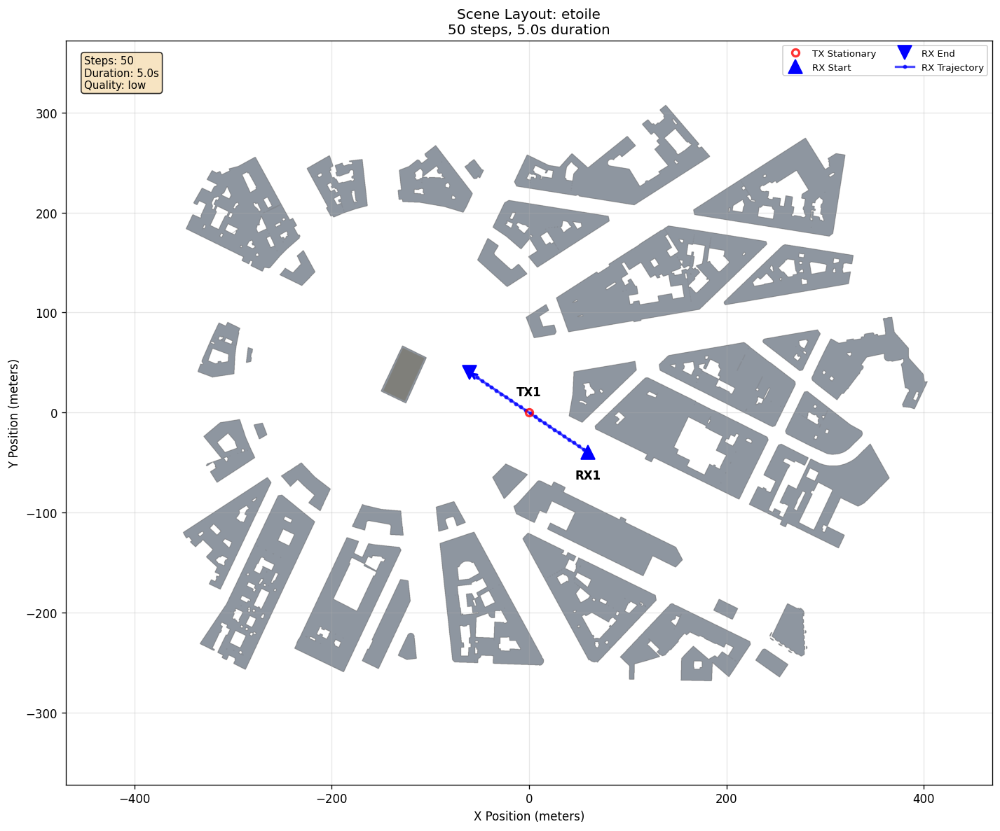

# Remote HDF5 Playback

[Scenarios](../../../README.md) > [Visualizer](../../README.md) >
[Data Modes](../README.md) > Remote HDF5 Playback

Remote HDF5 Playback keeps a generated HDF5 frame set on the server and
delivers `StandardMPCFrame` values to the Visualizer over gRPC. Use it when the HDF5
files should stay on one machine while the Visualizer runs elsewhere. The
frame-file server does not run ray tracing or recompute frames. This data mode
is read-only and provides no interactive recomputation. `remote_hdf5` is the
corresponding [`data.mode`](../../../../docs/shared/README.md#choose-a-data-mode) and CLI
value.

Install the [`grpc` optional
extra](../../../../docs/getting_started/installation.md#optional-extras) on the
server and Visualizer machines before running this example.

To run it, see [Running](#running).

## Scene Setup



| Element | Configuration |
| --- | --- |
| `BaseStation` | Fixed transmitter above the Etoile scene |
| `MobileRx` | Receiver moving diagonally across the scene over 50 frames |
| `data.mode` | `remote_hdf5` (Remote HDF5 Playback) |

## Scenario Configuration

```yaml
data:
  mode: remote_hdf5
```

With no connection overrides, the Visualizer connects to `localhost:50052`,
caches up to 50 frames, waits up to 10 seconds when connecting, and keeps the
server's startup frame index. For a cross-machine setup, run the frame-file
server where the generated frames are stored, then point
`data.remote_hdf5.server` at that host or use an SSH tunnel that preserves the
localhost endpoint.

For a different port on the same configured host, no YAML edit is needed:

```bash
python -m generator.io.grpc.file_server \
    --frames-dir scenarios/visualizer/data_modes/remote_hdf5/generation --port 50053
orchav-visualizer --scenario scenarios/visualizer/data_modes/remote_hdf5 \
    --data-mode remote_hdf5 --grpc-port 50053 --no-resume
```

For a trusted private network, add `--bind-host 0.0.0.0` (or a specific local
interface) to the server command and configure the client endpoint accordingly.
The service has no TLS or authentication. If the connection fails, restart the
server as needed and reopen the scenario. Requests are not replayed
automatically.

## Running

```bash
# Step 1: generate frames
orchav-generator scenarios/visualizer/data_modes/remote_hdf5/generation

# Step 2: serve the generated frame directory
python -m generator.io.grpc.file_server \
    --frames-dir scenarios/visualizer/data_modes/remote_hdf5/generation --port 50052

# Step 3: connect the Visualizer
orchav-visualizer --scenario scenarios/visualizer/data_modes/remote_hdf5
```

## What To Notice

- Open **System** and expand **Data Source**. It reports mode **Remote HDF5**
  and shows **Server Connection** and **Local Cache** information.
- Scrub from frame 0 to frame 49 and watch **Cached Frames** and **Hit Ratio**
  update while `MobileRx` follows the fixed sequence.
- The [generation child scenario](generation/README.md) creates local HDF5
  chunks under `generation/frames/`. The frame-file server reads those chunks,
  while the Visualizer receives individual frames rather than the HDF5 files.
- Remote HDF5 Playback is read-only. Use Live Generator (gRPC) when a running
  Generator should recompute frames.

## Browse Scenarios

> **Scenario path:** [All scenarios](../../../README.md) |
> [Visualizer](../../README.md) | [Data Modes](../README.md) | Current:
> **Remote HDF5 Playback**
>
> Up: [Data Modes](../README.md) | Compare:
> [Local HDF5 Playback](../hdf5_files/README.md) |
> [Live Generator](../live_grpc/README.md)
