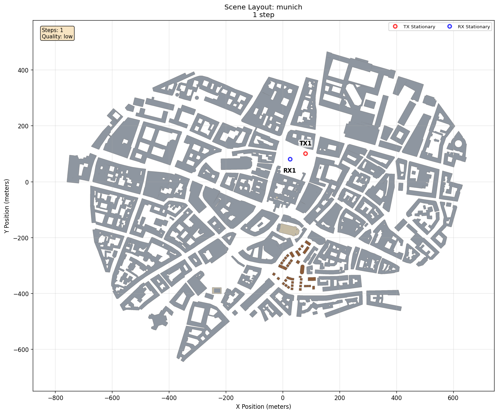

# MPC Inspection

[Scenarios](../../README.md) > [Visualizer](../README.md) > MPC Inspection

This Visualizer-focused scenario uses the
[Sionna RT](https://nvlabs.github.io/sionna/) `munich` scene, which represents
Munich's historic Frauenkirche district with dense urban streets and building
facades. ORCHAV places one rooftop transmitter and one
street-level receiver in that scene, generates one frame, and opens the
resulting multipath components in the Visualizer.

To run it, see [Running](#running).

## Scene Setup



| Element | Role |
| --- | --- |
| `RooftopCell` | Stationary elevated transmitter in the Munich scene |
| `StreetRx` | Stationary street-level receiver |
| `munich` | Sionna RT-provided scene representing Munich's historic Frauenkirche district |

## Scenario Configuration

```yaml
timeline:
  steps: 1
  duration_s: 0.0

raytracing:
  enabled: true
  export_path_metrics: true

generator_summary:
  enabled: true
  create: [scene2d]
```

The scenario uses the default `low` ray-tracing profile and omits
`view_defaults`, so it opens with the application defaults:
isometric camera, visible MPC paths, all TX/RX pairs selected, and
reflection-order coloring. See
[View Defaults](../../../docs/visualizer/scenario_defaults.md#view-defaults) for the
optional YAML fields that set a different initial camera, color mode, or
visibility state.

## Running

From the repository root, generate and inspect frame 0:

```bash
orchav-generator scenarios/visualizer/mpc_inspection
orchav-inspect scenarios/visualizer/mpc_inspection --frame 0
```

Then open the same frame set:

```bash
orchav-visualizer --scenario scenarios/visualizer/mpc_inspection
```

## What To Notice

- The initial view uses the Visualizer defaults: the isometric camera, MPC
  paths visible, and **Color By** set to **Order**.
- In **Paths**, use **Color By** to switch between **Order**, **Type**,
  **Delay**, **Loss**, and **Material**.
- The same tab can restrict the displayed paths by reflection order,
  interaction type, delay, path loss, material, and angles without changing the
  underlying HDF5 frame.
- Enable **Limit rendered MPCs**, then set **Max MPCs** to reduce the number of
  strongest displayed paths while keeping the standard frame available for
  inspection.
- Renderer selection changes drawing behavior, not the stored frame data.

## What To Try

To open the same frame directly in path-loss coloring or from a top-down
camera, add only the defaults you want to override:

```yaml
view_defaults:
  camera_view: top
  color_mode: path_loss
```

For backend comparison, use the [Renderer guide](../../../docs/visualizer/renderers.md)
rather than changing the scenario itself.

In **Paths**, choose **Open MPC Explorer...** to sort the frame's paths, select
one path, and inspect its ordered interactions and materials. See the
[MPC Explorer guide](../../../docs/visualizer/mpc_explorer.md) for the complete
workflow.

## Browse Scenarios

> **Scenario path:** [All scenarios](../../README.md) | [Visualizer](../README.md) |
> Current: **MPC Inspection**
>
> Up: [Visualizer Scenarios](../README.md) | Next:
> [Metrics Evolution](../metrics_evolution/README.md)
