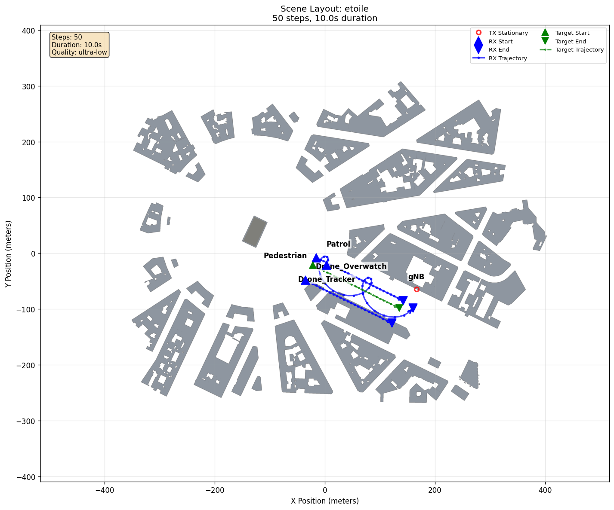
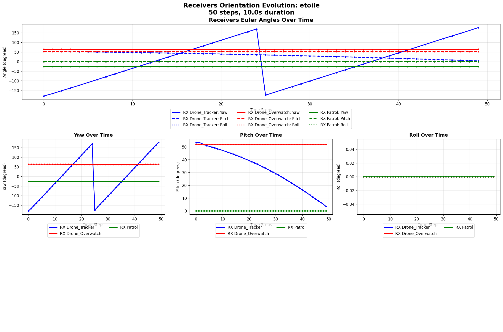

# Multi-Device Trajectory

[Scenarios](../../README.md) > [Visualizer](../README.md) > Multi-Device Trajectory

This Visualizer scenario uses the
[Sionna RT](https://nvlabs.github.io/sionna/) `etoile` scene, which represents
the Arc de Triomphe roundabout in Paris. It places one rooftop transmitter,
two airborne receivers, one ground receiver, and one moving pedestrian mesh in
the scene so users can inspect trajectories, orientations, actor selection,
and per-link multipath views over 50 frames.

The moving pedestrian mesh is a visual reference whose geometry can also
affect propagation paths. This keeps target motion visible while users inspect
receiver trajectories and per-link MPCs.

To run it, see [Running](#running).

## Scene Layout



| Element | Role |
| --- | --- |
| `gNB` | Stationary rooftop transmitter near the Arc de Triomphe |
| `Drone_Tracker` | Descending airborne receiver following the pedestrian |
| `Drone_Overwatch` | Higher-altitude airborne receiver sweeping beside the route |
| `Patrol` | Ground-level receiver moving parallel to the pedestrian |
| `Pedestrian` | Moving mesh target whose geometry can affect radio paths |
| `etoile` | Sionna RT-provided Arc de Triomphe roundabout scene |

## Scenario Configuration

```yaml
timeline:
  steps: 50
  duration_s: 10.0

raytracing:
  enabled: true
  export_path_metrics: true
  quality:
    preset: ultra-low

generator_summary:
  enabled: true
  create: [scene2d, speed, orientation]
  visualization:
    actor_label_mode: name
```

`generate.py` constructs the receiver trajectories and look-at orientations.
The custom script is used because this scenario combines programmatic
trajectory geometry with target-following orientation logic beyond the
YAML-only fields.

Running `generate.py` writes reusable HDF5 chunks under `frames/`, while
`summary/` contains the standalone topology, speed, and orientation figures
requested by the YAML.

## Running

From the repository root, generate the scripted frame set and inspect its last
frame:

```bash
python scenarios/visualizer/multi_device_trajectory/generate.py
orchav-inspect scenarios/visualizer/multi_device_trajectory --frame 49
```

Then open the scenario:

```bash
orchav-visualizer --scenario scenarios/visualizer/multi_device_trajectory
```

## What To Notice

- In **Scene** > **Nodes**, enable **Trajectory** under **RX** to see
  `Drone_Tracker`, `Drone_Overwatch`, and `Patrol` move around the roundabout.
- In the same panel, enable **Trajectory** under **Targets** to show the
  `Pedestrian` motion with the receiver paths.
- Under **Trajectory Style**, switch **Color** from **Node** to **Speed**,
  **Altitude**, or **Time** to compare the airborne receivers with the ground
  patrol receiver.
- In the persistent **Context** controls, select a TX/RX pair to compare the
  `gNB`-to-receiver links without regenerating the HDF5 frame sequence.
- In the persistent **Camera** controls, set **Track** to `Drone_Tracker` and
  choose **Follow**. Then choose **POV** with **Look** set to **Forward** to
  inspect how its selected link changes along the 50-frame sequence.

## Orientation Diagnostics



Use the orientation figure to check that the tracker receiver changes yaw as it
orbits and pitch as it descends.

## Browse Scenarios

> **Scenario path:** [All scenarios](../../README.md) | [Visualizer](../README.md) |
> Current: **Multi-Device Trajectory**
>
> Previous: [Statistics](../statistics/README.md) | Up:
> [Visualizer Scenarios](../README.md) | Related:
> [SIMULTECH 2026 Reproducibility](../../../docs/reproducibility/simultech_2026.md)
