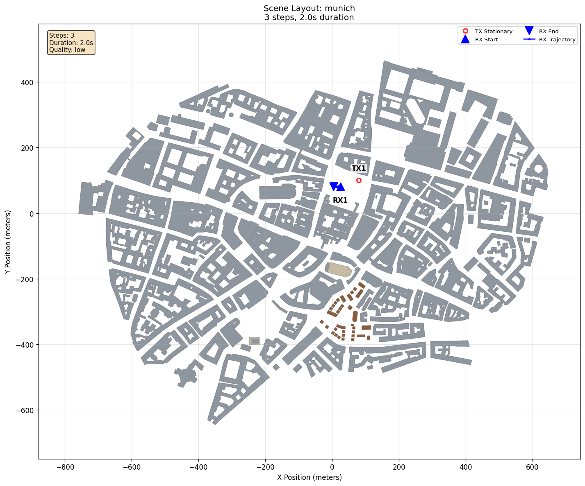
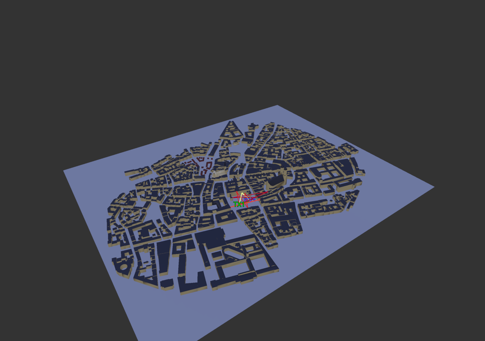

# Notebook Mode

[Scenarios](../../README.md) > [Visualizer](../README.md) > Notebook Mode

This scenario is for Jupyter and headless rendering workflows. It uses the
Munich scene and writes three ordinary HDF5 frames so notebook cells can
demonstrate frame selection, color modes, and camera settings.

Use [Notebook Visualization](../../../docs/visualizer/notebooks.md) for the
Python and Jupyter interfaces. Use
[Headless Rendering](../../../docs/visualizer/headless_rendering.md) for
command-line image output.

Install the [`jupyter` optional
extra](../../../docs/getting_started/installation.md#optional-extras) before
opening the notebook. The [notebook setup
steps](../../../docs/visualizer/notebooks.md#set-up-the-example) provide the
complete preparation sequence.

To run it, see [Running](#running).

## Scene Setup





| Element | Role |
| --- | --- |
| `RooftopCell` | Fixed transmitter in the Munich scene |
| `NotebookRx` | Receiver moving over three frames |
| `frames/` | HDF5 data shared by notebook and desktop workflows |

## Running

Generate the frames:

```bash
orchav-generator scenarios/visualizer/notebook_mode
```

Then render from a notebook:

```python
from visualizer.src.notebook.pygfx import PygfxNotebookViz

viz = PygfxNotebookViz("scenarios/visualizer/notebook_mode")
viz.render(frame=0, color_mode="reflection_order", azimuth=45, elevation=30)
viz.render(frame=2, color_mode="path_loss", azimuth=55, elevation=35)
```

Or open the included example notebook:

```bash
jupyter lab --no-browser examples/notebook/notebook_mode.ipynb
```

Open the same frames in the desktop Visualizer:

```bash
orchav-visualizer --scenario scenarios/visualizer/notebook_mode
```

## What To Notice

- Compare the frame 0 reflection-order render with the frame 2 path-loss
  render shown above. The actor position and path coloring both change.
- Call `viz.show(frame=0)` to orbit, pan, and zoom an in-cell view.
- Call `viz.animate(frames=[0, 1, 2])` to watch `NotebookRx` move through the
  three stored frames.
- Notebook rendering and the desktop Visualizer read the same local HDF5 frame
  set. The YAML omits `data` because this is the default file workflow.
- `PygfxNotebookViz` provides the supported notebook interface.

## Browse Scenarios

> **Scenario path:** [All scenarios](../../README.md) | [Visualizer](../README.md) |
> Current: **Notebook Mode**
>
> Up: [Visualizer Scenarios](../README.md)
