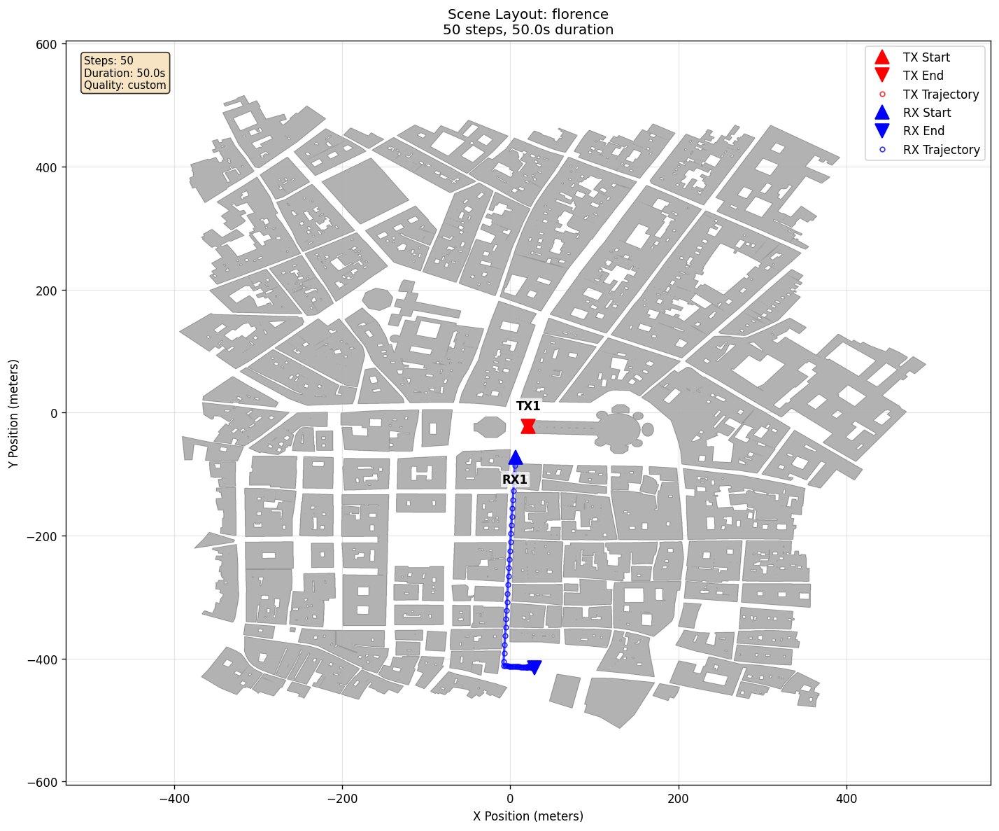
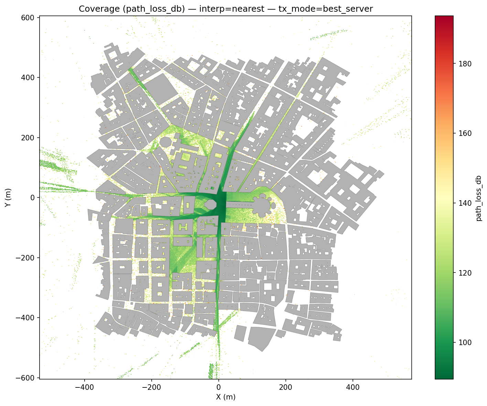

# Statistics

[Scenarios](../../README.md) > [Visualizer](../README.md) > Statistics

This scenario demonstrates whole-sequence Statistics in the Visualizer. It
uses the [Sionna RT](https://nvlabs.github.io/sionna/) `florence` scene, which
represents Florence's historic city center with dense streets and piazzas. A
street-level receiver
follows a 50-frame route while a rooftop transmitter stays fixed. The Analysis
tab summarizes the complete frame sequence, and the scenario also saves a
coverage map for the same area.

To run it, see [Running](#running).

## Scene Setup





| Element | Role |
| --- | --- |
| `TX1` | Stationary rooftop transmitter in the Florence scene |
| `RX1` | Receiver following a street-level waypoint route |
| `florence` | Sionna RT-provided scene representing Florence's historic city center |
| Coverage grid | Street-level virtual receiver samples at 1.5 m |

## Scenario Configuration

```yaml
timeline:
  steps: 50
  duration_s: 50.0

raytracing:
  enabled: true
  export_path_metrics: true
  quality:
    preset: custom

coverage:
  enabled: true
  grid:
    resolution_m: [2.0, 2.0]
    heights_m: [1.5]

generator_summary:
  enabled: true
  create: [scene2d, speed]
```

The custom ray-tracing and coverage profiles inherit the medium solver
settings, then override the interaction depth, ray budget, refraction, and
diffraction settings. The full YAML also sets two material scattering
coefficients and explicitly enables coverage figures with a scene overlay.
Frame output uses a local manifest-driven HDF5 frame set, while the coverage
data is saved separately to `coverage/coverage_maps.h5`.

The receiver route is declared in YAML with `mobility.type: waypoint`.
`frames/` contains the generated HDF5 frame set, `coverage/coverage_maps.h5`
contains the saved coverage-map data, and `summary/` contains standalone
diagnostic figures for the route, speed profile, and coverage map.

## Running

From the repository root, generate the frames and inspect the saved coverage
output:

```bash
orchav-generator scenarios/visualizer/statistics
orchav-inspect scenarios/visualizer/statistics --coverage
```

Then open the scenario:

```bash
orchav-visualizer --scenario scenarios/visualizer/statistics
```

## What To Notice

- When the Visualizer opens the frame set, the **Analysis** tab's
  **Statistics** section
  checks for a matching cache and otherwise computes the aggregate values
  automatically.
- The **Graphs** section summarizes the full 50-frame route. MPC count, path
  loss, delay, and material-use trends change as `RX1` moves through the
  streets.
- The saved coverage map provides a broader street-level path-loss view for the
  same Florence scene.

## What To Try

- Wait for the **Statistics** status to report that the values are ready, then
  expand **Graphs**. Use **Compute Statistics** only to force a fresh scan of
  the active frame set.
- Open **Coverage**, enable **Show coverage map**, and select the 1.5 m height.
  The coverage graphs in **Analysis** > **Graphs** follow the selected coverage
  metric and height.
- For spatial context, open **Scene** > **Nodes**, enable **Trajectory** in the
  **RX** section, and compare the route with the whole-sequence graphs.

## Browse Scenarios

> **Scenario path:** [All scenarios](../../README.md) | [Visualizer](../README.md) |
> Current: **Statistics**
>
> Previous: [Metrics Evolution](../metrics_evolution/README.md) | Next:
> [Multi-Device Trajectory](../multi_device_trajectory/README.md)
